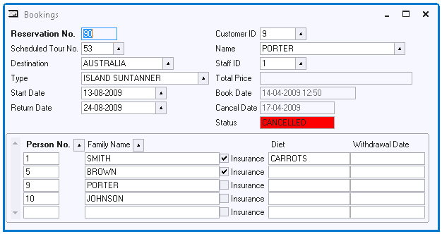

# Actions Example 5: Contrasting field colour based on record data

The action in this example depends on data and is triggered by the Enter Record event.



If a cancel date exists, the reservation is cancelled and the STATUS field (set to "CANCELLED" as a result of a Rules Engine constraint) must appear with a red background as a warning to the user.

Set the Pre-record-entry property of the Info Window to:

```
ActionDecision('SET_STATUS_RED')
```

Define the SET_STATUS_RED decision as:

*Decision SQL*

```
:"query.cancel_date" is not null
```

*Yes Action*

```
query.status.esd_char.data.background('red')
```

*No Action*

```
query.status.esd_char.data.background('Button Face')
```

Use the Object Activator as a stand-alone editor to compose the "query.status.esd_char.data" string representing the inside of the displayed text box control for the STATUS column. The :CANCEL_DATE construct in the Decision SQL is an abbreviated old-style navigation path.

An alternative implementation of this rule is to use an Extra Query with the following underlying query:

```
SELECT ' ' FROM RESERVATION WHERE CANCEL_DATE IS NOT NULL
```


:::note

The red color is not visible if the Input Allowed or Updatable attribute of the Status field is set to Off. If you want to set Input Allowed or Updatable to Off, find a different solution for highlighting cancelled reservations.

:::
