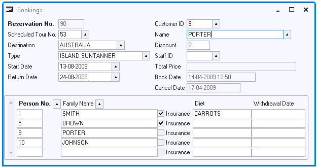

# Actions Example 6: Dynamic default value



Customers have a personal discount percentage. Whenever the user enters or changes the Customer ID, the customer's current discount percentage must be looked up in the CUSTOMER table and displayed as a default value in the Discount field.

If you want to make sure that the discount is only displayed AFTER the user has entered or changed the entire record, then write a constraint:

```sql
UPDATE  reservation r
SET     customer_discount =
(
        SELECT      discount
        FROM        customer
        WHERE       customer_id = r.customer
)

```

If you want the discount percentage to be displayed IMMEDIATELY after the customer ID is entered or changed, set the Post-edit property for the Customer field to:

```
ActionDecision( decision-name )
```

Set the Decision SQL to:

```sql
SELECT    discount
FROM      customer
WHERE     customer_id = :CUSTOMER

```

Set the Yes Action of the decision to:

```
query.person_discount(:1)
```

If the default value is the same for every customer, do not use an action. Set the Default Value attribute of the Discount field. Using this feature you only get default values for NEW records, not for CHANGED records.

If the discount percentage cannot be set for each individual Reservation, but is always identical to the customer's personal discount, then you do not need a database column RESERVATION.CUSTOMER_DISCOUNT. You can use a joined column instead. Note however that with a joined column, if the customer's discount changes, it will also change for all past and present reservations of this customer, which may not be the intended behavior.