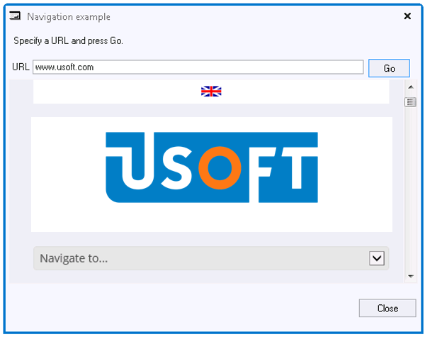

# Actions Example 7: Passing a value to an embedded web browser

This example provides navigation in an embedded web browser control to a URL specified in a field.



The window is an instance of a USoft Windows Designer dialog class, so it is NOT (or not necessarily) connected to tables in the application database.

The window contains a Microsoft Internet Explorer web browser control which is included in the Controls Tree.

Browser navigation is activated runtime by any action following an edit of the URL value, for example, pressing the Go button, but also pressing the TAB key from the URL field.

- Create a new dialog class and open it.
- Change the instruction text in the dialog.
- Insert a Text Box with label "URL" and a Go button.
- In the Controls Tree in the catalog, expand the "ActiveX Control" folder, then find the "ActiveXShell_Explorer_2" class and insert it by dragging it onto your design dialog.

- Use the Object Activator to set the Post-edit property of the URL Text Box to:

```
ActiveXShell_Explorer_2_1.Navigate( Variables.Text_Box_1() )
```

> [!TIP]
> Make subclasses of the Microsoft Web Browser and the esd_char control first. Then use these subclasses, rather than the original classes.