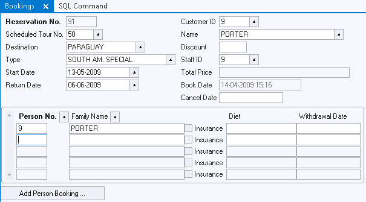

# Actions Example 8: Automatic insert in child table and Related Box



This Info Window has bookings in a parent box and participants in an embedded child box.

Assume that it is frequent that the customer booking the reservation (parent box) is also a person included in the reservation as a participant (child box).

A button "Add Person Booking..." automates the action of including the booker as a participant.

1. Insert the new button and set its label to "Add Person Booking ...".

2. Set the Action property of the Add Person Booking button to:

```
RecordStore(QUIET)
SqlScript
(
INSERT INTO participant( person_id, res_id, insurance )
VALUES( :MADE_BY, :RES_ID, 'N' )
)
Participants_taking_part_in_Reservation.QueryExecute()
Participants_taking_part_in_Reservation.query.person_id.esd_int.ControlSetFocus()

```

3. Use the Object Activator to compose this action statement script. The RecordStore action statement acts at the top-level info box (the parent box) and therefore does not need an explicit object identifier. This action statement is necessary to make sure the parent record is completed and a customer is known. :MADE_BY and :RES_ID are embedded action statements.

The INSERT statement can also be spelled as follows; in which case the action statements can be produced by using the Object Activator as a stand-alone editor:

```sql
INSERT INTO participant
(
    person_id
,   res_id
,   insurance
)
VALUES
( 
     :"query.made_by()"
,    :"query.res_id()"
,    'N'
)

```

4. After the INSERT action, all the Participant records for this Reservation are retrieved (including the newly added INSERT), and the cursor jumps to the first field of the Participants box.