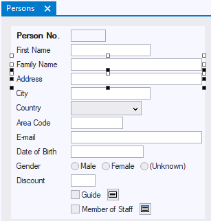

# Tips for positioning objects

When you insert a new object, it is common that initially, the visual arrangement is not at all what you want. Here are some practical tips for re-arranging the positioning of objects quickly and easily.

### Getting a reliable view of object positioning

When you add, change or drop objects, there are so many variables at play that Windows Designer cannot always automatically give an accurate rendering of the new look-and-feel of the info box or dialog.

Make sure you get an accurate view of how the window *actually looks* as a result of your recent changes.

- To get Windows Designer to refresh the design view displayed, choose View, Refresh, Design View from the main menu.

- To view the window as the end user will see it, choose Design, Run from the main menu.

### Using Orientation, Position, and Allow Neighbour properties

Most positioning problems can be overcome by having a good look at the Orientation, Position, and Allow Neighbour properties of the objects. Here is an explanation with added tips.

*Sibling objects* are objects with the same parent in the containment hierarchy as shown in the object tree.

|**Property**|**Meaning**|**Tips**|
|--------|--------|--------|
|Orientation|Determines whether child sibling objects that have Allow Neighbour = Yes are arranged left-to-right (Orientation = Horizontal) or top-to-bottom (Orientation = Vertical).|If you have many sibling objects, make sure they all have Allow Neighbour = Yes, then set the desired Orientation for the parent object|
|Position|Determines the *order* in which sibling objects will appear.Whether this is left-to-right or top-to-bottom order depends on Orientation and Allow Neighbour.|Do not allow siblings to have the same value for Position.Manually set Position for each of them. Do not rely on Windows Designer setting Position values in sequences where you have made edits.Set the first object at Position = 10, the second at Position = 20, and so on. This allows you to easily fit in further objects at some later time at any place in the sequence, eg. Position = 25 for an object that must fit between 20 and 30.|
|Allow Neighbour|If set to Yes, the next sibling object appears to the right ifthe parent object's Orientation = Horizontal, or below if theparent object's Orientation = Vertical.If set to No, the next sibling object appears below ifthe parent object's Orientation = Horizontal, or to the right if the parent object's Orientation = Vertical.|To get individual neighbours lined up vertically, it does not matter whether you use Orientation = Vertical and Allow Neighbour = Yes,or Orientation = Horizontal and Allow Neighbour = No.To get individual neighbours lined up horizontally, it does not matter whether you use Orientation = Horizontal and Allow Neighbour = Yes,or Orientation = Vertical and Allow Neighbour = No.To break up a form with 54 fields into 3 columns of 16, make sureOrientation = Vertical and Allow Neighbour = Yes, except for the last item in each column, where you want Allow Neighbour = No.|

### Grouping like objects

Group like objects by creating a new Group object and making sure they are children of this new object. The only purpose of Group objects is to make positioning easier. You can easily ungroup later if you like.

To group like objects:

1.Select the objects you want to group. To select multiple objects, hold the **Ctrl** key down, they click each object in turn in either the design view or object tree. In the design view, all concurrently selected objects will have WHITE selection handles except the most recently selected object:

Family Name and Address column controls selected concurrently, Address last

2.Right-mouse click and choose Group from the context menu.

3.Make property settings for the new Group, such as Orientation.

To tailor the group arrangement, you can possibly inspect or reset each object's Group property.

To ungroup grouped objects:

1.Right-mouse click on the Group object.

2.Choose Ungroup.

It is possible that Windows Designer resets Position attributes as an intended effect of playing with groups. A good way to counter this sort of effect is to *re-inherit:* press the Reset icon button in the Property Inspector for the Position property of the ungrouped objects.

### Nudging objects into place

When positioning objects in a complex window, they often do not line up exactly right.

Try to make major adjustments by using the tips earlier in this help topic.

For a finishing touch of exact positioning, however, feel free to:

- Add some extra pixels to the left of an individual object by setting the Horizontal Distance property.
- Add some extra pixels above an individual object by setting the Vertical Distance property.

###  

 

 

###  