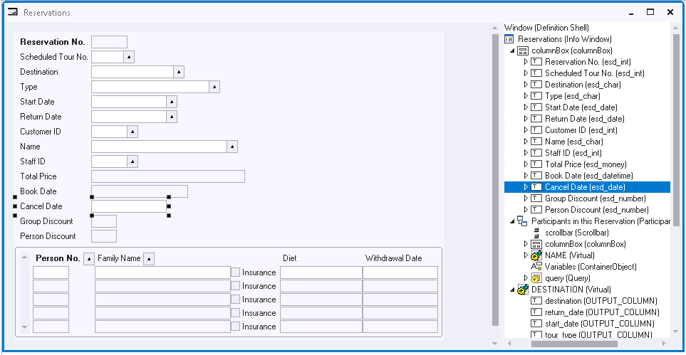
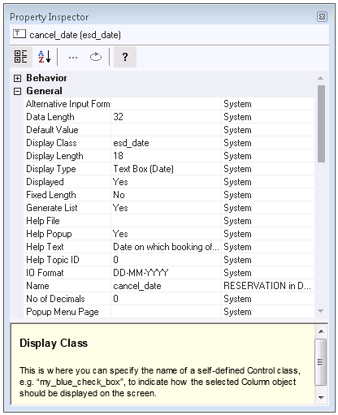

# Tools for objects and properties

The contents of each info box and each dialog is defined as a collection of *objects* characterised by *properties.* These objects exist in a containment hierarchy (as opposed to the class hierarchies visualised by the project catalogs on the left).

## Design View, Object Tree

You can view the objects in an info box class or dialog class by opening that class from the catalog. Do this by double-clicking on the catalog item, dragging the catalog item to the central area, or right-mouse clicking and choosing Open from the context menu.

A *design view* is opened in Windows Designer's central pane. This view displays the class as much as possible as it will be displayed by the end user, but with *selection handles* on one of the objects. On the right-hand side, an *object tree* shows the objects in the class in their containment hierachy.

In the design view, you can select objects in a course-grained fashion, also "zooming out" to even larger objects by holding the Alt key down and mouse-clicking at the same time. On the other hand, you can also select more precisely. To toggle between course-grained and finely detailed selection, press the Selection Filter toggle on Window Designer's main icon ribbon:

Selection Filter iconHere is a picture of a Design View (on the left) and an Object Tree (on the right).

On the left, selection handles mark the Cancel Date field as being the selected field. It shows the place of this field as it is viewed by the end user. The Object Tree equally has the Cancel Date field selected. It shows the place of this field in the object hierarchy:

 

## Property Inspector

You can view and change properties of an object in the *Property Inspector.* Open the Property Inspector from the View menu, or from the right-mouse context menu in the design view or object tree, or by clicking the Property Inspector icon on the toolbar:

The body of the Property Inspector has 3 columns. Also, it has an icon ribbon across the top:

The leftmost column shows property names. The middle column shows property values. To change a value, click in the cell and start typing, or click on the dropdown button, or click on the Edit icon in the icon ribbon.

The rightmost column shows *inheritance:* it shows where the property value "comes from". If this column is EMPTY, the property value is not inherited. It has been set locally, at the level that you are looking at. To reset it to its default, press the Reset icon on the icon ribbon. The property will then *re-inherit* its inherited setting.

In general, whenever possible, it is good practice to let a property have its inherited value rather than setting a value for it locally.

At the bottom is a Help pane that described what the currently selected property is for. You can switch the Help pane on and off by pressing the Show Help icon on the icon ribbon.