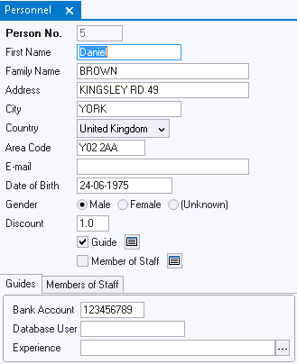

# Tabs (Windows Designer)

### Inserting tab pages in an info box

To insert tab pages:

1.Use the Windows Designer catalog to open the appropriate window/dialog, and then select the object into which you want to insert the tab pages.

2.From the menu bar, choose Insert, Tab, or drag-and-drop a Tab object from the Class Tree.

3.From the menu bar, choose Insert, Tab Page, as many times as you want the Tab object to have pages.

Tab objects must have at least ONE tab page. The first one is inserted automatically.

4.For each of the tab pages, use the Page Title property on the Visual tab page of the Property Inspector to give it the required label/prompt.

5.If required (e.g. if you want them ordered alphabetically), you can change the order of the tab pages by setting their Position property.

6.You can now drag and drop the required objects (e.g. tables or buttons) onto your tab pages.

A frequent mistake is to insert objects on the Tab object instead of on a Tab Page. Before inserting objects onto a tab page, make sure you select the Tab Page itself, not the Tab that contains it.

To minimize the risk of mistakes, USoft will automatically create a Tab Page if you attempt to drag and drop an info box onto a Tab control.

### Example: subtype tab pages

The Human Resources department of the Travel Agency needs a specialized window for viewing and manipulating employee details. This window should basically display PERSON data, with one tab page for GUIDE subtype data and one tab page for STAFF (office staff) subtype data.

In the Definer, GUIDE and STAFF subtypes are defined as mutually exclusive: EITHER one OR the other. It is possible to have a person with no subtype data at all.

To create the Personnel info window:

1. On the Info Boxes tab page of the catalog, right click on the Info Window node and choose New from the context menu. A subclass of Info Window will be created
2. Right click on the new subclass, and rename it to Personnel.

You have now made a Personnel info window at the same level in the Class Tree as the Persons info window.

It is also possible to define a Personnel subclass of the Persons info window.

 

To insert a tab with two tab pages in the Personnel info window:

1. Open the Personnel info window or drag-and-drop it from the catalog onto the design area.
2. Make sure you have selected the Personnel info window. The status line should read Info Window: Personnel.
3. Select the Controls tab page of the Catalog.
4. Select the Tab icon from the list of controls and drag-and-drop it onto the Personnel design view. A Tab object with one Tab Page is inserted in the Personnel window.
5. Select the Tab object and choose Insert, Tab Page from the menu bar. A second tab page is inserted.
6. Select the first tab page and set the Group Border Title property on the Visual tab page of the Property Inspector to Guides.
7. Select the second tab page and set the Group Border Title property on the Visual tab page of the Property Inspector to Members of Staff.

 

To display data on the two tab pages:

1. Select the first Tab Page and drag-and-drop the Guides subtype window from the Windows Designer catalog onto the Personnel design view.
2. Select the second Tab Page and drag-and-drop the Staff subtype window from the Windows Designer catalog onto the Personnel design view.
3. Run to test, and Save.

 