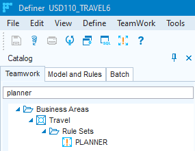
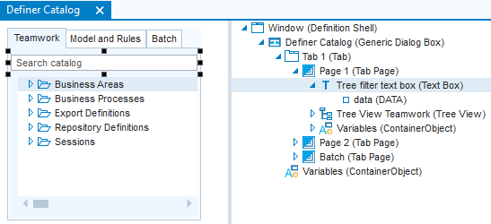

# Tree Views

## Inserting a tree view

To insert a tree view:

1.Use the Windows Designer catalog to open the window, dialog or control class into which you want to insert the tree view.

2.From the menu bar, choose Insert, Tree View, or drag and drop a tree view from the Windows Designer catalog.

3.Select the Tree View object. From the menu bar, choose Insert, Tree View Node, or drag and drop a tree view node from the Windows Designer catalog, as many times as you want tree view nodes in the tree.

For example, if you want your tree view to display employees per department, you need two tree view nodes.

4.Open the Property Inspector for the Tree View. For the Root Nodes property, specify the name of one or more tree view nodes. The value of this property determines which tree view node(s) are displayed in the root of the tree. For example:

```
Tree View Node 1
```

For example, if you want to display employees per department, then for the Root Nodes property of the tree view specify the tree view node that is going to retrieve departments.

5.Open the Property Inspector and for each Tree View Node, set the Child Nodes property. For each tree view node, this property determines which node(s) is/are the child node(s) of that tree view node.

For example, if you want to display employees per department, then for the Child Nodes value of the root node, specify the tree view node that is going to retrieve employees.

Depending on the complexity of the data structure, you may need to enter more than one Child Node, and/or more than one Root Node. You can enter multiple values in a Property Inspector text box by typing the first value, pressing CTRL+ENTER, typing the second value, and so on. Each of the values will appear on a new line.

6.For each tree view node, set the SQL Query property to determine which data must be represented by that tree view node.

In the example, the query for the department tree view node would be:

```sql
SELECT   dep_name
FROM     department
```

The query for the employee tree view node would be:

```sql
SELECT   emp_name
FROM     employee
WHERE    dep_name = :DEP_NAME
```

The :dep_name identifier refers to the dep_name column in the query of the department tree view node.

## Adding multiple child nodes

To add more than one child node to a tree view node:

1.Open the Property Inspector for the tree view node that must have more than one child node.

If you want to add more than one root node to the tree view, navigate to the Tree View object.

2.Set the Child Nodes or Root Nodes property to:

```
Tree View Node 1
Tree View Node 2
```

In this case, the child nodes will be ordered together by their first selected columns.

## Referring to a tree view's current item

To refer to the current item of a tree view or list view from within the same GUI class that the view is in, use the Object Activator to select the appropriate tree view or list view object, and then use the GetValueFromCurrentItem( ) method. This method applies to tree views and list views. Also see: Actions Example 10.

If you want to make the reference from OUTSIDE the GUI class that the view is in:

- If the reference to the current tree view or list view is only made once, you can pass it as a string value to the other GUI class. For this type of scenario, see Actions Example 10: Catalog Node Leading to Data Query.
- If you want to refer more than once to the (changing) current value of the tree view or list view, the GUI class where you want to make the reference needs a user-defined property of the tree view type or list view type. For this type of scenario, where the user-defined property holds an object instead of a simple string value, see Actions Example 11: Window with Separate Search Dialog.

## SQL used in tree views

USoft tree views are populated with data retrieved by SQL statements defined in the SQL Query property of Tree View Node objects.

How exactly this happens is determined by the combination of the SQL statements, the value of the Root Nodes property of the Tree View object, and the value of the Child Nodes property of the various Tree View Nodes.

In the SQL Query of a tree view node, only the first column will be displayed. If you want to display more than one column in a tree view node, consider concatenating those columns in the SQL Query of that tree view node. For example:

```sql
SELECT    p.first_name||' '||p.last_name
FROM      person p
ORDER BY  p.last_name
```

Each tree view node will by default be ordered by the first selected column in the SQL Query. If a tree view node has more than one child node, these child nodes will be ordered together by their first selected columns.

For each child node query, use a column identifier to refer to the parent tree view node just as with columns in "ordinary" info windows. Make sure that you include this column in the SELECT list of the parent node SQL query.

## Adding a Search facility to a tree view

You can add a text search facility to a tree view. The user can type a text search string in a special Search box and then press ENTER or click outside the box. This causes the tree view to display not the whole tree, but only those leaf nodes that match the search string, as well as their ancestor leaf nodes.

To see a demonstration of how this works, use the "Search catalog” box at the top of the catalog tabs in USoft Definer, for example, the Teamwork catalog tab:



The search is performed case-insensitively. The search is for node names retrieved by SQL statements of Tree View Nodes. Hard-coded node names are not matched.

If there are no search results, the tree view displays an empty pane. If there is no search string, the entire tree view is (re)displayed. To go back to the entire tree view after a search, erase the search value and press ENTER.

To add a seach facility to a tree view:

1. Insert a Text Box control near the tree view:



2. On the Text Box's event property, call the action exposed by the tree view control, and pass it the contents of the text box. You need something like this:

```
Tab_1.Page_1.Tree_View_Teamwork.FilterTree(Tab_1.Page_1.Variables.Tree_filter_text_box())
```

3. To get a prompt such as "Search catalog” in the search box, set the property of the text box's  object.

## Adding icons

To add icons to a tree view:

1.Use the Windows Designer catalog to open the window or dialog that contains the tree view.

2.For the Tree View object, set the Show Icons property on the Visual tab page of the Property Inspector to Yes.

3.For each of the Tree View Nodes, set the Image property to determine which icon or bitmap file to display.

You can define more than one image per tree view node. When a column in the SQL Query of a tree view node has an alias TREE_IMAGE, the value will be transferred to an image and used as the image that is displayed in front of the node. The image properties are still available but a definition of an image in the SELECT list overrules the Image property.

```sql
SELECT value, 'NodeImage.ico' "TREE_IMAGE" FROM table
```

## Adding overlay conditions

To add an overlay condition to a tree view:

1.Use the Windows Designer catalog to open the window or dialog that contains the tree view.

2.Open the Property Inspector and select the tree view node for which you want to display an overlay image.

3.On the Visual tab page, first set the Image property.

This is obligatory for displaying overlay images. An example of an icon that is not visible is:

```
transpar.ico
```

4.On the Behavior tab page, set the Overlay Condition property to determine if and when the icon specified by the Image property should have a second image superimposed on it.

The general form of an overlay condition is:

```
SELECT '' FROM ... WHERE ...
```

You can use variables to refer to columns selected in the SQL Query property of this tree view node. For example:

```sql
SELECT   ''
FROM     emp
WHERE    :EMP_NAME != 'John'
```

This will display an overlay image for all employees except John.

5.Set the Overlay Image property. The overlay image will now be displayed if the overlay condition is met, or if no overlay condition is specified.

You can define more than one overlay image per tree view node. When a column in the SQL Query of a tree view node has an alias TREE_IMAGE_OVERLAY, the value will be transferred to an image and used as overlay image superimposed on the image. The image properties are still available but a definition of an overlay image in the SELECT list overrules the Overlay Image property.

```sql
SELECT <value>, 'OverlayImage.ico' "TREE_IMAGE_OVERLAY" FROM <table>
```

When the columns of the overlay condition are added to the end of the SELECT list of the Query SQL, an overlay image becomes update-notify aware. Therefore:

*Query SQL*

```sql
SELECT  ONE_LINER 
FROM    MY_TABLE
```

*Overlay Condition*

```sql
SELECT '' FROM MY_TABLE WHERE ID > 10
```

should change to the following to become an update-notify aware overlay image (even though the overlay condition does not change):

*Query SQL*

```sql
SELECT ONE_LINER,ID FROM MY_TABLE
```

*Overlay Condition*

```sql
SELECT '' FROM MY_TABLE WHERE ID > 10
```

## Highlighting tree view entries

You can highlight a tree view entry by adding an additional column to the query of a tree view node. This results in the entry being displayed in a bold font type.

The additional column must get the "TREE_HIGHLIGHT" alias. When the retrieved column value is NULL, the entry is displayed in the default way. When the value is not NULL, it is displayed highlighted. For example:

```sql
SELECT    p.prompt
,         DECODE(count(c.FK), 0, NULL, 1) "TREE_HIGHLIGHT"
FROM      PARENT p, CHILD c
WHERE     p.PK = c.FK
GROUP BY  p.prompt
```

In this example, the prompts of parent records that have child records are highlighted.

## Adding checkboxes

You can add checkboxes to a tree view by adding an additional column to the queries of tree view nodes. The additional column must have the "TREE_STATE" alias. For example:

```sql
SELECT    p.first_name || ' ' || p.last_name
,         DECODE( p.GENDER, 'M', 'Y', 'N' ) "TREE_STATE"
FROM      person p
ORDER BY  p.last_name
```

Once the TREE_STATE column has been added to the SQL query for the node, a checkbox is displayed for the node. Possible values and corresponding states for the checkbox are:

|**Value**|**Checkbox State**|
|--------|--------|
|NULL    |No checkbox (TREE_STATE column not in query)|
|N       |

|
|Y       |

|
|U       |

|
|X       |

|


When a checkbox is displayed for an item, the user can change the state of the checkbox by using the mouse or the space bar. The sequence of values (states) that is looped through is N, Y, U then X. This sequence repeats indefinitely.

You can restrict the loop using the following properties, available in the Windows Designer Property Inspector for the Tree View Node in question:

|**Property**|**Purpose**|
|--------|--------|
|Exclude State|Adds or removes 

 state from the loop|
|Unchecked State|Adds or removes 

 state from the loop|
|Undetermined State|Adds or removes 

 state from the loop|


 

There are also two additional properties available for use with checkboxes in Tree Views:

|**Property**|**Purpose**|
|--------|--------|
|CheckBox Action|An action specified here is executed when the state changes.|
|Sync. Child State|When set to 'Yes' a connection is created between parent and child items. When the parent item changes state the child items will follow (when they display a checkbox). When a child item changes state the parent item (when it displays a checkbox) is set to the 

 state.|


## Adding pop-up menus

To add a popup menu and double-click behavior to a tree view:

1.Use the Windows Designer catalog to open the window or dialog that contains the Tree View and then select the tree view object.

2.If you want one popup menu page for all tree view nodes:

Open the Property Inspector for the Tree View and on the General tab page set the Popup Menu Page property to determine which menu to display in case of right mouse clicks.

If you want different popup menus for each tree view node:

Open the Property Inspector for the Tree View and on the General tab page set the Node-specific Menus property to Yes.

For each of the tree view nodes, set the Popup Menu Page property to determine which menu to display in case of right mouse clicks.

3.For each of the tree view nodes, set the Double-click Action property to determine which action to perform in case of double-clicks.

## Expanding tree views initially

To expand a tree view initially:

1.Use the Windows Designer catalog to open the window or dialog that contains the tree view.

2.On the Visual tab page of the Property Inspector, set the Expand Tree property to Yes if you want the tree view initially fully be expanded.

3.If you want the tree view initially to only be expanded with \<n> levels, reset the Expand Tree property to No, and set the Expand Tree property to \<n>.

## Synchronising a tree view with an info box

To synchronize a tree view with an info box within the same window, you can use an embedded action statement.

For example, if the user can scroll through Department records in an info box, a tree view can be made to display only employees in the Department currently displayed. The SQL Query for the root node of the tree view in this case is:

```sql
SELECT  employee_name
FROM    employee
WHERE   dept_name = :DEPT_NAME
```

## Recursive tree views

To make a recursive tree view:

1.Navigate to the tree view node that you want to make recursive.

All the child nodes of that tree view node will select the same kind of data. A single SQL query is used to display data a number of levels deep.

2.For the Child Nodes property of the tree view node, enter the name of the tree view node.

For example, for Tree View Node 1, set Child Nodes property to: Tree View Node 1.

3.You can specify a condition using the "treeLevel" keyword to limit the amount of recursion. The treeLevel keyword is preceded by a colon and surrounded by double quotes, like embedded action statements.

For example:

```sql
WHERE :"treeLevel" < 4
```

*Example*

A tree view displays all sub-departments per department. The SQL Query of Tree View Node 1, the root node, is:

```sql
SELECT  dept_name
FROM    department
WHERE   super_department_name = :DEPT_NAME

```

The Child Nodes property of Tree View Node 1 is Tree View Node 1.

The :DEPTNAME embedded action statement refers to the dep_name column values one level higher in the recursive tree.

## Creating a catalog tree view

A catalog or project catalog is a pane containing a tree view, or several tree views on tab pages. Catalogs are permanently docked in the left-hand edge of the application window.

Catalogs can be switched on and off. To hide a catalog, click the Close button in the top-right corner of the catalog pane. To show a catalog, you must add a menu item as described below.

To define a project catalog:

1. In the Windows Designer Catalog, find the Catalog dialog box.

2.Create a subclass MyCatalog of the Catalog dialog box.

3.Page 1 of MyCatalog contains a tree view with one tree view node. This tree view node is the root node of the tree view. Insert as many tree view nodes as you need.

4.Define the contents of the tree view.

You can enhance the tree view with popup menu's, overlay conditions and icons.

5.On Tab 1 of MyCatalog, you can insert another tab page, with another catalog tree view, and so on.

6.From the menu bar, choose File, Edit Application.

7.Set the Catalog property to MyCatalog.

8.Add a Menu Line to the Menu Page of your choice (the standard View menu is recommended), and set the Prompt property to "Show Catalog" and the Script property to:

```
ShowCatalog('True')
```

This menu option ensures that you can re-open the catalog if is currently hidden. Alternatively, you could set the Script property to:

```
CatalogToggle()
```

This menu option will toggle the display of the catalog on and off.

9.Save your changes.