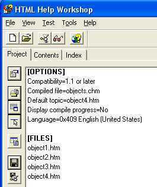
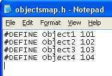
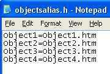
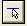
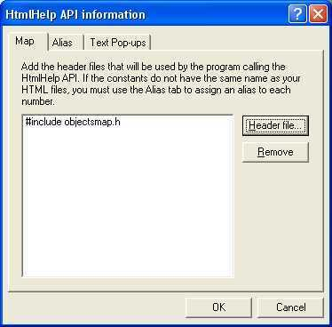
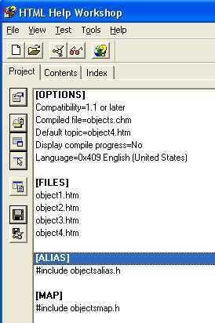
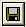
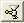

# Context-sensitive help

A sophisticated method of providing help is to make it context-sensitive. That is, instead of having the end-user browse through the help system to find the right topic, you can directly display the topic that corresponds to the object (window, field, or button, for example) that the end-user clicks on when requesting What's This? help, or when pressing the F1 key.

What's This? help is a Windows feature that typically provides a small popup window with a description of the object on which the What's This? help cursor has been dropped, or if the F1 key is pressed.

The topic in the popup window is displayed without opening the full help system, and must therefore be referenced by its map number, which is specified when building the help file containing the topic.

The same mechanism that provides What's This? help on fields and buttons, for example, can be used to provide help on entire windows, or dialogs.

## How to Make a HTML Help File Containing Context-Sensitive Topics

There are a number of tools available to provide assistance with building Compiled HTML Help (CHM) files. You should refer to the documentation provided with these tools for more information about how to use them. The following text describes how the HTML Help Workshop can be used to generate a CHM file suitable for displaying context sensitive help in USoft applications. HTML Help Workshop is available as a free download from the Microsoft Web site (search for HHW.EXE).

To make a help file containing context-sensitive help topics:

1. Using your favorite editor, make a HTML document containing the desired context-sensitive help for each object concerned. Each object will have its own HTML file. You will now have a set of HTML files, for example:

Object1.htmObject2.htmObject3.htmObject4.htm

2. Open HTML Help Workshop and from the File menu, choose New, followed by project to start the New Project Wizard.

3. Click Next to skip the step about converting WinHelp projects. Specify the name of the new project file, for example objects.hhp, and where you would like the file to be created, and click Next.

4. Check the HTML files checkbox, and click Next to include the HTML files that you made earlier in the project. Click Add to open a browse window so that you can find the HTML files. Click Next and Finish. The new project will now be created and opened in the Workshop

5. To make these help topics accessible from the USoft application, you must now provide mapping and alias information in the project. Using a text editor, create a map file and an alias file to be included in the compilation of the CHM file.

The map file, which we will call objectsmap.h, contains the following lines:

The alias file, which we will call objectsalias.h, contains the following lines:

6. In the HTML Help workshop, the map and alias files must now be included in the objects.hhp project file.

Click the following button on the project tab to open the HTMLHelp API information window.

On the Map tab, add the objectsmap.h file.

On the Alias tab, click the Include button, and add the objectsalias.h file. Click OK, and you will see that the files have been added to the overall project file.

7. Press the Save button to save your changes to the project file.

8. Press the following button to compile your new CHM file.

## How to call context-sensitive help from objects in your application

:::note

Use the Windows Designer to associate help topics with visible objects (controls) by specifying the map number for the topic, and the name of the help file from which to take it.

:::

- For fields, the best place to set these properties is the Base Table class of the tables involved. The fields will then have What's This? help irrespective of the type of window they appear in.
- For windows/dialog, set these properties at the window level.
- For buttons, set these properties at the individual button level (unless they are standard buttons that appear in many windows/dialogs, in which case you should specify them for the highest possible level button that has that kind of behavior.)

To call context-sensitive help from objects in your application:

1. Open the application in the Windows Designer, and find the objects that you wish to associate with help topics.

2. For each object, open the Property inspector and in the General properties section, set the following properties:

- Help File: Specify the name of the help file file; in this case Objects.chm. By default, the file is searched for in the working directory. If required, specify the path to your help file as well. For example:

**%SystemDir%\\help\\object.chm**

- Help Popup: Set to Yes (default).
- Help Topic ID: Specify the map number defined for this object in the objectsmap.h file. For example: 101 in the case of Object 1.

3. Save your changes.

Assuming that your new CHM file is in the location specified above, you can test that the help works by choosing Design, Run from the Windows Designer menu and clicking the F1 key for each of the objects for which help was specified.

## How to add a Help button

A Help button is a good candidate for turning into a separate class that you define once, and use often. For example, you may need a Help button on dialogs, where the What's This? help is not available.

To add a Help button:

1. In the Windows Designer, make a special "Help Button" class.

- Set its Label property to "Help".
- Set its Action property to:

**HelpRunWinhelp()**

- If all your Help buttons are to call the same help file, set the Help File property as well.

:::note

The help file identified by the Help File property can be either a WinHelp file (.HLP extension) or a Compiled HTML Help file (.CHM file extension).

:::

2. Open the class to which you want to add a Help button, and then drag and drop your newly created Help button onto it from the Class Catalog.

3. Select the newly inserted button, and set its Help Topic ID property to the appropriate map number for the specific help topic you wish to access..

If you did not specify the Help File property for the "Help Button" class, then specify it now for this particular instance.