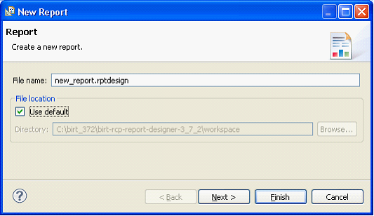
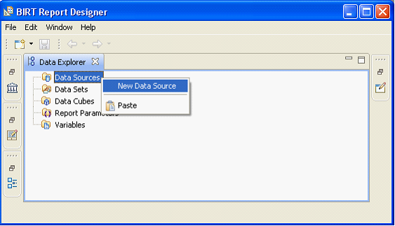
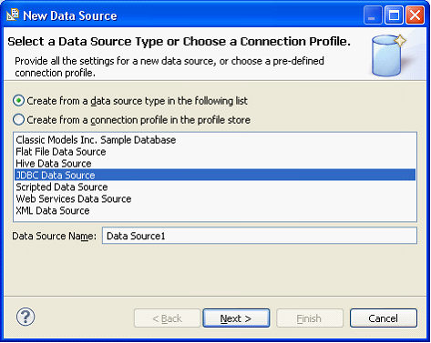
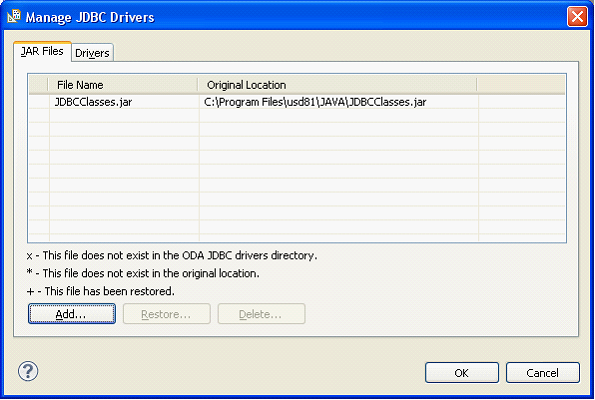
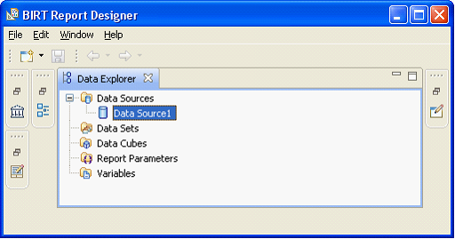

# BIRT Step 2: Create a BIRT report definition file

The report definition file contains all the information required to connect to the data source, to create a data set, and and to format the data in the data set. There are three steps associated with the creation of a report definition file:

- Create a data source – this step is described in this online help .
- Create a dataset
- Format the data of the dataset

:::note

Dataset creation and formatting are described in the BIRT Report Developer Guide

:::

**Creating a Data Source**

The data source must be specified in the report definition. The BIRT Report Designer must be made aware of the location of the USoft JDBCClasses.jar file. To do this, use the following procedure.

1. Start the BIRT Report Designer by executing birt.exe from the BIRT installation location, e.g. c:\\birt_372\\birt.exe.

2. Open an existing report file, or if this is the first time you have used the BIRT Report Designer, from the BIRT Report Designer’s File Menu, choose New, followed by New Report. The New Report dialog will be displayed.

3. Specify a filename and location for the new report file, or accept the defaults and press Next to specify the type of report, or Finish to directly create a new report file.

4. In the Report Designer, click on the Data Explorer tab, or choose Data Explorer from the Window, Show View menu option.

5. In the Data Explorer right click on the Data Sources item and choose new data source from the resulting menu.

6. The New Data Source dialog will be displayed. In this dialog, Choose JDBC Data Source, provide a Data Source name, or accept the default value, and click next.

7. The New JDBC Data Source profile dialog will be displayed.

8. Choose com.usoft.jrec.JrecDriver from the Driver Class drop down list. And provide a Database URL. This URL can be found on the last page of the Rules Service configuration utility, accessible from the USoft Binder.

If the com.usoft.jrec.JrecDriver class is not listed you must add the location of the USoft JDBCClasses. jar file to the list used by BIRT. To do this, press the Manage Drivers… button. The Manage JDBC Drivers dialog will then be displayed.

9. If JDBCClasses.jar is not listed in the Manage JDBC Drivers dialog, Press the Add button to browse for the file in question in the USoft JAVA folder. Then click OK. You will now be able to select com.usoft.jrec.JrecDriver as the JDBC Driver Class in the JDBC Data Source profile.

The new Data Source is now displayed in the list in the Data Explorer.

Continue with Step 3: Import and configure the BIRT off-the-shelf component.