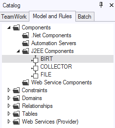
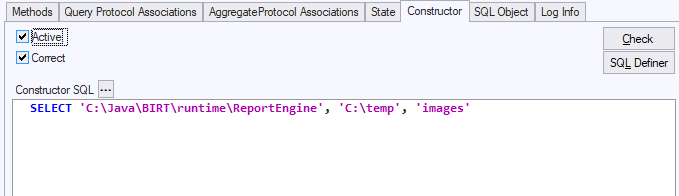

# BIRT Step 3: Import and configure the BIRT off-the-shelf component

To import and configure the BIRT off-the-shelf component:

1. In USoft Definer, choose Define, Teamwork, Object Shopping, Import Off The Shelf from the menu bar and import the BIRT component from GITHUB.

2. The BIRT component has now been added to the list of imported J2EE components in the catalog:



7. Double-click the BIRT item to open the component configuration screen.

8. Change the constructor of the BIRT component to:

```
SELECT ' c:\Java\BIRT\runtime\ReportEngine', 'C:\temp', 'images'
```



Where:

- c:\\Java\\BIRT\\runtime\\ReportEngine is the path to the BIRT Runtime ReportEngine folder. (Note that this make be different on your system, depending upon where you installed the BIRT software). This parameter is also used to find and load the external JAR files.
- C:\\temp is a folder that BIRT can use to store temporary files.
- images is the  image URL prefix. This is optional; this parameter allows you to alter the image source URL when creating HTML reports)

9. Commit your changes.

Continue with Step 4: Start the USoft Rules Service