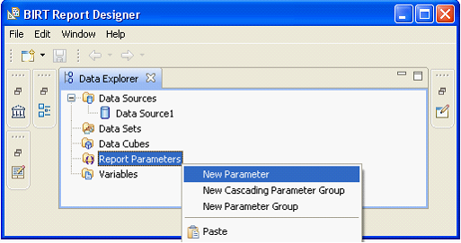
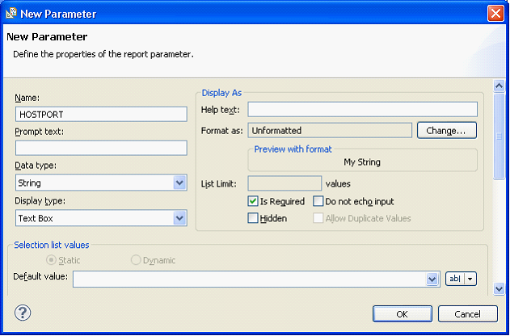
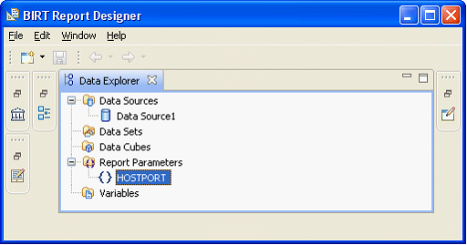
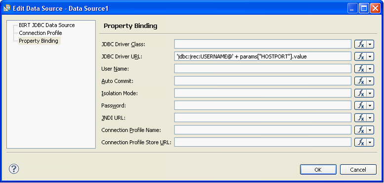

# BIRT Step 6: Parameterisation of the BIRT report definition

BIRT obtains  the data it requires data from USoft using the USoft Rules Service. The JDBC connection string to the USoft rules service contains a hostname and port number. To facilitate easy deployment of this report definition where multiple data sources are present, you can parameterize the definition to simplify configuration changes. You can create one report parameter that contains both  host name and port number variables. You can then use this parameter in the connection string of each data source that points to a USoft Rules Service. To do this follow the steps below:

1. In the BIRT Report Designer’s Data Explorer, right-click Report Parameters, and choose New Parameter from the resulting menu.



2. The New Parameter dialog appears. In the Name field of this dialog, type the name HOSTPORT and press OK.



Your BIRT design now contains a HOSTPORT Report Parameters item.



3. To use this new parameter in your data source connection string, double click the appropriate data source item in the list of Data Sources to open the Edit Data Source dialog, and select Property Binding from the list in the left-hand pane. The Property Binding screen appears.



4. Edit the contents of the JDBC Driver URL field so that it now contains:

```
jdbc:jrec:USERNAME@ + params[“HOSTPORT”].value
```

5. Press OK.

The command that you use in SQL Command to start the report generation using BIRT will now use the following Syntax

```sql
SELECT birt.generatepdf(
         '<path to report definition file>'
       , '<path to outputfile>'
       , 'HOSTPORT'
       ,'localhost:8888>')
```

or 

```sql
INVOKE   birt.generatepdf WITH 
SELECT   '<path to report definition file >'
,        '<path to outputfile>'
,        'HOSTPORT'
,        'localhost:8888>'
```

> [!NOTE]
> The actual command that you use depends upon Rules Service settings. The settings you need can be found on the last page of the Rules Service configuration tool, accessible from the USoft Binder.