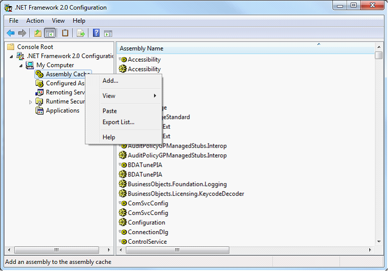
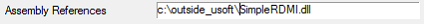

# C# component Example 3: External DLL

This example shows how you can call from your USoft application a method from a C# .NET class library that is made available by an external DLL.
1.    In USoft Definer, from the menu, choose Define, RDMI, dotNet Components, C# Components from the Define menu. The "C#t Components" window opens.
2.    Create a simple .NET C# component, by setting Name = MYCLASS and Program Code =

```language-cs
using System;
using System.Text;

class MYCLASS
{
     public static String SimpleClass(String instr)
     {
          return "ok" + instr;
     }
}
```

 

> [!NOTE]
> The Assembly References field should be left empty at this stage.

3. Press Commit. USoft compiles this code.

4. Press the Check button. The RDMI interface is generated by USoft. If there are already methods and parameters defined, you will be asked if you want to generate a new RDMI interface (the old methods and parameters will be overwritten) or if you just want to check the existing methods and parameters

5. In the Application, check the component using the following command in SQL Command:

```
invoke myclass.simplecall with select 'simple'
```

You should see the result:

```
ok: simple
```

## Creating an External Assembly (DLL)

1. Using, for example, Microsoft Visual Studio 2008 build a simple ‘SimpleRDMI’ project  using the following code:

> [!NOTE]
> In Microsoft Visual Studio 2008 you can do this using the following menu sequence File Menu, New Project, Visual C##-, Windows, Class Library.

```language-cs
using System;
using System.Text;
namespace SimpleRDMI
{
   public static class ExtClass
   {
      public static String Callme(String instr)
      {
         return "External call :" + instr;
      }
   }
}
```

3. Once this project is built copy the resulting SimpleRDMI.dll file to the \<USoftInstalldir>\\bin folder.

4.    Set Assembly References =
SimpleRDMI.dll

5.    In the component's Program Source, provide the identity of the namespace where the component was created, and call the external method in the DLL. Use the following code as an example:

```language-cs
using System;
using System.Text;
using SimpleRDMI;

class MYCLASS
{
     public static String SimpleCall(String instr)
     {
          return ExtClass.Callme(instr);
     }
}
```

6.    Press Commit.
7.    Press the Check button.
8.    In the Application, check the component using the following command in SQL Command:

```sql
INVOKE myclass.simplecall WITH SELECT 'simple'
```

You should see the result:

```
External call: :simple
```

## Calling the Assembly (DLL) from an alternative location

To make use of an assembly at a location other than the default \<usoftinstalldir>/bin folder, you can add it to the Global Assembly Cache (GAC).

1. Create a strong name for the assembly, using the Microsoft .NET Framework Strong Name Utility (sn.exe). For example:

```
C:\Program Files\Microsoft Visual Studio 8\SDK\v2.0\Bin\sn.exe" -k keyPair.snk
```

2. This newly created keyPair.snk file must now be referenced in the SimpleRDMI project Assembly information. In Visual Studio, add the following line to your AssemblyInfo.cs file:

```
[assembly: AssemblyKeyFileAttribute("c:\\outside_usoft\\SimpleRDMI\\keyPair.snk")]
```

3. Rebuild your project.

4. This newly created SimpleRDMI assembly must now be added to the Global Assembly Cache. From the Windows Control Panel, Select Administrative Tools, followed by .Net Framework \<version> Configuration,  My Computer, then Assembly Cache.

Right click on the Assembly Cache item, choose Add from the resulting menu, and add the name of the SimpleRDMI assembly. The illustration below shows the Windows 7 Control Panel.



5. In the DotNet Components window of the Definer, add  the name of the newly created SimpleRDMI.dll file to the ‘Assembly References’ field of the component created earlier.



6. Press Commit.

7. Press the Check button.

8. Make sure that the original SimpleRDMI.dll file has been removed file from \<usoftinstalldir>\\bin, and In the application, check that the component still works with the new assembly location by using the following command in SQL Command:

```
invoke myclass.simplecall with select 'simple'
```

You should see the result:

```
External call: :simple 
```