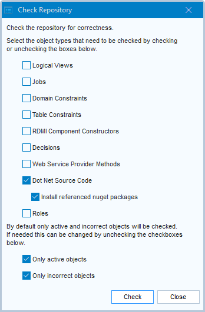

# Nugets

- [USoft as a Nuget client](#usoft-as-a-nuget-client)
- [Viewing installed nugets](#viewing-installed-nugets)
- [Installing an available nuget version](#installing-an-available-nuget-version)
- [Having a referenced nuget version installed automatically](#having-a-referenced-nuget-version-installed-automatically)
- [Deleting an installed nuget version](#deleting-an-installed-nuget-version)
- [Delivering a nuget version as part of your USoft application](#delivering-a-nuget-version-as-part-of-your-usoft-application)

## USoft as a Nuget client

Nuget, also NuGet, is the package manager for .NET. It allows developers to create, share and consume .NET libraries. Also, by extension, “a nuget” (as a countable noun) is one such .NET library.

USoft Definer is able to act as a Nuget client. You can install nugets in USoft Definer and then use them in RDMI C# components of your USoft solution.

USoft installs certain nugets automatically as part of the USoft setup. In addition, a “Find Nuget” tool allows you to install other available nugets.

To browse available nugets, go to [https://www.nuget.org](https://www.nuget.org).

The "Find Nuget” tool visits [https://api.nuget.org/v3/index.json](https://api.nuget.org/v3/index.json).

### Nuget compatibility with .NET framework versions

A nuget version you want to use must be compatible with the .NET framework version that your USoft solution uses. On Windows, USoft 10.1 uses the highest available .NET 4.x version. On Linux, USoft 10.1 uses the .NET 6.0 version.

Each nuget version advertises its compatibility with .NET framework versions. If you use a nuget in an RDMI C# component, and you have installed multiple nuget versions, USoft will automatically select the highest compatible nuget version, unless you specify an exact nuget version in the RDMI code as an assembly reference.

USoft-generated C# components such as XSL Stylesheets components handle assembly referencing automatically.

Many nuget versions carry with them the compatibility for multiple .NET versions. You can view .NET compatibilty for a nuget version in the extended “Find Nuget” view as explained in the next section. At file system level, different .NET versions are visible as subfolders of the **\\lib** subfolder of the nuget version folder, for example, *usoft-installation-folder*\\dotnet.packages\\JWT\\8.9.0\\lib\\net6.0.

In general, if you want to manage .NET versions explicitly, some knowledge of .NET framework versioning and subversioning comes in handy. Certain nugets are compatible only with the netstandard2.0 subversion, but netstandard2.0 is available in both .NET 4.8 and .NET 6.0.

## Viewing installed nugets

In USoft Definer, to view installed nugets:

1. Double-click the C# Components node in the Model and Rules catalog:	 	
2. 
3. 
4. 

## Installing an available nuget version

To install an available nuget version:

1. Open the Nugets window by following the 2 steps in the previous section.
2. Click the Find Nugets tab. Follow the instructions to search for nugets you are interested in.
3. When you have found the nuget you want to install, click on its Name, then in the Nuget Versions related box, right-click the nuget version you require and choose from the context menu.

> [!TIP]
> Installed nuget versions are listed in the “Find Nuget” tool but they are not declared as C# components in their own right. They are not visible in the Model and Rules, Components catalog. The fact that a component uses a nuget (version) is only visible in the component's source code as an assembly reference.

## Having a referenced nuget version installed automatically

You have referenced a nuget package in the [Assembly References]() field of your component.

To have this nuget package installed automatically:

1. Make sure the reference to the package in the Assembly References field is correct.
2. Choose Tools, Check Repository from the Definer menu.
3. Make sure the "Dot Net Source Code” box is checked, and that the "Install referenced nuget packages” is checked:

4. 

## Deleting an installed nuget version

To delete an installed nuget version:

1. Open the Nugets window by following the 2 steps in the "Viewing...” section above.
2. if you can see the nuget version you want to delete in the Installed Nugets tab, right-click that nuget version and choose .
3. Otherwise, if you need help finding the nuget version you want to delete, click the Find Nugets tab. Follow the instructions to find the nuget version you want to delete. When you have found the nuget version you want to delete, click on its Name, then in the Nuget Versions related box, right-click the version number you require and choose from the context menu.

After de-installation, at file system level, you may want to delete the corresponding folder from the dotnet.packages subfolder.

## Delivering a nuget version as part of your USoft application

To deliver a nuget version to a Production environment where you do not run USoft Definer:

1. Open the Nugets window by following the 2 steps in the "Viewing...” section above.
2. If you can see the nuget you want to deliver in the Installed Nugets tab, right-click that nuget version and choose .
3. Otherwise, if you need help finding the nuget version you want to deliver, click the Find Nugets tab. Follow the instructions to find the nuget version you want to deliver. When you have found the nuget version you want to deliver, click on its Name, then in the Nuget Versions related box, right-click the version number you require and choose from the context menu.

This gives you a [USoft Blend](/docs/Repositories/Blend_scripts_for_repository_management) snippet that you can either paste-to-clipboard or save as a file. You can deliver the nuget version to Production by including this snippet in your release deliverables. A most convenient way to do this is by releasing through [USoft Delivery Manager](/docs/Continuous_delivery) and declaring the script as a [deploy script](/docs/Continuous_delivery/Blend_deploy_scripts/Blend_deploy_scripts.md).

 