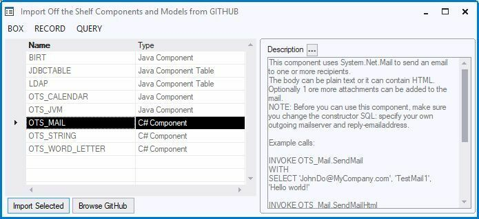

# Importing off-the-shelf components and models

Off-the-shelf components and models are ready-made, downloadable components and models that can be used and changed at will. They provide useful components to perform various tasks, demos to show and explain functionality, and small models which can be used as starting point or can be added to an existing repository.

To use them, all you need to do is to import their definitions into your USoft repository.

### How to import

To import an off-the-shelf component or model from GITHUB into your repository:

1. In USoft Definer, choose Define, Teamwork, Object Shopping, Import Off The Shelf from the menu bar.

The "Import Off the Shelf Components and Models from GITHUB" dialog opens. The dialog shows all components and models which are available in the GITHUB. Each entry has a Type (for example 'C# component', 'Demo', 'Model') and an extended description of what it does.

2. Select the component or model you want to import by clicking on the left-hand border of the grid control. The selected row is highlighted in black:



3. Press the 'Import Selected' button to import the component into your repository.

### GITHUB

All off-the-shelf components and models are located in a publicly available GITHUB location:

```
https://github.com/USoftRD/OffTheShelfs
```

In order to connect to GITHUB from USoft Definer, GIT for windows needs to be installed. GIT for windows can be downloaded from: https://gitforwindows.org.  

More detailed information about GITHUB can be found on the Wiki-Pages of GITHUB:

```
https://github.com/USoftRD/OffTheShelfs/wiki
```

The wiki pages also describe how you can contribute yourself and add your own components and/or models to GITHUB.

### Terms of use

Off-the-shelf components and models are delivered on an "as is" basis: the impact of their use in applications, e.g. the need for managing versions and making patches, is not part of standard maintenance agreements.