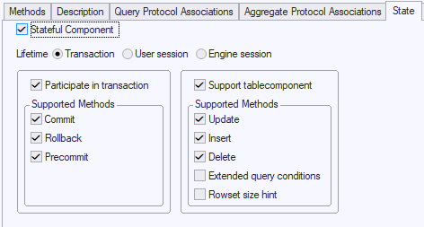

# Component state

On a component's State tab, you can determine when the component is constructed and when it is destroyed. You can also set what functionality it supports:

## Stateful Component, Lifetime

RDMI components can be stateless or stateful. This is determined by Stateful Component (Y/N).

A stateless component does not have a setting for Lifetime.

A stateful component has a Lifetime setting. This setting is either Transaction, User session, or Engine session.

:::warning

In place of the “User session” and “Engine session” options, USoft 9.x had a single option Lifetime = Session, with the meaning of the current “Engine session” option.

:::

### When is a component constructed and when is it destroyed?

When a Rules Engine invokes a method of a **stateless** component, it checks if a constructor method exists and if so, calls that constructor method. If the constructor method has parameters, these are supplied by the constructor SQL. Then the invoked method is called. The component is destroyed as soon as this method finishes executing.

When a Rules Engine invokes a method of a stateful component with Lifetime = **Transaction**, it checks if the component is already instantiated (that is, if an instance of the component has been created). If not, it calls the constructor method. If the constructor has parameters, these are supplied by the constructor SQL. Finally, the invoked method is called. The component is destroyed at the end of the transaction, ie., when a commit or rollback is issued.

When a Rules Engine invokes a method of a stateful component with Lifetime = **User session**, it checks if the component is already instantiated (that is, if an instance of the component has been created). If not, it calls the constructor method. If the constructor has parameters, these are supplied by the constructor SQL. Then the invoked method is called. The component is destroyed when the caller disconnects from the Rules Engine. When running client/server or runbatch, this occurs when the application is closed. When running a Rules Service, this occurs when the caller ends his connection to the Rules Service.

When a Rules Engine invokes a method of a component with Lifetime = **Engine session**, it checks if the component is already instantiated (that is, if an instance of the component has been created). If not, it calls the constructor method. If the constructor has parameters, these are supplied by the constructor SQL. Then the invoked method is called. The component is destroyed when the Rules Engine shuts down. This occurs when the client/server, runbatch, or Rules Service process shuts down.

:::note

This means there is a difference between Lifetime = "User session” and Lifetime = "Engine session” only when you run a Rules Service.

:::

### Advantage and disadvantage of statefulness

Stateful components have the *advantage* that time-consuming operations that need to be performed *only once* can be executed once by the constructor, and that the result of their execution remains available for multiple subsequent method calls within in the same Transaction, User session, or Engine session (depending on the Lifetime setting).

The *disadvantage* of prolonging the lifetime of a component is that settings may persist when this is not intended, and wrongly used in subsequent processing. This can be risky when running a Rules Service with Lifetime = “Engine session”: component settings made by one user can become visible to another user if that other user is assigned the Rules Engine assigned previously to the first user.

- USoft advises to set Lifetime = “Engine session” if only client/server and/or runbatch processing is used.

- USoft advises to set Lifetime = "User session”, wherever possible, if Rules Service processing is (also) used. Use Lifetime = “Engine session” only if the constructor is time-consuming and you can be sure that no settings persist that could affect another user unintentionally.

## Participate in transaction

When a component participates in a transaction, the Rules Engine calls the Commit, Rollback and Precommit methods of the component if you have specified on the State tab that the method is supported.

When the Rules Engine performs a commit, the Rules Engine first calls the PreCommit method for each transaction component involved. If all PreCommit calls are successful, the Rules Engine commits all transaction components.

When the Rules Engine performs a rollback, it calls the Rollback method of all transaction components.

|        |        |
|--------|--------|
|PreCommit|This method checks whether changes made by the InsertRow, UpdateRow, or DeleteRow method are correct. It must return 1 for OK, and 0 or –1 for fail. If –1 is returned, the transaction is rolled back.|
|Commit  |Has no input, output or return parameters. When called, this method permanently stores all data that has been changed by the InsertRow, UpdateRow, and DeleteRow methods.|
|Rollback|Has no input, output or return parameters. When called the method undoes all changes made by the InsertRow, UpdateRow, and DeleteRow methods.|

If the PreCommit method of a transaction component returns 0, the Rules Engine does NOT commit, and does NOT rollback. Also, the Rules Engine does NOT issue an error message.

As writer of the transaction component code, you need to provide these error messages.

If the PreCommit method of a transaction component returns –1, the Rules Engine performs a rollback, and provides the corresponding message for a rollback.

It is also possible to raise an exception from the PreCommit method. As part of this exception, you can provide a message. This message will then be displayed within a USoft environment, and a rollback will be performed. You can translate these messages by using Application Strings.

## Support table component

Check this box if the component serves as a basis for a component table. Such a component must be stateful.