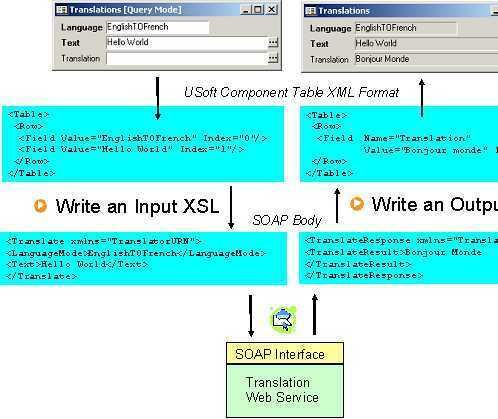

# Using XSL transformations for web service component tables

When performing a query on a component table that represents a web service method, the following steps are executed:

1. Query parameters are provided by the user as values in the WHERE clause of a SELECT statement.

The syntax of a query on a component table is:

```
SELECT   *column-1*[,...*column-n*]
FROM     *web-service-component-table* 
WHERE    *column* = *value* AND ...
```

2. USoft translates these parameters into the USoft component table XML format.

3. Next, USoft performs an XSL transformation to translate this USoft component table XML format into the XML format that the web service requires. You have to define the XSL transformation used for this action.

> [!NOTE]
> You can define this XSL transformation in the Input XSL field in the last page of the New Web Service Component Wizard. This can be an URL, a location on the disk, or just a plain XSL string.

4. Next, USoft calls the web service using the XML produced by the XSL transformation.

5. USoft again performs an XSL transformation to translate the output XML document into the USoft component table XML format. You have to define the XSL transformation used for this action. You can define this XSL transformation in the Output XSL field in the last page of the New Web Service Component Wizard. This can be an URL, a location on the disk, or just a plain XSL string.

6. USoft automatically transforms this USoft component table XML document into a record set that is returned to you as result of the SELECT statement.

 

> [!NOTE]
> If you have simple type input parameters for an RPC-oriented method, then you do not need the Input XSL and steps 2) and 3) are skipped.

> [!NOTE]
> If you do not want to transform the input and no input XSL is provided, then steps 2) and 3) are skipped.

 

*Example*

Suppose an external (non-USoft) Translation web service provides a Translate method that translates a text from one language to another language by using a LanguageMode parameter, for example: EnglishTOFrench.

Once you have defined a web service component table that represents the Translate (query) method of this web service, the following diagram shows the process described above.

In the example, the text "Hello World" is translated from English to French.

The important thing is that you must define the Input and Output XSL transformations, the other steps are carried out by USoft.



 

 