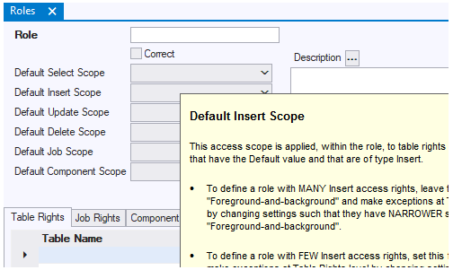
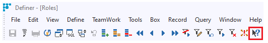
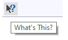
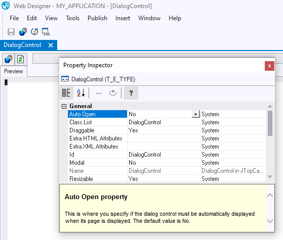
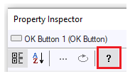

# Welcome to USoft Knowledge Base

Do you want to expand your own knowledge and skills of USoft in a structured, effective way?

Are you looking for the best way to train people who join a USoft project team?

Do you want identify or assess USoft knowledge and skills in yourself or others?

This page is the good place to start! It tells you about :

- [Product information](#Product+information)
- [Tutorials and courseware](#Tutorials+and+courseware)

## Product information

USoft supplies standard documentation with all its products.

### Knowledge Base

At community.usoft.com, the Knowledge Base section features explanations, tutorials, and how-to instructions. In many sections of community.usoft.com, within and outside the Knowledge Base, you will find additional resources and contributions by people within USoft and external to USoft.

### In-product Fields Help

Some USoft applications (USoft Definer, USoft Authorizer...) offer in-product Fields Help. This is instant information on the meaning of a field that you have currently in your screen.

Fields Help for "Default Insert Scope” in the Roles window (USoft Definer)To get in-product Fields Help:

1. Locate the "What's This” button on the icon ribbon just below the menu:

2. Click on the "What's This” button:

Your mouse pointer changes into a pointer with a question mark.

3. Move this mouse pointer to the field that you want assistance on, then single-click on the field.

###  

### In-product Property Help

The USoft UI tools (USoft Web Designer, USoft Windows Designer) offer in-product Property Help for each property of each control. This is instant information on the meaning of a property that you have currently selected in your Property Inspector.

Property Help text appears in a pane with a yellow background at the bottom of the Property Inspector :

Property Help for the Auto Open property of a DialogControl in Web DesignerTo get in-product Property Help:

1. On the control class that has the property, right-mouse-click and choose Property Inspector. The Property Inspector opens.

2. Select the property you want assistance on. The property name is now highlighted by a dark blue colour (see the "Auto Open” property selected in the picture).

3. Locate the Show Help button on the icon ribbon at the top of the Property Inspector:

 

Show Help button in Property Inspector4. You can toggle this button on and off to display or hide the Property Help text.

###  

### Studio Help

USoft Studio is a stand-alone web site with its own PDF and on-screen help. Click the Help link in the top right corner, or browse the Help pane in the Home screen, or click on question mark icons in more specific areas.

## Tutorials and courseware

USoft supplies tutorials and courseware for learning how to put the USoft platform to best advantage.

### Tutorials in Knowledge Base

At community.usoft.com, where you are now, most sections of the Knowledge Base are **tutorials.** Some are reference sections: this is marked by a blue "REF.GUIDE” tag. The Knowledge Base is the part of USoft Community that is curated by the USoft R&D team.

> [!TIP]
> Many colleagues never access Community in any other way than via the Search bar. They use Knowledge Base like they use Wikipedia.
> This is absolutely fine, but when you are learning, to get a sense of overview, it can also be nice to drill down into the carefully named and sequenced chapters and sub-chapters of Knowledge Base. In Community Home, press the **USoft Knowledge Base** tile, or.

### Courseware exercises and solutions

USoft maintains and sells **courseware** modules that map 1:1 to the different Knowledge Base sections. Courseware is different from Knowledge Base tutorials in that it adds

- **Slide decks** for presentation,
- actual **example software** called “demoapps” that you can install, run, and develop further to try out. The “demoapp” examples are Travel Agency (a tour operator) and EU-Rent (a car rental company).
- hands-on **exercises** and solutions tested against these demoapps.

Courseware is ideal for training in a classroom setting, but also suitable for online teaching and for self-study.

Please contact your USoft representative or USoft Support for information on how to obtain and use courseware.

**See also**