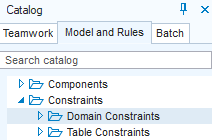
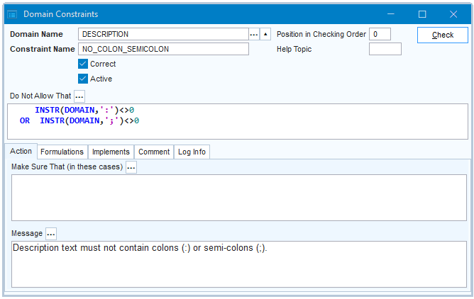
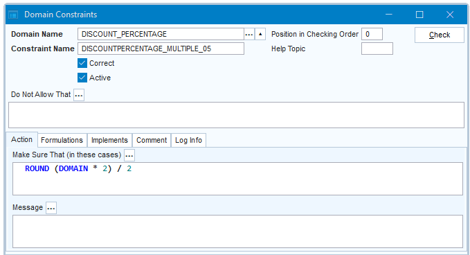

# Domain constraints

A **domain constraint** is a restriction (a form of data integrity) that applies to column values of a given type. It is expressed in one or more SQL fragments.

For example, a domain constraint could enforce that no colon (:) or semicolon (;) characters are used in description texts of a specific type, giving an error message if a user attempts to use these characters:

```sql
    INSTR(DOMAIN,':')<>0
OR  INSTR(DOMAIN,';')<>0
```

Another domain constraint could automatically round all values of a specific type to multiples of 0,5, without giving any error message:

```sql
ROUND(DOMAIN*2)/2
```

A domain constraint belongs to a specific **domain**. The restriction is enforced for all the data values stored in all the columns based on that domain.

> [!NOTE]
> Use a [domain attribute](/docs/Modeller_and_Rules_Engine/Domains) if your restriction is in one of these categories. In these cases you don't need to write a domain constraint:

### Restrictive domain constraints

A *restrictive* domain constraint checks for each value produced by the user or the application if it is allowed. If it is not allowed, processing is blocked and the domain constraint gives an error message.

*Examples*

"A description text must not contain colon (:) or semicolon (;) characters.”

"A person's first name must be entered with an initial capital letter followed by lowercase-only."

> [!TIP]
> The first example is best considered as restrictive. You want the message to communicate the rule to the user, so that he or she can decide what to replace the forbidden characters by (perhaps another interpunction character such as a comma).
> The second example is perhaps better considered as productive (next section), because the rule fully dictates what the target value must be. It is more user-friendly to produce it automatically for the user than to complain about it.

### Productive domain constraints

A *productive* domain constraint automatically performs some operation on each value that a user submits for a column based on the domain. This way, the domain constraint guarantees that all the resulting values are allowed values.

A productive domain constraint typically operates in silence: it does not give a message.

*Examples*

"Discount percentages must be rounded to a multiple of 0.5”.

"A person's first name must be entered with an initial capital letter followed by lowercase-only."

If you implement the second example by a productive domain constraint, the constraint will automatically capitalise the first letter if it was not already a capital letter, and it will automatically change the remaining characters to lowercase if they were capital letters.

### How to write a restrictive domain constraint

To write a restrictive domain constraint:

1. In the left-hand catalog, on the Model and Rules tab, find the Constraints, **Domain Constraints** node.

2. Double-click this node, or right-click and choose New Domain Constraint. Alternatively, you can choose Define, Constraints, Domain from the main menu.



The Domain Constraints window is opened.

3. In the Domain Name field, identify the domain that the constraint is for. At runtime, the constraint will be active when any value in any column based on this domain is entered or changed.

4. In the Constraint Name field, enter any unique name.

5. In the **Do Not Allow That** field, write a SQL condition expressing what is not allowed, using the DOMAIN keyword as a placeholder for the runtime input value. For example, to block any use of colons (:) and semi-colons (;), write:

```sql
    INSTR(DOMAIN,':')<>0
OR  INSTR(DOMAIN,';')<>0
```

6. In the Message field, write an explanatory message to the end user that will be displayed when she attempts to enter a value that is blocked by the constraint.

Now **have the constraint checked**. This step is essential. See "Having the constraint checked” later in this article.



### How to write a productive domain constraint

To write a productive domain constraint:

1. In the left-hand catalog, on the Model and Rules tab, find the Constraints, **Domain Constraints** node.

2. Double-click this node, or right-click and choose New Domain Constraint. Alternatively, you can choose Define, Constraints, Domain from the main menu.


The Domain Constraints window is opened.

3. In the Domain Name field, identify the domain that the constraint is for. At runtime, the constraint will be active when any value in any column based on this domain is entered or changed.

4. In the Constraint Name field, enter any unique name.

5. In the **Make Sure That** field, write a SQL expression that indicates what the input value must be replaced by, using the DOMAIN keyword as a placeholder for the runtime input value. For example, to make sure that any value is rounded to a multiple of 0.5, write:

```
ROUND(DOMAIN*2)/2
```

You can optionally combine this with a SQL condition in the Do Not Allow That field. If you do that, values that meet the Do Not Allow That condition will be subjected to the Make Sure That correction.

You typically leave the Message field empty, but if you supply a Message, it is displayed as a Warning (not: an Error) message each time the constraint replaces an input value by the corrected value.

Now **have the constraint checked**. This step is essential. See "Having the constraint checked” later in this article.



### Having the constraint checked

1. Click the Check button.

If the domain constraint is correct, the checker will set the Correct = Yes flag.

If the constraint is not correct, a message is shown with an asterisk (*) at the position of the syntax error. Review your SQL and then press Check again, until the constraint is correct.

> [!CAUTION]
> This step is essential. Your constraint will NOT have an effect as long as Correct = No. When you create a .CON flatfile you are warned about the existence of incorrect constraints, but when you run from repository, as you are likely to do in Development, this behaviour can be confusing.

2. Click Save to save work.

> [!TIP]
> You can switch constraints off by setting Active  = No. This can be practical for quick testing and debugging. Try not to release any inactive constraints. Even in Development, keep inactive constraints in Development to a minimum: switch them back on as soon as possible.
> In summary, best practice is for all your constraints to have both Correct = Yes and Active = Yes.