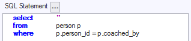
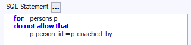
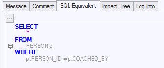

# USoft Rule Language

## Introduction

For constraint SQL, USoft offers an alternative to SQL that is easier for non-technical people to read.

This alternative is referred to as the **USoft Rule Language.** Its main purpose is to demonstrate the conceptual logic of USoft constraints and the USoft Rules Engine in contexts such as introductory events and Sales demos. You may also find the USoft Rule Language helpful in a learning context.

The USoft Rule Language is not available in other contexts than constraint SQL.


:::warning

For this reason, the USoft Rules Language is not normally a good choice for professional applications. Developers cannot cut-and-paste constraint SQL to other contexts that expect SQL. Use [SQL syntax](/Modeller_and_Rules_Engine/SQL_syntax) instead.

:::

When writing table constraints, you can choose between expressing the business logic in SQL syntax or in USoft Rule Language syntax. Both are entered in the same way and in the same place, on the Statement tab or edit area of the (Table) Constraints tab or Info Window. Both are treated similarly by the constraint checker. The result of the check is displayed as SQL on the read-only SQL Equivalent tab of the (Table) Constraints window. This is the code that is actually executed by the Rules Engine.

Here is a constraint example using standard SQL Syntax



Here is the same business logic expressed in USoft Rule Language Syntax:



Both result in the same SQL Equivalent after you press the Check button:



The SQL Equivalents tab is useful because:

- When constraints have been expressed in USoft Rule Language rather than SQL, developers must still be able to cut and paste the SQL equivalent to, for example:

- SQL Command windows to check for violating records in the runtime application.
- Production scripts, e.g. for upgrading an existing production database so that it complies with a new UPDATE constraint.
- A batch definition context if they decide that existing constraint logic should now be treated asynchronously.

- For advanced users who study USoft constraint handling, inspect Benchmark profiles, etc. the SQL equivalent is essential for a clear understanding of the USoft  algorithm

Developers of existing applications can continue writing SQL if they wish, and never use the USoft Rule Language syntax. It is also possible to write a mix of USoft Rule Language statements and SQL statements within one application.

## USoft Rule Language by construct

### Simple Restrictive Constraint

*Example 1*

**USoft Rule Language**

```
FOR drivers
DO NOT ALLOW THAT  age < 23
```

**SQL Equivalent**

```sql
SELECT   ''
FROM     driver
WHERE    age < 23
```

### Simple Productive Constraint

*Example 2*

**USoft Rule Language**

```
FOR drivers
MAKE SURE THAT   status = 'Accredited'
WHERE            age > 23
OR               license_date > sysdate  -  (3 * 365)
```

**SQL Equivalent**

```sql
UPDATE   driver
SET      status = 'Accredited'
WHERE    age > 23
OR       license_date > sysdate - (3 * 365) 
```

### Subquery

*Example 3*

**USoft Rule Language**

```
FOR drivers d
DO NOT ALLOW THAT EXISTS
(
   SELECT      ''
   FROM        contract c
   ,           business_party b
   RELATE      b "PAYS FOR" c
   WHERE       b.id = d.id
   AND         c.paid = 'N'
)
```

**SQL Equivalent**

```sql
SELECT         ''
FROM           driver d
WHERE EXISTS
(
   SELECT      ''
   FROM        contract c
   ,           business_party b
   RELATE      b "PAYS FOR" c
   WHERE       b.id = d.id
   AND         c.paid = 'N'
)
```

### Join

*Example 4*

**USoft Rule Language**

```
FOR               drivers d
,                 contracts c
,                 "Business Parties" b
CONNECTED AS      b "PAYS FOR" c
DO NOT ALLOW THAT b.id = d.id
AND               c.paid = 'N'
```

**SQL Equivalent**

```sql
SELECT    ''
FROM      driver d
,         contract c
,         business_party b
RELATE    b "PAYS FOR" c
WHERE     b.id = d.id
AND       c.paid = 'N'
```

### Insert statement

*Example 5*

**USoft Rule Language**

```
FOR            participants
(
               reservation_id
,              person_id
)
ADD WHERE NOT EXISTS
SELECT         r.reservation_id
,              p.person_id
FROM           reservation r
,              person p
WHERE          <condition>
```

**SQL Equivalent**

```sql
INSERT INTO participant
(
             reservation_id
,            person_id
)
SELECT
             r.reservation_id
,            p.person_id
FROM         reservation r
,            person p
WHERE NOT EXISTS
(
        SELECT       ''
        FROM         participant pt
        WHERE        pt.res_id = r.res_id
        AND          pt.person_id = p.person_id
)
AND    <condition> 
```

### Update statement

*Example 6*

**USoft Rule Language**

```
FOR              drivers
MAKE SURE THAT   status = 'Accredited'
WHERE            age > 23
```

**SQL Equivalent**

```sql
UPDATE      driver
SET         status = 'Accredited'
WHERE       age > 23
```

### Delete statement

*Example 7*

**USoft Rule Language**

```
REMOVE ALL      drivers
FOR WHICH       age < 23
```

**SQL Equivalent**

```sql
DELETE FROM    driver
WHERE          age < 23
```

## USoft Rule Language by keyword

This section covers the same ground as the previous sections, but this time in a "Reference Guide” style: more completely, and in an alphabetical list.

### ADD

ADD clauses in the USoft Rule Language serve to identify data queried for insert into a table. The equivalent of the SQL INSERT clause is introduced by FOR. ADD clauses are only used in constraint SQL that (potentially) INSERTs data.


:::tip

ADD clauses in the USoft Rule Language serve to identify data queried for insert into a table. The equivalent of the SQL INSERT clause is introduced by FOR.

:::
ADD clauses are only used in constraint SQL that (potentially) INSERTs data.
NOTE: The construct with ADD WHERE NOT EXISTS is much more compact than its SQL Equivalent, because it implies the WHERE condition and subquery that check that the record to be inserted does not already exist.
The disadvantage of ADD WHERE NOT EXISTS is that it will only let you write INSERT statements that perform this check. This is a slight disadvantage, since the vast majority of INSERT constraints require this check.

*Example 8*

**USoft Rule Language**

```sql
FOR            participants
(
               reservation_id
,              person_id
)
ADD WHERE NOT EXISTS
SELECT         r.reservation_id
,              p.person_id
FROM           reservation r
,              person p
WHERE          (condition)
```

**SQL Equivalent**

```sql
INSERT INTO participant
(
             reservation_id
,            person_id
)
SELECT
             r.reservation_id
,            p.person_id
FROM         reservation r
,            person p
WHERE NOT EXISTS
(
        SELECT       ''
        FROM         participant pt
        WHERE        pt.res_id = r.res_id
        AND          pt.person_id = p.person_id
)
AND     (condition)
```

### CONNECTED AS

CONNECTED AS clauses in the USoft Rule Language serve to identify a USoft relationship (as declared in USoft Definer) that defines how data from multiple tables are to be joined.
CONNECTED AS in a USoft context is a synonym of RELATE. Because RELATE, in turn, is equivalent to conventional WHERE clauses that spell out how the parent column(s) correspond(s) to the child column(s), CONNECT AS is also a synonym of these conventional WHERE clauses.

*Syntax*

```
CONNECTED AS   *table-alias-1 single-string-parent-role  table-alias-2*
```

where the required and all-capitals *single-string-parent-role* is the same or similar to the (all-capitals) Parent Role value for the relationship as defined in USoft Definer:

- If the Parent Role value does NOT contain a space, it is equivalent to *single-string-parent-role*, whether surrounded by optional double quotes or not;
- If the Parent Role value DOES contain one or more spaces, you must surround *single-string-parent-role* by double quotes.

For example, if you have a relationship "Customer PAYS FOR Rental" with Parent Role = PAYS FOR, and you use table alias "c" for customer and "r" for rental, the CONNECTED AS looks like this:

```sql
CONNECTED AS   c "PAYS FOR" r
```

*Example 9*

**USoft Rule Language**

```sql
FOR                drivers d
,                  rentals r
,                  "business parties" b
CONNECTED AS       d "REGISTERED IN" r
,                  b "PAYS FOR" r
DO NOT ALLOW THAT  b.id = d.id
AND                r.paid = 'N'
```

**USoft SQL Equivalent**

```sql
SELECT       ''
FROM         driver d
,            rental r
,            business_party b
RELATE       d "REGISTERED IN" r
,            b "PAYS FOR" r
WHERE        b.id = d.id
AND          c.paid = 'N'
```

**Conventional SQL Equivalent**

```sql
SELECT       ''
FROM         driver d
,            rental r
,            business_party b
WHERE        d.id = r.driver_id
AND          b.id = r.customer_id
AND          b.id = d.id
AND          c.paid = 'N'
```

### DO NOT ALLOW THAT

In the USoft Rule Language, DO NOT ALLOW THAT corresponds:

- In FOR ... DO NOT ALLOW THAT, to the first SQL WHERE clause. See Examples 10-13.
- In GROUPED BY ... DO NOT ALLOW THAT, to the SQL HAVING clause. See Example 14.

*Example 10*

**USoft Rule Language**

```sql
FOR drivers
DO NOT ALLOW THAT  age < 23
```

**USoft SQL Equivalent**

```sql
SELECT   ''
FROM     driver
WHERE    age < 23
```

*Example 11*

**USoft Rule Language**

```sql
FOR drivers d
DO NOT ALLOW THAT EXISTS
(
   SELECT      ''
   FROM        contract c
   ,           business_party b
   RELATE      b "PAYS FOR" c
   WHERE       b.id = d.id
   AND         c.paid = 'N'
)
```

**USoft SQL Equivalent**

```sql
SELECT         ''
FROM           driver d
WHERE EXISTS
(
   SELECT      ''
   FROM        contract c
   ,           business_party b
   RELATE      b "PAYS FOR" c
   WHERE       b.id = d.id
   AND         c.paid = 'N'
)
```

*Example 12*

**USoft Rule Language**

```sql
FOR drivers d
DO NOT ALLOW THAT 3 <
(
   SELECT      count(*)
   FROM        contract c
   ,           business_party b
   RELATE      b "PAYS FOR" c
   WHERE       b.id = d.id
   AND         c.paid = 'N'
)
```

**USoft SQL Equivalent**

```sql
SELECT         ''
FROM           driver d
WHERE 3 <
(
   SELECT      count(*)
   FROM        contract c
   ,           business_party b
   RELATE      b "PAYS FOR" c
   WHERE       b.id = d.id
   AND         c.paid = 'N'
)
```

*Example 13*

**USoft Rule Language**

```sql
FOR drivers d
DO NOT ALLOW THAT d.age <
(
   SELECT      a.minimum_age
   FROM        application a
)
```

**USoft SQL Equivalent**

```sql
SELECT         ''
FROM           driver d
WHERE d.age <
(
   SELECT      a.minimum_age
   FROM        application a
)
```

*Example 14*

**USoft Rule Language**

```sql
FOR                customers cust
,                  car       car
CONNECTED AS       cust "USES" car
GROUPED BY         customers cust
,                  car       car
DO NOT ALLOW THAT  COUNT(*) > 1
```

**USoft SQL Equivalent**

```sql
SELECT    cust.type
,         car.type
FROM      customer cust
,         car      car
RELATE    cust "USES" car
GROUP BY  cust.type
,         car.type
HAVING    count(*) > 1
```

### FOR

FOR clauses in the USoft Rule Language serve to identify the table being queried from, or the table being manipulated.


:::danger

Do not confuse with FOR WHICH.

:::

*Syntax*

```
FOR   *single-string-object-name-plural   table-alias*
```

where the required and case-insensitive *single-string-object-name-plural* is the same or similar to the Object Name Plural value for the table as defined in USoft Definer:

- If the Object Name Plural value does NOT contain a space, it is equivalent to the Object Name Plural value, whether surrounded by optional double quotes or not.
- If the Object Name Plural DOES contain one or more spaces, you must surround *single-string-object-name-plural* by double quotes.

For example, if you have a table BANK_ACCOUNT with Object Name Plural = Bank Accounts, the *single-string-object-name-plural* is:

```
"Bank Accounts"
```

and the following are legal variants:

```
"bank accounts"
"BANK ACCOUNTS"
```

*Example 15*

This example shows that the USoft Rule Language FOR clause in a FOR ... DO NOT ALLOW THAT construct corresponds to the SQL FROM clause of a SELECT statement:

**USoft Rule Language**

```sql
FOR drivers
DO NOT ALLOW THAT age < 23
```

**USoft SQL Equivalent**

```sql
SELECT   ''
FROM     driver
WHERE    age < 23
```

*Example 16*

**USoft Rule Language**

```sql
FOR drivers d
DO NOT ALLOW THAT EXISTS
(
   SELECT      ''
   FROM        contract c
   ,           business_party b
   RELATE      b "PAYS FOR" c
   WHERE       b.id = d.id
   AND         c.paid = 'N'
)
```

**USoft SQL Equivalent**

```sql
SELECT         ''
FROM           driver d
WHERE EXISTS
(
   SELECT      ''
   FROM        contract c
   ,           business_party b
   RELATE      b "PAYS FOR" c
   WHERE       b.id = d.id
   AND         c.paid = 'N'
)
```

*Example 17*

This example shows that the USoft Rule Language FOR clause in a FOR ... MAKE SURE THAT construct corresponds to the SQL UPDATE keyword:

**USoft Rule Language**

```sql
FOR drivers
MAKE SURE THAT   status = 'Accredited'
WHERE            age > 23
OR               license_date > sysdate  -  (3 * 365)
```

**USoft SQL Equivalent**

```sql
UPDATE   driver
SET      status = 'Accredited'
WHERE    age > 23
OR       license_date > sysdate - (3 * 365) 
```

### FOR WHICH

FOR WHICH clauses in the USoft Rule Language serve to identify records to be deleted from a table. FOR WHICH is the equivalent of the SQL WHERE keyword in a DELETE statement.


:::danger

Do not confuse with FOR.

:::

The table being deleted from is identified in the REMOVE ALL clause, which is the equivalent of SQL DELETE.

FOR WHICH is only used in constraint SQL that (potentially) DELETEs data.

*Example 18*

**USoft Rule Language**

```sql
REMOVE ALL      drivers
FOR WHICH       age < 23
```

**USoft SQL Equivalent**

```sql
DELETE FROM    driver
WHERE          age < 23
```

*Example 19*

**USoft Rule Language**

```sql
REMOVE ALL      drivers d
FOR WHICH exists
(
   SELECT      ''
   FROM        contract c
   ,           business_party b
   RELATE      b "PAYS FOR" c
   WHERE       b.id = d.id
   AND         c.paid = 'N'
)
```

**USoft SQL Equivalent**

```sql
DELETE FROM      driver d
WHERE EXISTS
(
   SELECT        ''
   FROM          contract c
   ,             business_party b
   RELATE        b "PAYS FOR" c
   WHERE         b.id = d.id
   AND           c.paid = 'N'
)
```

### GROUPED BY

GROUPED BY clauses in the USoft Rule Language are the equivalent of GROUP BY clauses in ordinary USoft constraint SQL, which in turn are the equivalent of GROUP BY clauses in conventional SQL.

The GROUPED BY clause may only appear immediately after an initial FOR clause or (in the case of multiple, joined tables) immediately after a FOR ... CONNECTED BY construct.

*Syntax*

```
GROUPED BY   *single-string-object-name-plural   table-alias*
```

where the required and case-insensitive *single-string-object-name-plural* is the same or similar to the Object Name Plural value for the table as defined in USoft Definer:

- If the Object Name Plural value does NOT contain a space, it is equivalent to the Object Name Plural value, whether surrounded by optional double quotes or not;
- If the Object Name Plural DOES contain one or more spaces, you must surround *single-string-object-name-plural* by double quotes.

For example, if you have a table BANK_ACCOUNT with Object Name Plural = Bank Accounts, the *single-string-object-name-plural* is:

```
"Bank Accounts"
```

and the following are legal variants:

```
"bank accounts"
"BANK ACCOUNTS"
```

*Example 20*

**USoft Rule Language**

```sql
FOR                customers cust
,                  car       car
CONNECTED AS       cust "USES" car
GROUPED BY         customers cust
,                  car       car
DO NOT ALLOW THAT  COUNT(*) > 1
```

**USoft SQL Equivalent**

```sql
SELECT    cust.type
,         car.type
FROM      customer cust
,         car      car
RELATE    cust "USES" car
GROUP BY  cust.type
,         car.type
HAVING    count(*) > 1
```

**Conventional SQL Equivalent**

```sql
SELECT    cust.type
,         car.type
FROM      customer cust
,         car      car
WHERE     cust.id = car.cust_id
GROUP BY  cust.type
,         car.type
HAVING    count(*) > 1
```

### MAKE SURE THAT

The USoft Rule Language MAKE SURE THAT clause corresponds to the SQL SET clause. The equivalent of the SQL UPDATE clause is introduced by FOR.

*Example 21*

**USoft Rule Language**

```sql
FOR drivers
MAKE SURE THAT   status = 'Accredited'
WHERE            age > 23
OR               license_date > sysdate  -  (3 * 365)
```

**SQL Equivalent**

```sql
UPDATE   driver
SET      status = 'Accredited'
WHERE    age > 23
OR       license_date > sysdate - (3 * 365) 
```

*Example 22*

**USoft Rule Language**

```sql
FOR              drivers
MAKE SURE THAT   status = 
(
   SELECT      mention
   FROM        label l
   WHERE       object = 'licensee'
)
WHERE     age > 23
```

**SQL Equivalent**

```sql
UPDATE      driver
SET         status = 
(
   SELECT   mention
   FROM     label l
   WHERE    object = 'licensee'
)
WHERE       age > 23
```

### REMOVE ALL

REMOVE ALL clauses in the USoft Rule Language serve to identify the table deleted from. They are the equivalent of SQL DELETE clauses. The SQL conditions that identify the records to be deleted (the "WHERE clauses") are introduced by FOR WHICH.


:::tip

REMOVE ALL clauses are only used in constraint SQL that (potentially) DELETEs data.

:::

*Syntax*

```
REMOVE ALL   *single-string-object-name-plural   table-alias*
```

where the required and case-insensitive *single-string-object-name-plural* is the same or similar to the Object Name Plural value for the table as defined in USoft Definer:

- If the Object Name Plural value does NOT contain a space, it is equivalent to the Object Name Plural value, whether surrounded by optional double quotes or not;
- If the Object Name Plural DOES contain one or more spaces, you must surround *single-string-object-name-plural* by double quotes.

For example, if you have a table BANK_ACCOUNT with Object Name Plural = Bank Accounts, the *single-string-object-name-plural* is:

```
"Bank Accounts"
```

and the following are legal variants:

```
"bank accounts"
"BANK ACCOUNTS"
```

*Example 23*

**USoft Rule Language** 

```sql
REMOVE ALL      drivers
FOR WHICH       age < 23
```

**SQL Equivalent**

```sql
DELETE FROM    driver
WHERE          age < 23
```

*Example 24*

**USoft Rule Language**

```sql
REMOVE ALL      drivers d
FOR WHICH exists
(
   SELECT      ''
   FROM        contract c
   ,           business_party b
   RELATE      b "PAYS FOR" c
   WHERE       b.id = d.id
   AND         c.paid = 'N'
)
```

**SQL Equivalent**

```sql
DELETE FROM      driver d
WHERE EXISTS
(
   SELECT        ''
   FROM          contract c
   ,             business_party b
   RELATE        b "PAYS FOR" c
   WHERE         b.id = d.id
   AND           c.paid = 'N'
)
```

## Variable constraint messages

In USoft it is possible to use values from violating records in the constraint message that is presented to the end user. To make this possible, the columns from which these values are taken must be explicitly enumerated in the select-list of the constraint statement.

Unlike SQL syntax, the standard USoft Rule Language syntax is not suitable for expressing these values.

However, if the statement is USoft Rule Language then the constraint checker will attempt to resolve variables in the constraint message even though columns are not explicitly stated

If resolution is successful, the select-list items are generated into the select-list of the SQL equivalent.

If resolution of message variables in combination with a USoft Rule Language statement is NOT successful, then the constraint checker throws a restrictive error message.

*Example 25*

**USoft Rule Language**

The message contains variable elements that, confusingly, do not surface in the Rule Language statement. They do surface in the SQL Equivalent statement (further below).

Message:

```
Customer with ID <d.id> cannot be a driver whilst having unpaid contract with code <c.code>.
```

Statement:

```sql
FOR                drivers d
,                  contracts c
,                  "business parties" b
CONNECTED AS       b "PAYS FOR" c
DO NOT ALLOW THAT  b.id = d.id
AND                c.paid = 'N'
```

**SQL Equivalent**

Message:

```
Customer with ID <d.id> cannot be a driver whilst having unpaid contract with code <c.code>.
```

Statement:

```sql
SELECT       d.id, c.code
FROM         driver d
,            contract c
,            business_party b
RELATE       b "PAYS FOR" c
WHERE        b.id = d.id
AND          c.paid = 'N'
```

 