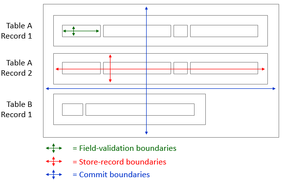
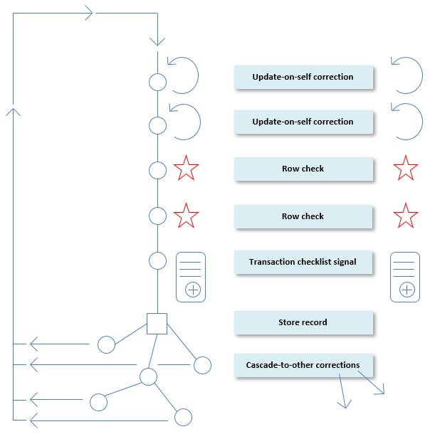
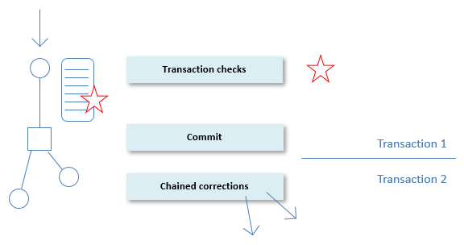

# Constraint activation events

Constraints in USoft are activated when **field-validation events**, **store-record events**, and **commit events** occur. These events are discussed individually at the end of this help topic.

To visualise when these events occur and how they are related, consider this picture. It depicts a transaction in which 2 records of a table A are manipulated as well as 1 record of a table B.

This picture clearly shows a 3-tier "box-in-a-box" structure. Fields are defined by field-validation boundaries and encased within records. Records are defined by store-record boundaries and encased within transactions. Transactions are defined by commit boundaries.

Each record has a number of *fields* (depicted horizontally next to each other, in this picture) that hold column values.

- When a user interactively moves from field to field in a screen and enters values, a *field-validation boundary* is crossed each time she moves to the next field. This causes a **field-validation event** to occur. This event does not occur until the user does something that implies she has finished editing the field value.

- When a SQL statement performs an INSERT, UPDATE or DELETE on behalf of a user, this involves supplying or updating one or more field values in one or more records. In the same way as during user interaction, for each of the field values affected, a field validation event occurs.

Each transaction has a number of *records* or *rows* (depicted vertically next to each other, in this picture) that are manipulated as part of the transaction:

- When a user interactively moves from record to record in a screen and enters values, a *record-validation boundary* is crossed each time she moves to a different record. This causes a **store-record event** to occur. This event does not occur until the user does something that implies she has finished editing the record. It does not occur as long as she merely moves between fields within the same record.
- When a SQL statement performs an INSERT, UPDATE or DELETE on behalf of a user, this involves supplying or updating one or more field values in one or more records. In the same way as during user interaction, for each of the records affected, a store-row event occurs.

As soon as a store-record event occurs, a transaction is opened. Other store-record events could follow, causing the transaction to span multiple records. In the example in the picture, the transaction has 3 records stored. Each transaction is concluded either by commit or rollback.

- If the transaction is concluded by commit, a *commit boundary* is crossed separating this transaction from the next. This causes a **commit event** to occur.

- If the transaction is concluded by rollback, the entire transaction is undone and has no further implications for constraint activation.

## Field-validation event

A **field-validation event** is for a *column* in an *application table*.

During user interaction, a field-validation event occurs whenever:

- The user leaves a field based on the column after entering or changing the column value in it, for example, by navigating to a different field in the same or a different record, or  by attempting to close the window or page.

- The user performs an action implying commit, such as choosing File, Save from the menu.

During constraint evaluation, a field-validation event occurs whenever:

- A constraint effectively supplies a new or changed value for the column as part of an INSERT or UPDATE manipulation.

Field-validation events activate domain constraints.

If a primary key spans more than one column, the group of columns that the primary key is across form a **field group,** and the same applies to the group of columns that the corresponding foreign key is across. The integrity of multi-column key values is not validated until the user exits the field group.

Field validation and group validation are delayed until the beginning of the store-record event if manipulations are executed in the SQL Command dialog or by using the SqlScript() method, and also when executed from non-USoft applications that connect to the USoft Rules Engine via ODBC.

## Store-record event

A **store-record event** is for a *record* (or: row) in an *application table*.

During user interaction, a store-record event occurs whenever:

- The user leaves a record in the table after entering or changing the column value in it, for example, by navigating to a different record in the same table or in a different table, or by attempting to close the window or page carrying the record.

- The user performs an action implying commit, such as choosing File, Save from the menu.

During constraint evaluation, a store-record event occurs whenever:

- A constraint effectively manipulates the record (by supplying or changing at least 1 new or changed column value in it) as part of the execution of an INSERT or UPDATE manipulation.

Store-record events activate single-record constraints and transitional constraints.

**Raising a store-record event**

The occurrence and handling of store-record events is fully transparent in the USoft Rules Engine, but you can programmatically force this event to occur.

The USoft GUI tools have scripting commands for raising the store-record event explicitly.

Default USoft runtime menus often have an option for raising the store-record event. In default client/server application menus, choose Record, Store Record.

**Terminology**

Throughout this explanation, *record*  and *row*  are used interchangeably. *Record*  is not a physical record in a database table, but rather a record instance or record object constructed in memory as part of a table instance being processed. This record instance may have been initially queried from the database, and it translates back into a physical database record if and when the transaction commits.

*Row event* is a synonym of *store-record event.* 

*Save local* is an older term for *store-record event.*

**Structure**

The structure of a store-record event is visualised in the picture below. The event starts by executing update-on-self corrections (if any are defined) to the record being processed. Next, the record is subjected to row checks (if any are defined). Then, if there are other records that will need to undergo transaction checks as a result of this store-record event, these records are identified and signalled on the transaction checklist. Finally, the record being processed is *stored* internally.

Up to this point, processing has been a linear operation within the record being processed. The next step is the executing of cascade-to-other corrections. These "go out" to other record instances. For each record affected, a separate store-record event is raised. This may causes a recursive "ripple" effect that finishes only when no further cascade-to-other corrections are found. The recursive nature of this process is visualised by the arrows on the left-hand side.

 

## Commit event

 

A **commit event** is for a *transaction* as part of a session during which a user is connected to a USoft application.

During user interaction, a commit event occurs whenever:

- The user performs an action implying commit, such as choosing File, Save from the menu.

During constraint evaluation, a commit event does not occur. Constraints are activated by commit events but do not raise commit events.

Commit events activate multi-record restrictive constraints.

 

**Raising a commit event**

While the raising of a commit event is typically user-initialited, its handling is fully transparent in the USoft Rules Engine.

You can programmatically force this event to occur. The USoft GUI tools have scripting commands for raising the commit event explicitly. In client/server applications, choose File, Save. Default USoft runtime menus typically have an option for raising the commit event.

 

**Terminology**

*Commit event* is, to all extents and purposes, equivalent to a COMMIT command in terms of the RDBMS.

We are using the phrase *commit event* in these help topics for the special purpose of distinguishing types of events that cause constraints to be evaluated.

In windows and pages facing end users, a range of different verbs is used, including *Save, Send, Confirm, Commit,* and *Submit.*

 

**Structure**

The structure of a commit event is visualised in the picture below. The event starts by subjecting records to transaction checks made necessary by multi-record restrictive constraints as well as deferred single-record restrictive constraints (if any such constraints have been defined). This process is optimised as much as possible by using a transaction checklist of records affected. This list was compiled earlier during store-record events within the transaction.

If the transaction passes all transaction checks, the next step is to commit the manipulations to the database.

If constraints have been defined with Deferred = Post Commit, this leads to chained corrections. These will raise new field-validation events and store-record events within the next transaction.

 