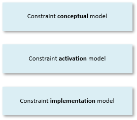

# Constraint conceptual model

To understand how a network of USoft constraints is implemented in a runtime Rules Engine, you need an understanding at 3 different levels.

At the highest level, the **constraint conceptual model** helps you understand the purpose of USoft constraints: what are they designed to achieve?

At a slightly more technical level, the **constraint activation model** helps you understand when constraints come into play: when they are triggered. Constraints are executed directly because of a client action, or indirectly as the knock-on effect of another constraint having an effect on data. To understand what sets a constraint in motion, you need to know about constraint activation events.

At the most technical level, you need some insight into how USoft actually makes constraints work. For example, you need to understand that in preparation for an UPDATE operation, the Rules Engine first retrieves the primary key values of the records that will be affected by the UPDATE by executing a SELECT under the hood. You need this kind of technical knowledge if you want to debug and optimise professional USoft applications. Many of the internal workings of the Rules Engine come to the surface when you inspect the effect of running Profiler or Tracer in USoft Benchmark.

The remainder of this help topic is about the constraint conceptual model.

## What does a constraint express?

USoft constraints are built on a network of tables, columns and relationships in a relational database.

When you express a USoft constraint, you express a level of data integrity that must be guaranteed for all the data values in all the columns mentioned in the constraint. This data integrity is set-oriented and not procedural. The procedure by which the data integrity is achieved is not important. The only thing that counts is that the end result, reached after all procedures have run their cause, satisfies all the data integrity rules.

## You can dictate restrictive or productive handling

Some rules are restrictive by nature. If a certain type of customer is allowed to borrow any amount of money under a given maximum, you can only act restrictively if an attempt is made to go beyond that limit: the actual amount chosen is up to the customer and not the Rules Engine.

Other rules are productive by nature. If an order price must necessarily be calculated by following a decision table with strict rules about numbers of articles and discount percentages, you want the Rules Engine to calculate the result actively, as opposed to giving error messages to a client until she specifies the only correct answer.

There are also rules that can be enforced both restrictively and productively. In the USoft constraint conceptual model, you can dictate which of the 2 modes of operation you prefer. If a customer must have at least 1 order, and you have all the necessary information to actually create a first order record with default values if it does not yet exist, it is perhaps user-friendly to let an INSERT constraint do just that. But in other similar situations it may be better to let the customer make manual decisions about his first order, and run into a restrictive constraint action unless his values meet the rules.

Another example of when you can choose between restrictive and productive action is when you choose to have either a restrictive or a cascading Delete Rule for a relationship. Both achieve the result that no children without parents will ever exist. A restrictive handling (the equivalent of a SELECT constraint) does this by giving an error message if a client does anything that goes against this rule. A productive handling (the equivalent of a DELETE constraint) does this by automatically dropping any orphan records in the child table.

## You cannot dictate evaluation times - but there are practical exceptions

USoft will guarantee that all the data integrity that you define is automatically kept. But as a principle, USoft does not let you express WHEN a constraint is evaluated. It will choose the evaluation time that is fastest. This is an aspect of constraint handling that is in the constraint activation model, but not in the constraint conceptual model.

There are 2 reasons why, as a USoft developer, you still need to know quite a lot of things about evaluation times chosen by USoft, and why USoft gives you a degree of influence in deciding when a constraint is "fired" or evaluated. One is that you may know things about your data that USoft cannot know, so that you can make the application faster by having a say in constraint evaluation. The other is user-friendliness. The standard time when the Rules Engine reports some type of rule may be when the user has finished editing a record and exits it, but you may have reasons why you want the user to get a message or confirmation as soon as she has finished editing an individual *field* in the record. The two may overlap. You may decide that user-friendliness can wait, and defer a constraint evaluation to commit time to speed up processing as long as the user does not commit.

 

 

 