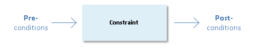
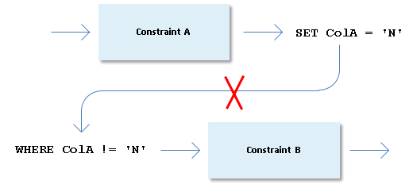
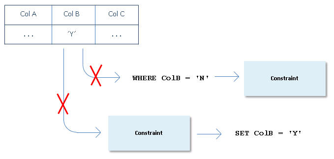
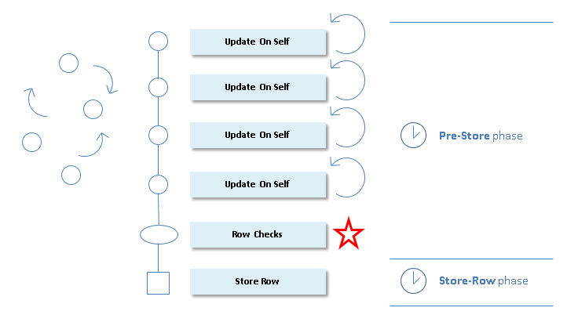

# Preconditions and postconditions

The Rules Engine uses *preconditions* and *postconditions* in some optimisation techniques. These are used in UPDATE constraints.

A constraint has a precondition for a given column if, in the WHERE clause of the statement, the column is compared to a constant, or to an expression evaluating to a constant, or to NULL or to NOT NULL. Clauses with subqueries and clauses containing OR are never preconditions. There may be more than one precondition: in this case the preconditions are linked by AND.

A constraint has a postcondition for a given column if that column is SET to a constant value, or to an expression evaluating to a constant, or to NULL. A SET clause setting the column to a subquery is never a postcondition. There may be several postconditions: in this case the SET clause contains two or more parts separated by commas.

*Example*

Consider the following SQL statement:

```
UPDATE    <Table>
SET       ColA =
(
          SELECT    ... 
          FROM      <Table2> 
          ... 
)
,        ColB = 'N'
WHERE    ColA IS NULL
AND      ColC = 'Y'
```

In this SQL statement, the clauses:

```
ColA IS NULL
```

and

```
ColC = 'Y'
```

are preconditions, while the clause:

```
ColB IS 'N'
```

is a postcondition.

> [!NOTE]
> In SQL, you can write more than one SET statement using commas as separators as in the example, but you can use the following construct against Oracle only:

```
...SET (ColA, ColB) = (<Expr>,<Expr>)
```

Before UPDATE constraints are evaluated, the Rules Engine looks for any preconditions and postconditions of the constraints:



## Deactivation between constraints

The Rules Engine deactivates between constraints at compile time. This happens:

- When flat files are created.
- If you run from repository, the first time a particular set of constraints is loaded on the client as a result of row events.

In this process, the optimal order in which to examine pre-store constraints is determined.

*Example*

This illustration shows a situation in which the Rules Engine knows that if a constraint A results in a correction, constraint B no longer needs to be considered for the same record. Constraint B is deactivated by constraint A:



On the basis of such dependencies, the constraints that are most likely to deactivate the greatest number of other constraints are evaluated first.

In general, constraint X deactivates constraint Y in the following situations:

- The **post**condition of X and the **pre**condition of Y are mutually exclusive. If X succeeds for the current row, Y can no longer be applicable to this row.
- The **post**condition of X and the **post**condition of Y are equivalent. If X succeeds from the current row, then there is no point in evaluating Y since the result would be the same.
- The **pre**conditions of X and Y are mutually exclusive. If X applies to the current row, then Y cannot apply to it and vice versa.

## Deactivation between incoming data, preconditions and postconditions

At runtime, the Rules Engine makes a comparison between all incoming column values and the preconditions and postconditions of UPDATE constraints. This comparison is made for each store-record event in which these constraints are involved.

- If the column value and the **pre**condition are mutually exclusive, the constraint need not be evaluated.

- If the **post**condition coincides with the column value, the constraint need not be evaluated either, since it could only set the column to the value it already has. Of course, this applies only if no other columns are potentially changed by the constraint.



## Update-on-self sorting

When flat files are created, constraints that potentially give rise to update-on-self corrections are sorted internally.

For each constraint, sorting is on the basis of:

- How many other constraints each constraint potentially deactivates. This has a higher priority than:
- How many other constraints each constraint potentially causes to be evaluated.

In other words, for each "update-on-self constraint" that comes into play for a given store-record event, the number of other constraints potentially deactivated by this constraint determines the ranking of the constraint in the execution order. For constraints with the same ranking, those that cause evaluation of most others get the higher ranking.

The following picture is an attempt to visualise that "update-on-self constraints" are sorted for optimisation:



You can manually influence this type of optimisation by adding preconditions and postconditions to constraint SQL statements where possible.

There is no overhead time for sorting and deactivation strategies because these strategies have been applied when the flat file (the .CON file) was generated.