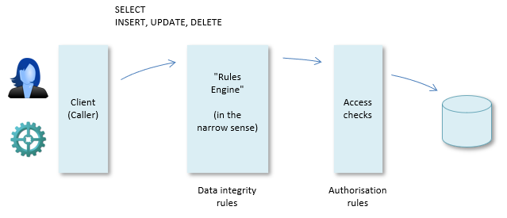
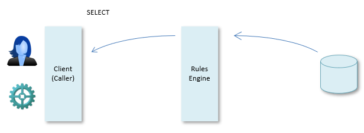
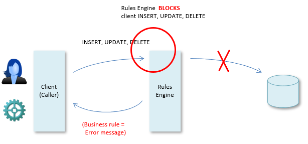
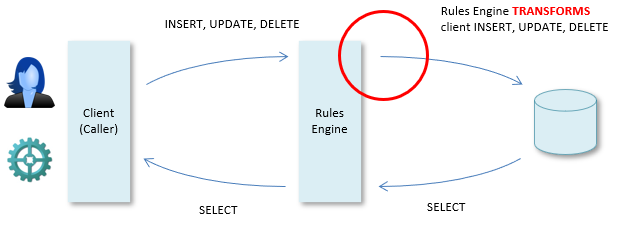

# The USoft Rules Engine

To understand more advanced properties of USoft constraints, the best starting point is the Rules Engine.

In USoft solutions, the Rules Engine is the software layer that connects clients to business data in an RDBMS. It takes both data query and data manipulation requests in the form of SQL, as if it were itself the RDBMS. It passes these requests on to the RDBMS on behalf of the USoft client, but in the process, the requests are transformed, and checks and other behaviour are added. The purpose of this extra behaviour is to enforce all the **data integrity rules** expressed in USoft Definer.

## Separate authorisation rules

In addition, at a layer closer to the data, the Rules Engine enforces data access rules (also: authorisation rules). These roles are expressed separately in USoft Definer at the level of **roles**. When a user logs on, this role information is combined with information in the USoft Authorizer tables - the tables with names prefixed T_AUTH... . Most importantly, these T_AUTH... tables store information about which individual users are associated with which roles.

Strictly, the Rules Engine enforces both data integrity rules and authorisation rules, in two distinct layers. In everyday practice, it is customary to talk of "the Rules Engine" in the narrow sense to refer only to the part that enforces the data integrity rules. The help topics in this section focus on understanding this part - they ignore the authorisation layer.

## The Rules Engine as API: SELECT

USoft clients can put in **query** requests in many ways - by formulating an explicit SELECT statement, or by doing something else such as filling out a form in a GUI. The Rules Engine considers every query to be a SQL SELECT operation. It will return the data result if the client is authorised to see the data.

With queries, no rules (except authorisation rules) are enforced. All the data integrity rules were already enforced when the data was put in the database in the first place. For queries, the Rules Engine layer acts as a kind of API. It determines what data is available and how that data is called. This is especially apparent in Logical Views. The RDBMS knows only physical tables and columns. Because a Rules Engine with its added Logical Views is interposed, the Logical View table and column names are "in the API" that the client can use to get to the data.

## Rule enforcement: INSERT, UPDATE, DELETE

The Rules Engine really comes into its own when clients perform data **manipulation**. They can do that in many ways - by formulating explicit INSERT, UPDATE and DELETE statements, or by doing something else, such as adding a row to a spreadsheet or changing or removing that row. The Rules Engine considers every such action to be the equivalent of either SQL INSERT, or UPDATE, or DELETE. It will carry out the manipulation if all the data integrity rules allow it. It may perform further manipulation if data integrity rules dictate this. In other words, for each individual record being manipulated, the effect of the Rules Engine (if any) is either **blocking** or **transformatory**.

If **blocking**, the data manipulation does not take place. For example, if a rule says that a customer must have at least one order, then any attempt to delete his last order is blocked. Here, the standard approach is that the Rules Engine returns the text of the blocking business rule as an error message, although error messages may be customised for many reasons:

If **transformatory**, the data manipulation is carried out, but "behind the screens" further manipulation also takes place so that the end result has the level of data integrity defined by all the rules. For example, if a rule says that all the orders of a customer must be dropped if the customer himself is dropped, then any DELETE of the customer will result in DELETEs of orders "behind the screens". Here, the standard approach is that the Rules Engine does not return explicit messages. Clients can find out what happened by doing a SELECT as the next action:

 

 