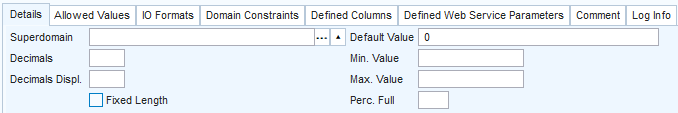

# Data types

In USoft, **Data type** is one of the most important domain attributes. This attribute specifies what kind of data the domain has values for:

- Text (of various types);
- Numbers, for example, integers, or amounts of money;
- Calendar dates, or times of day, or a combination of these;
- Relatively large and unstructured data such as images, videos or documents.

**Data type** has a direct impact on storage in the underlying RDBMS. It roughly corresponds to data types as known by your RDBMS. When you execute Create Tables, it determines which column data type USoft generates in the RDBMS.

When you define the data type of a domain, you can choose from a large list of data types. Some are RDBMS-specific. Others are automatically converted by USoft to the most appropriate data type on your RDBMS platform. If you use this last category, your application will be portable across database platforms. That is why the best-practice tips below point to convertible data types.

## How to apply data types in your USoft application

In USoft, you apply data types to *columns* via *domains*. The first step is to find out if you want to re-use an existing domain that has the data type. Re-use is best if possible. If you cannot re-use, create a new domain with the data type.

To find an existing domain with a data type you want to apply:

1. In USoft Definer, choose Define, Domains from the menu.
2. Press F2 for Query Mode, then find the domains of a given data type by querying by a value in the Data Type field. You can click the small lookup button directly to the right of this field to get a list of data types to choose from.

To create a new domain with a data type you want to apply:

1. In USoft Definer, choose Define, Domains from the menu.
2. In the empty window, type a name for the domain in the Domain Name field.
3. Set the Data Type field to the data type you want to use. You can click the small lookup button directly to the right of this field to get a list of data types to choose from.
4. Complete the domain definition by setting at least all the mandatory domain attributes to a value. Press Save to commit.

To apply the data type to a column:

1. In USoft Definer, choose Define, Tables, Database Tables. Query the table that contains the column.
2. In the Columns grid, for the column, in the Domain column, specify the domain that has the data type you want to apply. You can press F12 (Lookup) to get a list of domains to choose from.  You can press F11 (Edit) to change settings for the domain.

## Data types: best-practice tips

Domains are not data types. Have strongly-typed domains that represent a business reality in your application. Good domain names are CUSTOMER_NAME, PRODUCT_ID. Do not misuse USoft domains as datatypes. Avoid domains such as STRING_30. Instead, have a domain with a string data type and with a column width of 30, but with a more application-specific domain name.

Choose a Unicode data type that is portable across database platforms (ie., *convertible* by USoft). These tips help you select a good data type for popular kinds of data. First, the table below summarises. Then, each tip is detailed in a separate section.

|**Kind of data**|**Suggested USoft data type**|**Other suggestions**|
|--------|--------|--------|
|Boolean |NUMBER  |
Allowed values: 0, 1

Display type: Check Box
|
|Date    |DATE    |IO Format: DD-MM-YYYY|
|Date-and-time|DATE    |IO Format: DD-MM-YYYY HH24:MI:SS|
|Integer |NUMBER  |Decimals: left empty|
|Number with decimals|NUMBER  |Decimals: specified|
|String  |NVARCHAR|Column Width: specified|
|Text    |NCLOB   |Column Width: left empty|

### Boolean

Typical boolean columns are best based on a domain with Data Type = NUMBER, Column Width = 1, Allowed Values = 0 (for false) and 1 (for true). Typically, Display Type = Check Box, in which case the allowed value with the **lowest** Position must be the value that corresponds to Boolean false.

For 2-valued booleans, make sure the column has Mandatory = Yes. It is usually helpful to have a Default Value. Often, the more useful Default Value is the value corresponding with Boolean false.

Typical boolean domain

Typical boolean domain, Details tab

Typical boolean domain, Allowed Values tab### Date

Typical date columns without time presentation (ie., columns that store calendar day values) are best based on a domain with Data Type = DATE, Display Type = Text Box (Date), Column Width = (empty), Display Length = 18, IO Format = DD-MM-YYYY.

Setting the IO Format prevents USoft from displaying in the USoft default DD-MON-YY format (for example: 01-JAN-24). The latter has the major drawback of not containing the century, and is also an Oracle-only format.

The DD-MM-YYYY format suggested here is a popular date representation for calendar days in European countries and is known to multiple database platforms. Some teams prefer YYYY-MM-DD. This is the ISO-8061 standard. It offers sort order advantages, but is less readable for end users.

On SQL Server, USoft converts DATE automatically to DATETIME.

### Date-and-time

Typical time columns (ie., columns that store a moment in time on the calenday) are best based on a domain with Data Type = DATE, Display Type = Text Box (Date and Time), Column Width = (empty), Display Length = 24, IO Format = DD-MM-YYYY HH24:MI:SS.

On SQL Server, USoft converts DATE automatically to DATETIME.

### Integer

Typical integer columns are best based on a domain with Data Type = NUMBER, Display Type = Text Box (Number), Column Width = (expected maximum width, eg., 8), Display Length = (same as Column Width), Decimals = (empty), IO Format = (empty).

On SQL Server, USoft converts NUMBER automatically to NUMERIC.

### Number with decimals

Typical columns for numbers with decimals are best based on a domain with Data Type = NUMBER, Display Type = Text Box (Number), Column Width = (expected maximum number length + number of decimals as set by Decimals, eg., 6 + 2 = 8), Display Length = (empty), Decimals = (required number of decimals), IO Format = ZZZZZ9.99 (click [here ](/docs/Modeller_and_Rules_Engine/Domains/IO_formats.md)for more on this), where the number of '9’ symbols after the separator dot equals the number of decimals set by Decimals, and the number of symbols preceding the dot equals the Column Width minus Decimals.

These tips also apply to typical columns for amounts of money. For these, set Display Type = Text Box (Money). In money amounts, many teams like 5 decimals with 2 decimals displayed because this gives good rounding results: Decimals = 5, Decimals Displayed = 2.

On SQL Server, USoft converts NUMBER automatically to NUMERIC.

### String

'String’ here applies to string values that are short enough to be handled in a single-line text box. Typical columns for this type of shorter string value are best based on a domain with Data Type = NVARCHAR, Display Type = Text Box (Character), Column Width = (the required maximum width).

NVARCHAR is a Unicode data type. On Oracle, USoft converts NVARCHAR automatically to NVARCHAR2.

### Text

'Text’ here applies to longer string values: running text. This is displayed in a multi-line fashion: a high column box or a pop-up text editor. Typical columns for text are best based on a domain with Data Type = NCLOB, Display Type = Multi-Line Text Box, or: Text Editor, Column Width = (left empty).

NCLOB is a Unicode data type. On SQL Server, USoft converts NCLOB automatically to NVARCHAR(max).

## Viewing all available data types

To view all available data types:
1.    In USoft Definer, choose Define, Domains from the menu.

2.    In the Domains window, click the lookup button immediately to the right of the Data Type field.

The Data Types for Domains window opens. You can see data types listed on the left. On the right is information about RDBMSs and database drivers where the data type is known.

## Convertible data types

A number of data types are RDBMS-specific. Other data types are convertible: USoft automatically converts these data types to the equivalent data type on the RDBMS that it is running against.

The table below lists data types that USoft can convert, with equivalent data types by RDBMS.

|**USoft**|**Oracle**|**SQL Server /

Oledb

**|**Odbc**|**Derby**|
|--------|--------|--------|--------|--------|
|BINARY  |RAW     |BINARY  |BINARY  |BINARY  |
|BIT     |RAW     |BIT     |BIT     |VARCHAR |
|BLOB    |BLOB    |VARBINARY(max)|LONG VARBINARY|BLOB    |
|BYTE    |LONG RAW|IMAGE   |LONG VARBINARY|VARCHAR |
|CHAR    |CHAR    |CHAR    |CHAR    |CHAR    |
|CLOB    |CLOB    |VARCHAR(max)|LONG VARCHAR|CLOB    |
|DATE    |DATE    |DATETIME|DATE    |TIMESTAMP|
|DATETIME|DATE    |DATETIME|DATE    |VARCHAR |
|DECIMAL |DECIMAL |DECIMAL |DECIMAL |DECIMAL |
|DOUBLE PRECISION|FLOAT   |FLOAT   |FLOAT   |VARCHAR |
|FLOAT   |FLOAT   |FLOAT   |FLOAT   |NUMERIC |
|FLOAT4  |FLOAT4  |REAL    |REAL    |VARCHAR |
|IMAGE   |LONG RAW|IMAGE   |LONG VARBINARY|VARCHAR |
|INT     |INTEGER |INTEGER |INTEGER |VARCHAR |
|INTEGER |INTEGER |INTEGER |INTEGER |INTEGER |

|**USoft**|**Oracle**|**SQL Server /

Oledb

**|**Odbc**|**Derby**|
|--------|--------|--------|--------|--------|
|LONG    |LONG    |TEXT    |LONG VARCHAR|VARCHAR |
|LONG VARBINARY|LONG RAW|IMAGE   |LONG VARBINARY|VARCHAR |
|LONG VARCHAR|LONG    |TEXT    |LONG VARCHAR|VARCHAR |
|LONGRAW |LONG RAW|IMAGE   |LONG VARBINARY|VARCHAR |
|MONEY   |NUMBER  |MONEY   |FLOAT   |NUMERIC |
|NCHAR   |NCHAR   |NCHAR   |WCHAR   |VARCHAR |
|NCLOB   |NCLOB   |NVARCHAR(max)|LONG WVARCHAR|VARCHAR |
|NTEXT   |NCLOB   |NTEXT   |LONG WVARCHAR|VARCHAR |
|NUMBER  |NUMBER  |NUMERIC |NUMERIC |NUMERIC |
|NUMERIC |NUMERIC |NUMERIC |NUMERIC |NUMERIC |
|NVARCHAR|NVARCHAR2|NVARCHAR|WVARCHAR|VARCHAR |
|NVARCHAR2|NVARCHAR2|NVARCHAR|WVARCHAR|VARCHAR |
|RAW     |RAW     |BINARY  |BINARY  |VARCHAR |
|REAL    |FLOAT   |REAL    |REAL    |VARCHAR |
|SMALLDATETIME|DATE    |SMALLDATETIME|DATE    |VARCHAR |
|SMALLINT|SMALLINT|SMALLINT|SMALLINT|SMALLINT|
|SMALLMONEY|NUMBER  |SMALLMONEY|REAL    |NUMERIC |
|TEXT    |LONG    |TEXT    |LONG VARCHAR|CLOB    |
|TIME    |DATE    |DATETIME|DATE    |VARCHAR |
|TIMESTAMP|DATE    |DATETIME|DATE    |VARCHAR |
|TINYINT |SMALLINT|TINYINT |TINYINT |VARCHAR |
|UNICHAR |NCHAR   |NCHAR   |WCHAR   |VARCHAR |
|UNITEXT |NCLOB   |NTEXT   |LONG WVARCHAR|VARCHAR |
|UNIVARCHAR|NVARCHAR2|NVARCHAR|WVARCHAR|VARCHAR |
|VARBINARY|RAW     |VARBINARY|VARBINARY|VARBINARY|
|VARCHAR |VARCHAR |VARCHAR |VARCHAR |VARCHAR |
|VARCHAR2|VARCHAR2|VARCHAR |VARCHAR |VARCHAR |
|WCHAR   |NCHAR   |NCHAR   |WCHAR   |VARCHAR |
|WLONGVARCHAR|NCLOB   |NTEXT   |LONG WVARCHAR|VARCHAR |
|WVARCHAR|NVARCHAR2|NVARCHAR|WVARCHAR|VARCHAR |

 