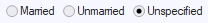

# Option Buttons display type

The Option buttons display type produces a group of 2-3 individually labelled buttons, for example:

The options presented are mutually exclusive. Exactly 1 option is active (checked, selected) at any one time. If the end user clicks a different option, the previously selected option is automatically unselected.
To create a group of option buttons:

- Create a domain with Display Type = Option Buttons.
- Define the allowed values for the domain (Allowed Values tab).
- Define the Default Value for the domain.
- Create columns based on the domain.

Here are some tips:

- Use option buttons if the end user has 2 or 3 options. For details on when to use check boxes instead, see the Check Boxes help topic. If there are 4 options or more, prefer a Dropdown List Box or a lookup window.
- Make one option button the default.
- Do not allow NULL values. The best design for columns based on the domain is to have Mandatory = Yes.
- For each option, consider setting Value and Prompt to the same string value. This keeps you from constantly having to look up the Value-Prompt mapping during development.