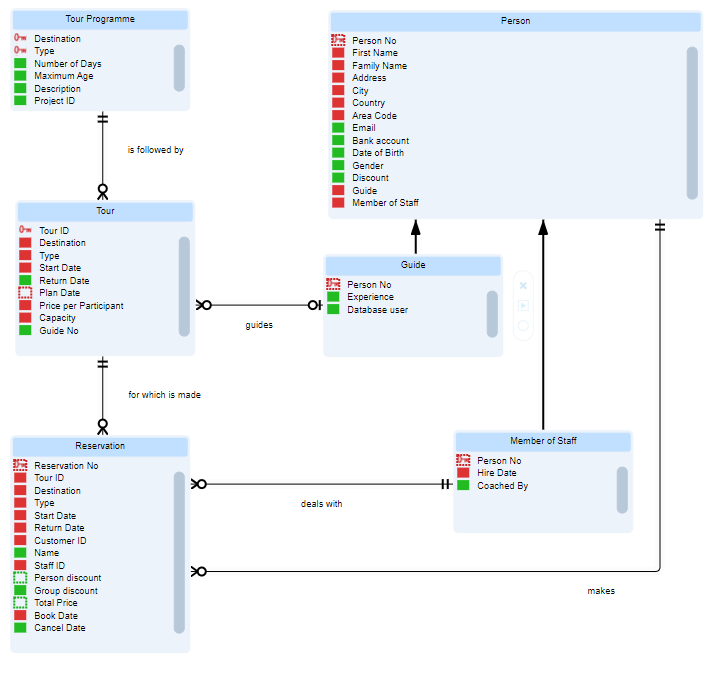

# EAR diagrams

## What is an EAR diagram?

An **EAR diagram** (Entity-Attribute-Relationship diagram) depicts which database tables, columns and relationships you have in your datamodel. Table boxes are for database tables (or entities). Text items inside the boxes are for columns (or attributes). Lines between the table boxes are for relationships:

EAR diagramAs you can see, the items for columns/attributes within the table boxes have small coloured icons that represent some properties of the column/attribute. You can view and edit *all* the properties of a column/attribute by selecting the column/attribute and then pressing the **Properties** icon in the icon menu across the top. This is one of the rightmost icons on the ribbon.

The *line ends* of relationship lines also show special symbols. These represent some properties of the relationship. You can view and edit *all* the properties of a relationship by selecting the relationship and then pressing the **Properties** icon in the icon menu across the top. This is one of the rightmost icons on the ribbon.

The functionality that USoft offers around EAR diagrams is very different between USoft 11 and USoft 10.

## EAR diagrams in USoft 11

`USoft 11``{.vs_11}`

In USoft 11, you can create, store and browse an EAR diagram in USoft Definer either for the entire **repository** or for a specific **business object.** 

:::tip

USoft recommends development teams associate each EAR diagram with a specific business object.
The option to open an EAR diagram for the repository as a whole is only appropriate for initial situations, for example, for test, tutorial, Sales demo, or jump-start situations.

:::

USoft keeps EAR diagrams in sync with the Definer records for tables, columns, domains and relationships depicted in the diagram. This synchronisation is 2-way:

- If you change anything in Definer tables, columns, domains or relationships, the next time you open the diagram, the drawing automatically follows your changes.
- If you draw, change or drop anything in the EAR diagram, when you close the diagram, Definer records are manipulated (added, changed, dropped) automatically. Commit is not automatic: you can commit these manipulations if you like them, or roll them back if you don't.

For diagrams at **repository** level, the diagram depicts all the tables, columns, domains and relationships in the data model.

For diagrams at **business object** level, the diagram only depicts tables and columns where the table is associated with the business object. In terms of USoft Definer, the table must be in the **data contents** of the business object. It does not make a difference whether a table is *owned* by the business object or not. Relationships and subtypes are in the diagram only if they involve 2 tables that are both associated with the business object. Self-referential relationships on a table  associated with the business object are also depicted.

### Opening an EAR diagram for the entire repository

An EAR diagram for the entire repository is a property of a Repository Definition object. You can technically have multiple Repository Definitions but the intended use is that you keep exactly 1 Repository Definition for your repository.

To open an EAR diagram for the entire repository:

1. Click the Teamwork tab in the catalog on the left-hand side.
2. Right-mouse-click the Repository Definitions node and choose "Open EAR diagram...” from the context menu.

If you have a single Repository Definition, this opens the diagram for that Repository Definition.

If you do not have any Repository Definition, this creates a Repository Definition called "Default” and then opens the diagram for that Repository Definition.

If you have multiple Repository Definitions (not recommended), this raises an error. You need to choose the specific Repository Definition that you want to open the diagram for. Do this by expanding the Repository Definitions node in the catalog, right-clicking the node of the Repository Definition child node you want to open the diagram for, and choosing “Open EAR diagram...” from the context menu.

### Opening an EAR diagram for a business object

To set up business objects and EAR diagrams, you can start with the business object or you can start with the diagram.

To start with the business object:

1. Open the Business Objects window for the business object. You can do that from the Definer main menu via Teamwork, Definition, Business Object or by double-clicking a Business Object from the Teamwork catalog in the left-hand pane.
2. Make sure the business object is associated with the tables that you want to see in the diagram. This should be a small number of tables that are closely related: they typically have Relationships between them. They could also be related by having a supertype/subtype relationship. Press the button to list the tables associated with the business object. The Owned flag has no direct relevance to EAR diagrams. You can associate a table with multiple business objects, but a given table can only be owned by a single business object.
3. Open the EAR diagram either by pressing the button next to the EAR Diagram field in the Business Objects window, or by right-mouse-clicking on the Business Object in the Teamwork catalog and then choosing "Open EAR Diagram...”.

To start with the diagram:

1. Have a business object that you want to draw a diagram for.
2. Open the EAR diagram either by pressing the button next to the EAR Diagram field in the Business Objects window, or by right-mouse-clicking on the Business Object in the Teamwork catalog and then choosing "Open EAR Diagram...”. Assuming that the business object had no tables associated with it, you will get an empty EAR diagram canvas.
3. Draw the EAR diagram. When you are done, press the Save button in the top left corner. What you have drawn will now be translated into Definer manipulations: table, column and relationship records will be added, changed or dropped depending on what you have drawn in the diagram.
4. View the effect of what you have done. Save if you like it, or Rollback if you don't. You are now ready to re-open the diagram and make further changes if you like.

## EAR diagrams in USoft 10

`USoft 10``{.vs_10}`

In USoft 10, EAR diagrams are created and stored in USoft Studio and not USoft Definer. In USoft Definer 10, there is a limited feature for generating-and-browsing an EAR diagram from Definer data and storing it in an external file.

### E/R diagrams in USoft Studio

If you use USoft Studio and USoft Definer in combination, USoft Studio will hold your **specifications,** including any diagrams, and USoft Definer will hold your **implementations.** In this setup, USoft recommends that you draw E/R diagrams in USoft Studio and import related specifications that refer to the diagram in USoft Definer, using the "Import from USoft Studio" bridge.

### Generated E/R diagrams in USoft Definer

Another feature is the possibility to generate an E/R diagram from USoft Definer.

You can have an EAR diagram generated for

- The entire repository.
- A specific business area.
- A specific business object.

For the last two options, the generated diagram will contain those tables that you have indicated as belonging to the business object, or the business area.

To generate an E/R diagram in USoft Definer:

1. If generating for a specific business area or business object, make sure that the tables and relationships that you want covered in the EAR diagram are all part of the specific business object, or business area.

2. Find the node for the business object or business area in the Teamwork catalog. If generating a diagram for the entire repository, find the "Business Areas” top-level node of the Teamwork catalog.

3. Right-mouse-click on the node. Choose either "Generate Diagram" or "Generate Diagram and Browse".

The diagrams that you generate in this way are importable into USoft Studio.

You can improve a generated diagram by dragging the boxes for tables to better positions on the canvas. This way, you can achieve that the relationship lines do not cross and all the text elements are properly readable.

You can either edit the diagram in the browser or you can import the diagram into USoft Studio and edit it there.