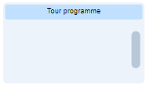
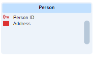
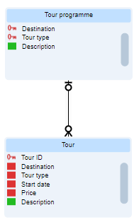
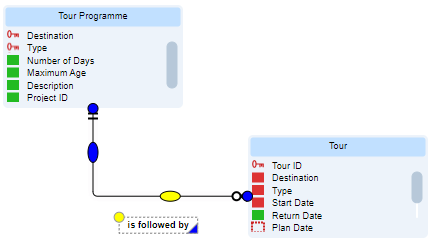

# How to draw objects in an EAR diagram

## Setting up a canvas for an EAR diagram

To draw an EAR diagram, you first need to set it up. This works very differently between USoft 10 and USoft 11. For details on this, please go to the [EAR diagrams](/Modeller_and_Rules_Engine/EAR_diagrams/EAR_diagrams.md) article.

## Drawing tables (or: entities)

Tables (or: entities) are represented in EAR diagrams by **table boxes**. A table box looks like this:

### Adding a new free-floating table box

To add a new free-floating table box :

1. Hold down the left mouse button in any place on the canvas. A small context menu appears:

2. Choose Entity from the context menu.
3. Double-click on the word Entity in the blue title bar across the top of the table box and replace the word "Entity” by the name of your table. If you type "Tour programme” here, USoft Definer will create a table called "TOUR_PROGRAMME” when you exit the diagram.

### Adding a new table box connected to an existing table box

You can add a new table by connecting it to an existing table. This gives you a new table and a new relation line in one go.

To add a new table box and connect it to an existing table box:

1. Hover the existing table box with your mouse. A small icon menu appears on the right-hand side.

2. Click the small arrow icon in the middle of this menu. A small context menu appears:

3. Choose Entity from the context menu.

A new table box appears, connected to the existing table box. Re-position the boxes and lines as you see fit. Double-click on the word Entity in the blue title bar across the top of the new table box and replace the word "Entity” by the name of your new table. If you type "Tour programme” here, USoft Definer will create a table called "TOUR_PROGRAMME” when you exit the diagram.

### Dropping a table box

To drop a table box:

1. Hover the table box with your mouse. A small icon menu appears on the right-hand side:

2. Click the 'x’ icon at the top of this icon menu.

:::danger

If you drop a table box from an EAR diagram for a business object, not only will the table be disconnected from the business object, it will be dropped from the repository altogether.
When you exit the diagram, you can still rollback if you want to keep the table after all.

:::

### Moving a table box

You can move a table box to a different position on the canvas.

To move a table box:

1. Hover the blue title bar across the top of the table box.
2. Drag-and-drop the table box to the new position.

### Resizing a table box

You can resize a table box in all directions. You can make the box taller if you want the user to see all the attributes in the table without having to use the scrollbar that comes with the table box. When a table has multiple relations, you can often make the relation lines look much better if you make the table box taller or broader.

To resize a table box:

1. Hover the edge (left, right, top or bottom) of the table box by which you want to stretch or squeeze the box.
2. Drag-and-drop the edge to the new position you want it to have.

## Drawing columns (or: attributes)

Columns (or: attributes) are represented in EAR diagrams by **attribute items**. An attribute item appears inside a table box. It is a text string with a small coloured icon to its left. Here are attribute items for the PERSON_ID and ADDRESS columns of the PERSON table. The small red key icon shows that PERSON_ID has Key = 1 (is the primary key, or part of the primary key), and has Mandatory = Yes. The red rectangle shows that ADDRESS has Mandatory = Yes:

### Adding an attribute item

To add an attribute item:

1. Hover any empty spot inside the table box to which you want to add the attribute.
2. Press and hold the left mouse button down. A small context menu with a single option "Attribute” appears.
3. Select this option. The attribute item appears with a default name such as "Attribute 1”.
4. Double-click this default name and replace it by the name of your column/attribute.

### Changing properties of an attribute item

You can change properties of a column/attribute. Depending on what you change, this may affect the coloured icon displayed to the left of the attribute name in the table box.

To change properties of an attribute item:

1. Click the coloured icon shown to the left of the attribute name.
2. In the icon menu across the top of the canvas, press the icon (find it near the right-hand end of the icon ribbon). A Properties sheet appears on the right-hand side of the canvas.
3. In the Properties sheet, make changes by typing in the fields.

### Changing the order of attributes in a table

To change the order of attributes in a table:

1. Grab an attribute by the coloured icon to the left of the attribute name (hold the left mouse button down on the icon).
2. Drag the icon to a new position you want it to have. Stay within the table box.
3. Drop the attribute in its new position (release the mouse button). The other attributes adjust.

### Dropping an attribute item

To drop an attribute item:

1. Hover the attribute item. A pop-up context menu with a single option ‘x’ (for "drop”) appears to the right.

2. Move the mouse so that it hovers the 'x’, then press left mouse button down.

## Drawing relationships (or: relations)

Relationships (or: relations) are represented in EAR diagrams by **relation lines**. A relation line connects 2 table boxes:

The meaning of the diagram is completely independent of how you position the lines and boxes on the canvas. The picture below means exactly the same thing as the picture above:

Occasionally, a relation line has 3 corners and connects a table box to itself. In this case it depicts a relationship from a table to itself, eg. a relationship "STAFF COACHES STAFF” for table STAFF.

### Adding a relationship

You can add a new table by connecting it to an existing table. This way, you draw a table and a relation line in one go. See "Adding a new table box connected to an existing table box” at the start of this article.

Another way is to draw a new relation line between two existing table boxes:

1. Hover one of the table boxes  you want to connect. A small icon menu appears on the right-hand side:

2. Press left mouse button down on the 'o’ icon at the bottom of this icon menu. The ‘o’ icon turns dark blue.
3. Drag to the edge of the table box where you want the line to connect to. The 'o’ icon turns yellow.
4. Release the mouse button.

### Changing properties of a relationship

You can change properties of a relationship. Depending on what you change, this may affect the symbols on the line ends where the line connects to table boxes.

To change properties of a relationship:

1. Click on the relation line in the diagram.
2. In the icon menu across the top of the canvas, press the icon (find this near the right-hand end of the icon ribbon). A Properties sheet appears on the right-hand side of the canvas.
3. In the Properties sheet, make changes by typing in the fields.

### Reversing the cardinality of a line

You can reverse the cardinality of a line (parent becomes child and child becomes parent; or: subtype becomes supertype and supertype becomes subtype):

1. Hover the line without clicking on it. A small context menu appears:

Relation line, context menu2. Click on the `<` icon at the bottom of this context menu.

### Changing the position or shape of a relation line

You can change the position or shape of a relation line after you have drawn it.

Select the line by clicking on it. Draggers appear by which you can change the position of drawing elements.

As the picture shows, oval-shaped draggers appear in the middle of line segments. Circle-shaped draggers appear where the line meets a table box.

Blue and yellow, circle-shaped and oval-shaped draggersChange the appearance of a line by holding the left mouse button down on a dragger and dragging it to the new position. Use the oval-shaped draggers to swing a line into a new shape. Use the circle-shaped draggers to determine where the line meets the box. You can also use circle-shaped draggers to attach a line to a different box.

Draggers can be dark blue or yellow. Dark blue is the default. Yellow indicates that the dragger was used before: the line or connection point as you see it has been changed earlier. You can double-click on yellow draggers to revert to the default (dark blue) position.

### Dropping a relation line

To drop a relation line without dropping the table boxes that it connects:

1. Hover the line without clicking on it. A small context menu appears:

Relation line, context menu2. Click on the 'x’ icon at the top of this context menu.