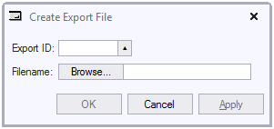

# Dialogs

A dialog is a window that helps the user perform a specific task. Depending on the task at hand, a dialog may or may not contain data fields, images, buttons, helpful text or other elements.
In a USoft context, a dialog is any window in a USoft application that does not correspond to (is not "based on") a specific database table and therefore is not, or not primarily, for interacting with application data. This makes dialogs different from USoft Info Windows, Info Boxes, Lookup Windows, Related Windows and Subtype Windows.
The following dialog allows a user to select some ID that identifies data to be exported, and to indicate a location on a file system where the export must be written to by typing a filename-and-filepath or by using a Browse facility:

A dialog is modal. This means that the user MUST respond to it, or else will not be able to navigate away from it. For this reason, a dialog usually has an OK and a Cancel button and sometimes also an Apply button:

- The OK button allows the user to indicate that the task is finished. If the task is successfully performed, the dialog will disappear and the cursor will move back to the interface elements from which the dialog was opened.
- The Cancel button offers a way out of the dialog without performing the task.
- The Apply button offers a way to perform the task but leave the dialog open, so that it may be re-used. This button is less usuall than the OK and Cancel buttons.