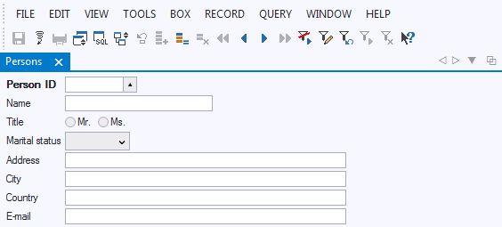
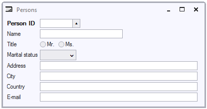
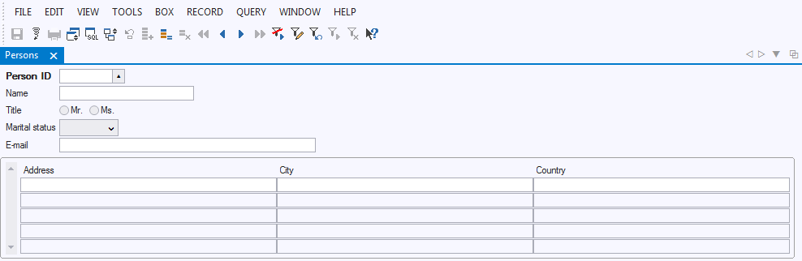

# Info windows

USoft automatically creates a form interface called info window for each database table you have defined. An info window allow the user to fill out a form with new data that are stored in the table, but also to perform queries that retrieve existing data from that table.

By default, an info window is presented in a tabbed interface; it is an "info tab" rather than a an "info window": 

A user may choose to display the form as a floating window by clicking the Multiple Windows Mode icon in the top right corner:

Clicking this icon causes the info window to look like this:

An info window may contain one or more info boxes. Whenever the underlying table has a mandatory relationship to another table or tables, then all tables are shown. In the example above, there are two info boxes.

## Info boxes

An Info Window may contain one or more Info Boxes. The following info window "Persons" (displayed here in a tabbed interface rather than as a floating window) contains two Info Boxes, one below the other. The top Info Box is for Person data and the bottom Info Box is for related Address data:

USoft will automatically create Info Boxes for child data, like the Info Box for Address data in the example, whenever you declare a Relationship with mandatory child data. (This is done by setting the Relationship's "Child Must Exist" attribute to Yes.)
In addition, as a designer, you can also determine manually that you want an Info Window to contain multiple Info Boxes.