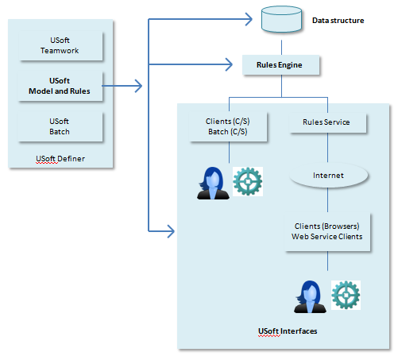

# Introducing USoft Modeller and Rules Engine

With USoft Modeller and Rules Engine, you can create data-intensive business applications rapidly. From a single source, three tiers of functionality are generated automatically:

- A **data structure** for storing business data.
- A **Rules Engine** for enforcing business rules connected to that data.

- Default (C/S and Web) **interfaces** for interacting with this Rules Engine.

You determine data structure essentially by defining domains, tables and columns. You build a Rules Engine essentially by defining constraints.

USoft Modeller and Rules Engine is the central module of the USoft Definer IDE (= Integrated Development Environment), which also comprises the USoft Teamwork and USoft Batch modules:

 