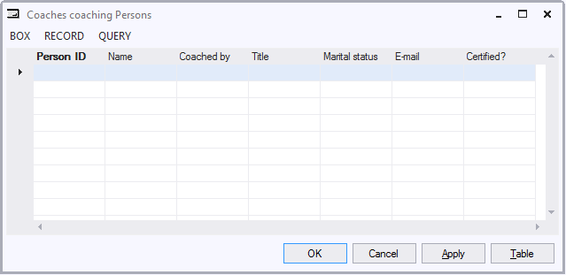

# Lookup windows

A Lookup Window is a form interface that allows a user who is editing a foreign key field (in a child table) to lookup possible data for this field (in the parent table).
When you declare Relationships, in Info Boxes for the child table, USoft automatically creates a lookup button to the right of each field that corresponds to a foreign key in that child table. In the following example, "Coached by" is a foreign key referring to a parent table with Coach data. This explains why this field has a lookup button to the right of the input field:

When the user clicks the lookup button, or positions the cursor in the Coached By field and presses F12, a Lookup Window appears:

In the Lookup Window, the user can query parent data and, once these data are retrieved in the Lookup Window, select one of the parent records and then click OK. As a result of this:

- The user will navigate back to the form with the foreign key field (Coached By in the example).
- USoft will copy the selected value (here, the Person ID of the Coach) in the foreign key field.
- USoft will close the Lookup Window.

Alternatively, the user may click Apply instead of OK. In this case, the Lookup Window remains open for further lookup action for other child records.