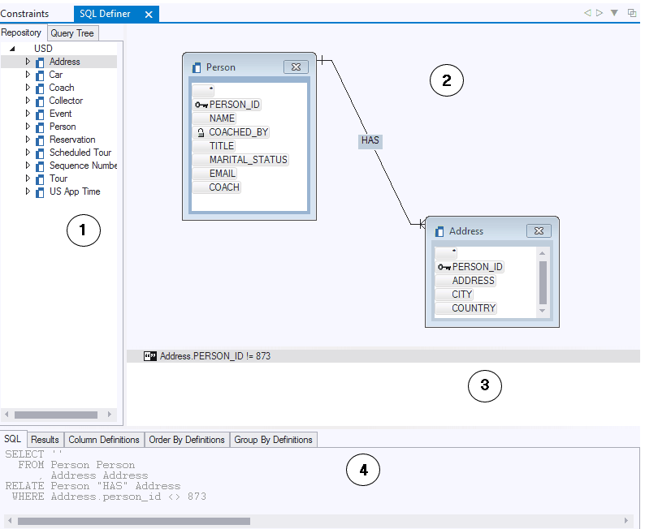

# SQL Definer

The SQL Definer enables you to build SQL statements by manipulating a tree-like representation:

The SQL Definer window consists of four panes, which can be opened/closed by means of the Show menu. In the illustration above these panes have been marked (1) - (4 ) to help identify them.

1.    Query Catalog. The Query Catalog is the tab pane on the left. The Repository tab page displays query components. The Query Tree tab page displays the hierarchy of the SQL statement built so far.

2.    From List pane. The From List pane is the pane at the top. It displays tables used in the current statement. Columns are listed for each table. Small icons indicate which columns are (foreign) key columns. If relationships exist between these tables, they are indicated by solid lines between the tables. A label indicates the Parent Role of the relationship.

3.    Condition Tree pane. The Condition Tree pane is the pane in the middle. It displays the WHERE conditions defined for the current statement These conditions are made up of expressions, functions and operators.

4.    Select List pane. The Select List pane is the tab pane at the bottom. Tab pages display the text of your SQL statement so far, the data that it would retrieve, Column Definitions, ORDER BY definitions, and GROUP BY definitions, respectively.