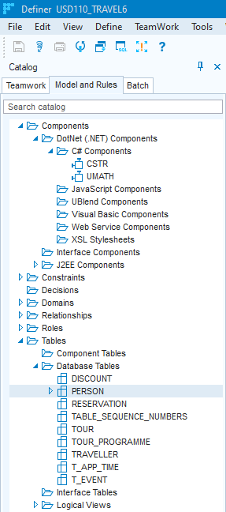

# The Catalog

When you first start the Definer, the Definer window is displayed with a **Catalog** pane on the left-hand side. The remainder of the window shows an empty workspace.

This Catalog has 3 tabs: TeamWork, Model And Rules, and Batch. On each tab, there is a tree view that shows a collection of objects. You can expand and collapse nodes in the tree view. This allows you to explore the various types of object stored in the repository. Folder nodes are for object types. By expanding a folder node, you can explore the actual objects of a type.

USoft Definer, Catalog pane## Opening windows from the Catalog

As an alternative to menu options, you can use the Catalog to navigate to objects in the repository:

- Drag-and-drop a tree node in the Catalog onto the workspace, or
- Double-click on a tree node in the Catalog, or
- Right-mouse-click on a tree node in the Catalog.

## Folder nodes, object nodes

A folder node is for a **type** of object, for example: Database Tables. Folder nodes open windows where you can query objects of that type.

Non-folder nodes are for **specific** objects, for example: the PERSON database table. Non-folder nodes open windows in which the record for the specific object has been retrieved.

## Searching the Catalog

To search a catalog tab:

1. Click in the "Search catalog” text field at the top of the catalog tab.
2. Type the text string to search for.
3. Press ENTER or click outside the field.

The search is performed case-insensitively. It is applied only to names of specific objects, not to names of object **types**. The search result contains all the objects that have the search text string in their name. The search result is a subset of the catalog tree in which the matched object nodes, but also their ancestor folder nodes are displayed.

If there are no matches, the catalog tab will display an empty space. To return from a search result to the full tree view, erase the search text string from the "Search catalog” field and press ENTER once more.

## Showing, hiding the Catalog

You can show and hide the Catalog pane. To show it, choose Catalog from the View menu. To hide it, click the Close button in the top-right corner of the catalog pane, or choose Hide Catalog from the context menu of most catalog tree nodes.

Changes in the object model are not immediately reflected in the Project Catalog. Choose View, Refresh Catalog (Cntr + F5) to have the Catalog display the latest situation.

## Model and Rules, Catalog icons

The following icons are used in the Modeller and Rules Engine tab page of the catalog to denote the various objects:

|        |        |
|--------|--------|
|

|Database Table|
|

|Interface Table|
|

|Component Table|
|

|Domain  |
|

|Interface Domain|
|

|Relationship|
|

|Component|
|

|Domain Constraint|
|

|Domain Constraint, incorrect or unchecked|
|

|Table Constraint|
|

|Table Constraint, incorrect or unchecked|
|

|Inactive Constraint|
|

|Logical View|
|

|Logical View, incorrect or unchecked|
|

|Web Service (Provider)|

 