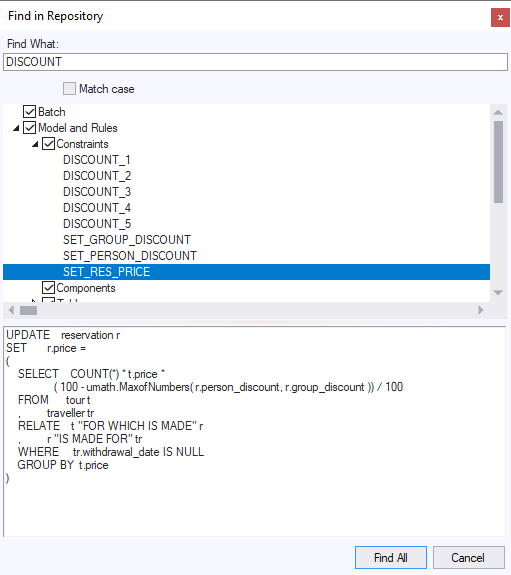

# The Find In Repository dialog

The Find in Repository dialog, accessible from the Definer's Edit menu, allows you to search for an occurrence of a string in several areas of the repository.

Find in Repository dialogThe Find in Repository dialog contains:

- An area where you can type the string that is to be searched for.
- A tree view that allows you to restrict the search areas, and also shows the results of the search.
- A text area that shows the text in the selected item in the tree view containing the searched string.

If you double-click an item in the tree view, the definition window for that item will be displayed. In the example illustrated above, double-clicking on SET_RES_PRICE opens the constraint definition window for the SET_RES_PRICE constraint.
You can restrict the search area by unchecking boxes in the tree view before pressing the Find All button. Only those areas for which the checkbox is checked will be searched. You can toggle the setting of the checkboxes using the mouse, or the keyboard space bar.
The dialog is dockable.