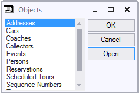

# The Objects List

You can open each standard Info Window by choosing it in the Objects List dialog:

This dialog always remains on top of other windows or dialogs that are currently open (except for other windows or dialogs that are always on top).
To open the Objects List dialog, do one of the following:
1.    Choose View, Objects from the standard menu bar.
2.    Press Alt + V + O.
3.    Click the Objects icon (below) on the Toolbar

Objects iconTo use the Objects List dialog:
1.    If you want to open an Info Window but KEEP the Objects List open: double-click the required item in the Objects List, or click it and then press Open.
2.    If you want to open an Info Window but NOT keep the Object List open, click the required item and then press OK.