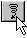

# The Transactions window

Every time that you execute a local save, the data manipulations since the last commit are added to the current transaction. At the same time, any checks that can be made on the data without actually committing it are carried out. Only when you commit your changes can all the checks be executed on the database, as one change may affect several other columns in other tables.
If you want to see the current state of the transaction at any given moment, choose File, Transactions from the menu bar. The Transactions window shows you which checks still have to be carried out on the database:

- The number of records processed by the database.
- The number of records locked (modified) in the interface, before changes are sent to the database.
- The number of requested locks to the database (SELECT FOR UPDATE statements).

You can roll back any uncommitted transaction by clicking Rollback in the Transactions window or the Rollback button on the toolbar:

However, it is important to realize that this will undo ALL your changes since the last time you executed a commit.
In most cases, you will probably only need to correct a few things and then re-commit.