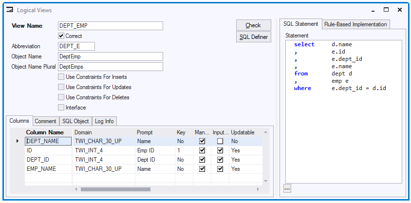

# Logical Views

A **logical view** presents data from one or more tables (called 'underlying tables') to the user or developer. It presents those data differently than the underlying tables do themselves.

Logical views do not store data themselves. Rather, they present data stored in the underlying table(s).

Each logical view is defined by a SQL SELECT statement that selects data from the underlying table(s).

Logical views are used:

- To assemble related data from different tables in a single meaningful view, so that the user does not have to go to all the individual tables to obtain the data. This is shown in Example 1.

- To present data differently than they are stored. This is shown in Example 2.

- To make calculations using data from underlying tables, and present the result of these calculations in screens.

In USoft Windows Designer and USoft Web Designer, you automatically get info windows and info web pages for each Logical View. This makes it easy to create interfaces that present the Logical View data to the user in a single window or in a single web page.

*Example 1*

This logical view assembles data about participants. Unlike the underlying table Participant, it contains the start date and return date of the tour that the person is participant in, as well as the family name and gender of the participant:

```sql
select     pt.person_id
,          p.family_name
,          p.gender
,          t.destination
,          t.tour_type
,          s.start_date
,          s.return_date
from       participant pt
,          person p
,          reservation r
,          schedtour s
,          tour t
relate     p "TAKES PART AS" pt
,          r "IS MADE FOR" pt
,          s "FOR WHICH ARE MADE" r
,          t "IS SCHEDULED AS" s
```

*Example 2*

This logical view presents e-mail salutations to persons. The underlying Person table does not store the salutations in this format:

```sql
select     p.person_id
,          'Dear ' ||
           DECODE(
              p.gender           
           ,  'M'           
           ,  'Mr. '           
           ,  'Ms. '           
           ) ||
           UPPER( SUBSTR( p.family_name, 1, 1 ) ) ||
           LOWER( SUBSTR( p.family_name, 2 ) ||
           ': '           salutation
from       person p
```

## How to define a Logical View

To define a logical view:

1. Right-click on Logical Views in the project Catalog, and choose New Logical View. Alternatively, choose Define, Tables, Logical Views from the menu bar. The Logical Views window appears.

2. Type the SQL statement.

3. Press the Check button to have the SQL statement checked. For more on checking, see the next section.

- If the Logical View is incorrect, a message is displayed explaining what is wrong.

- If the Logical View is correct, the Correct flag is set.

4. Save your work. This step is necessary: Check does not Save by itself.

## Checking Logical Views

Before you can use a Logical View, you must check it for correctness by pressing the Check button in the Logical View window or tab.

Checking a Logical View results in its Correct flag being set to Yes. Checking a view is the only way to give it the Correct flag.

A subsequent change may affect the Logical View, for example:

- You change the Logical View's SQL Statement.

- An underlying table is changed or dropped.

If such a change occurs, the Logical View is automatically reset to Correct = No. In this case, it will need to be rechecked. In the "Logical Views" node in the tree view of the Modeller and Rules Engine catalog, unchecked Logical Views are signalled by a contrasting icon.

You can get all unchecked views to be rechecked in one go by using the Tools, Check View facility in the USoft Definer menu.

The VERIFY_VIEW_WHERECLAUSE Rules Engine parameter specifies whether manipulations on logical views must be checked to see if the values entered match the WHERE clause of the logical view or not.

If set to 'True' (default), the values inserted or updated in a logical view are checked against the WHERE clause of the logical view. If they do not match, an error message is displayed: 'manipulation does not match WHERE clause'. In this case, you cannot enter data in the logical view that cannot be queried by this logical view. If set to 'False', this check is not performed.

If the setting is not present in the Rules Engine parameters, recreate the Definer repository tables WITHOUT dropping the tables. This action will create the new parameter.

## How to check a Logical View

To check a Logical View:

1. Get the Logical View in your screen in the Logical Views window or tab. (You can open this tab from the Define, Tables, Logical Views menu option and query the Logical View you want to check, or you can double-click it in the Logical Views node in the tree view of the Modeller and Rules Engine catalog or Teamwor catalog.)

2. Press the Check button.*

If the Logical View is correct, the Correct flag will be set to Yes and the Columns list in the bottom half of the window or tab will be (re)computed.

3. Save. This step is necessary: Check does not Save by itself.

* Alternatively, you can check ALL Logical Views in a single action by choosing Tools, Check Repository from the menu.

## Logical View attributes

When you check a Logical View, USoft automatically computes a list of columns for the Logical View. Each of these columns will automatically get certain attribute settings based on column attributes of the underlying table(s).

Also, the view checker makes a number of special decisions. In the example below:

- The column names (in the Columns tab) are NOT always the same as in the defining SQL Statement (on the right).
- The Key, Mandatory, Input Allowed and Updatable column attributes are NOT always the same as in the underlying tables.

The view checker has made these decisions to enable you to use the view properly. It has added the prefixes DEPT_ and EMP_ to disambiguate between department names and employee names. It has also determined that it is the employee ID that serves as primary key, and that department names are not editable in this view:



Once the list of columns for a Logical View has been computed, you can manually change column attribute settings. In particular, when you write a Logical View that has a primary key spanning multiple columns, USoft will not always guess correctly which columns are in the primary key; it is important to specify this manually by setting the Key attribute to '1' for the correct Logical View columns.

When you set a Logical View column attribute, always consider if it is not preferable to make the setting at the underlying table level instead. For example, information that is Mandatory in the sense that it must always be supplied must be set to Mandatory at the table level, not in Logical Views. Conversely, it makes no sense to set a Logical View column to non-Mandatory if it is directly based on an underlying table column that is itself Mandatory, since the latter setting will cause the application to always require a value in this column, regardless of whether the user attempts to interact with the data through the Logical View or directly at table level.

Columns in Logical Views have their own Default Value attribute. If you specify a default value for a Logical View column, this overrides any default value set for the corresponding column(s) in the underlying table.

## How to set Logical View column attributes

1. First, make sure you have finished writing the Logical View's SQL Statement.

2. Check the Logical View.

If the Logical View is correct, this will cause the Correct flag to be set to Yes and the list of Columns in the lower part of the Logical Views window or tab to be (re)computed.

3. Edit the attribute settings in the Columns grid as required.

4. Save.

 