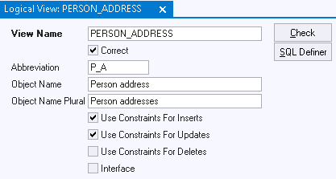
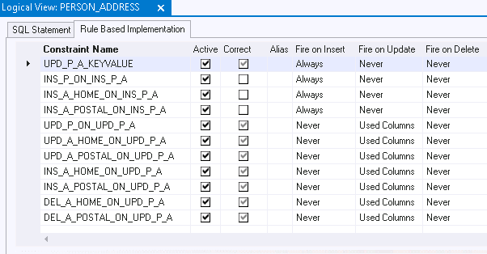

# Rule-based logical views

## What is a rule-based logical view?

Views present data from one or more tables to the user in some way that is attractive to business users, but departs from the underlying table structure in which the data is actually stored. Unfortunately, you cannot always automatically manipulate data in views in the same way as in the underlying tables.

Rule-based Logical Views solve this. They let you determine what should happen when a user manipulates the view. You do this by declaring special rules that execute when a user performs a manipulation (INSERT, UPDATE, or DELETE) via the view.

For example, you can make sure that when a user inserts a record into a Logical View, this INSERT is translated by special rules into multiple INSERTs into 2 or more different underlying tables.

## How to define

To define a rule-based Logical View:

1. Start by defining and testing a new Logical View in the normal way. Provide the SQL Statement, press the Check button so that USoft sets the view to Correct = Yes, then save your work. Or find an existing Logical View that you want to make rule-based, and make sure it has Correct = Yes.

2. Decide which of the three DML actions (insert, update, delete) you want to make rule-based. For each of these actions, set the Use Constraints... flag to Yes. Save your work.


:::note

You don't always need special rules for each DML action. In a view that joins a parent and a child table connected by a Relationship with Delete Rule = Cascading, it is likely that you don't need a special rule for delete action, in which case you keep the setting Use Constraints for Deletes = No.

:::

3. Plan ahead what are the special rules that you want executed for each rule-based DML action in this logical view.

4. In the Columns tab of the Logical View tab or window, make any necessary adjustments to column attribute settings. In particular, since you are providing extra functionality, it is likely that some columns that were initially set to Updatable = No should now get Updatable = Yes. Save your work.

## Dealing with database-generated key values

If the Logical View shares a database-generated key value with an underlying table, you need to take special action if (on Insert into the view) your special rules are going to write that key value into multiple underlying tables. Write a transitional Update constraint against the view that retrieves the next generated key value ahead of time, in other words, before the user action on the view is translated to actions on underlying tables:

1. Invoke the GetNextGeneratedUniqueValue() method of the internal \<table name> component. The generic INVOKE syntax is:

```
INVOKE    *table-name*.GetNextGeneratedUniqueValue()
```

but you can replace the INVOKE keyword by function call Syntax a typical SQL statement of a transitional Update constraint retrieving the key value will look like this:

```sql
UPDATE   *rule-based-logical-view*
SET      *primary-key* = *underlying-table*.GetNextGeneratedUniqueValue()
WHERE    *primary-key* IS NULL
```

2. Write your special rules as transitional constraints on the Logical View (meaning that the Transition Table attribute is set to the name of the Logical View and you use one or more of the Fire On... flags). You have a design choice here:

- You can define all the desired behavior on the constraints themselves.
- Alternatively, you can have a transitional constraint call a USoft batch job that executes the desired behavior. Start the constraint SQL with

```
INVOKE BatchRunner.*job-name* WITH SELECT ... .
```

3. Before testing, debugging or maintaining the solution, make sure that all the transitional constraints are Active and Correct.

TIP: The "Rule-based Implementation" tab in the Logical View tab or window helps you with this step.

## Flagging a rule-based logical view

You can make a Logical View rule-based for each of the 3 DML actions (INSERT, UPDATE, DELETE) separately. Do this by setting the Use Constraints ... flag for that action. Each flag informs the Rules Engine that the default behavior for that action is to be overridden by your special rule(s). Here is a view that is rule-based for INSERT and UPDATE action, but not for the DELETE action:



Logical View rule-based for Insert and Update but not for Delete## Declaring underlying rules of a rule-based logical view

 

You declare the special rules underlying the rule-based logical view by creating transitional constraints on the view. There are two general strategies:

- Providing a transitional constraint that calls a USoft batch job where you can provide the implementation as a sequence of statements. Providing the implementation as a sequence of statements gives you the possibility to execute statements in a specific order. In this strategy, all the special rules (DML statements) are found in the same place. This makes the implementation easier to read, maintain and debug. The disadvantage is that you need to provide a job and an external set for the sole purpose of performing a DML action on a view.

- Providing only transitional constraints that implement the special rules directly. This solution has the advantage of only using the constraint mechanism, but you cannot enforce the order in which the constraint statements are executed.

 

If you choose the constraints-only strategy, a special "Rule-based Implementation" tab in the Logical Views tab or window helps you debug and maintain your constraints. Here, you can view and edit the constraints connected to the view without having to navigate to the Constraints tab or window:



List view in "Rule-based Implementation" tab in Logical Views tab/window