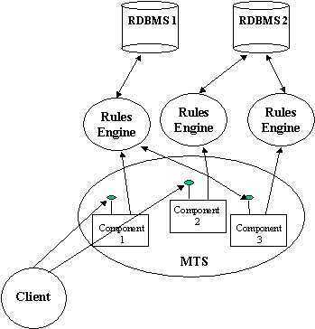

# Microsoft Transaction Server (MTS)

Microsoft Transaction Server (MTS) is a component-based transaction processing system for building, deploying, and administering Internet and Intranet server applications. The MTS programming model provides a transaction coordination framework for developing components that encapsulate business logic. In Windows XP, MTS and Microsoft's Component Object Model (COM) are unified in COM+.

USoft applications can be integrated with the Microsoft Transaction Server (MTS) architecture to support distributed transactions. A USoft application and MTS components can be involved in distributed, 'global' transactions. One of the main advantages is that these distributed transactions benefit from the two-phase commit protocol.

Requirements

To be able to integrate USoft Developer with MTS, you need:

- MTS version 2.0
- MS SQL Server version 7.0 or Oracle version 7.3.4 or higher
- Microsoft ODBC Manager version 3.51.

For more information about MTS, including the exact database requirements, please refer to the Microsoft Transaction Server Reference supplied with MTS.

## Distributed transactions and the two-phase commit protocol

A distributed transaction is a transaction that consists of data manipulations made on one or several databases, using one or more database connections. A non-distributed transaction is a transaction that consists of data manipulations made on only one database, using only one database connection (which is the case for the two-tier USoft client/server architecture). The MTS architecture supports distributed transactions: a transaction can consist of data manipulations made by several components on several databases.

Distributed transactions benefit from the two-phase commit protocol. This protocol provides a standard way of handling distributed transactions. MTS also uses this two-phase commit protocol.

When the two-phase commit protocol is used for a distributed transaction, the transaction will only be committed if ALL manipulations made by Rules Engines and MTS components involved in that transaction, on the same or different databases, are successfully committed. If one of the components fails to commit, the whole transaction is aborted and a rollback occurs.

## The MTS architecture

In the new architecture, an MTS component connects to the Rules Engine via the Remote Rules Service. The Rules Engine acts here as a server.

MTS components are COM-components that can be involved in distributed transactions. These components can be written with Visual Basic, C++ or any language that is adapted to write COM components.

 

Architecture combining MTS Components and the Rules Engine

 

To connect to the Rules Engine, an MTS component uses an ODBC Data source. This data source must have been set up for the Remote Rules Service. You must use one of the following API's: ODBC, OLE-DB, ADO, or JDBC. Refer to the USoft Remote Rules Service API Help for more information on these subjects.

Within the MTS architecture, the Rules Engine appears as a database connected via the Remote Rules Service API. The actual database, however, is the RDBMS that the Rules Engine connects to. Therefore, the Rules Engine must tell MTS that this RDBMS also participates in the distributed transaction. To allow the RDBMS to participate in the distributed transaction, the Rules Engine needs to: connect to the RDBMS either with an ODBC connection, or with an MS SQL Server connection.

If you want to connect, for example, to an Oracle database, you must use an ODBC for Oracle driver that supports MTS. This driver is delivered by Microsoft with the installation of MTS. Please refer to your MTS documentation for details.

To improve performance:

- Set the connection pooling for the USoft Remote Rules Service API to ON.
- Set the timeout to 600.

Without connection pooling, a Rules Engine will be created for each new database connection. This takes quite a long time. With connection pooling turned on, after a component releases its Rules Engine connection, this connection can be re-used for another component.

**Restriction:** With distributed transactions, the Rules Engine cannot handle deferred constraints directly.

 