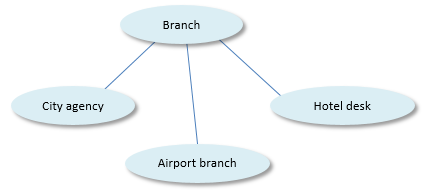
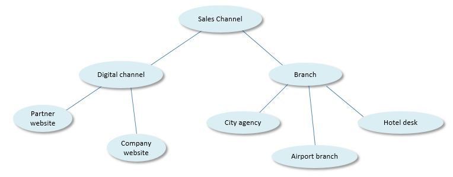
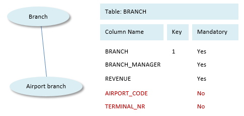

# What are supertypes and subtypes?

A **subtype** is a type that shares characteristics with another type (its **supertype**), but that also has one or more characteristics of its own.

### Concept

Subtypes are also referred to as specialisations, subclasses, or "special cases". In a car rental organisation, imagine that 'city agency', 'airport branch' and 'hotel desk' are all subtypes of supertype 'branch':



The 3 subtypes share common characteristics of the supertype, such as the fact that they have an address and a branch manager, but they also have characteristics of their own: an airport branch has a airport terminal where it is located, but non-airport branches do not.

### Subtype trees

Supertypes may be, in turn, subtypes of a supertype at a higher level. This way, in theory, you can build entire tree structures called *taxonomies*:



In conceptual modelling generally, a subtype can have multiple supertypes. However, USoft Definer supports a maximum of 1 supertype for each subtype (as in the tree structure shown).

In USoft Definer, it is not necessarily practical to build extensive subtype tree structures, even if (conceptually) such subtype trees can be distinguished.

### Modelling subtypes in columns

You can model subtypes simply by defining extra columns for the extra characteristics of the subtype. These subtype columns must be defined with Mandatory = No, since it must be possible to store (in the same table) supertypes that do not have the subtype characteristics:



In this setup, you can add a BRANCH_TYPE column that you allow (typically through allowed values at domain level) to be set to either 'CITY_AGENCY', 'AIRPORT_BRANCH', or 'HOTEL_DESK'. You can then write constraints such as the following, which enforce that Airport Code and Terminal Number are specified for airport branches but not other branches:

```sql
SELECT         ''
FROM           branch
WHERE          branch_type = 'AIRPORT_BRANCH'
AND
(              airport_code IS NULL
     OR        terminal_nr  IS NULL
)

SELECT         ''
FROM           branch
WHERE          branch_type != 'AIRPORT_BRANCH'
AND
(              airport_code IS NOT NULL
     OR        terminal_nr  IS NOT NULL
)
```

### Modelling subtypes using relationships with Max Children = 1

You can model subtypes by creating relationships where subtype information is in the child table. The primary key of the relationship is the primary key of the supertype table. The foreign key of the relationship is the primary key of the subtype table. If the concept is a "true" subtype, then each Branch is allowed to be an Airport Branch only once, so the relationship must have the Maximum Children = 1 setting. This time, the supertype characteristics Airport Code and Terminal Number are allowed to be Mandatory columns:


To model a subtype using a relationship is to misrepresent a subtype for a child entity, but a practical advantage is that Relationships are easier to deal with than Supertype Tables (next section) if your application is subject to complex data management operations.

### Modelling subtypes using Supertype Table

You can model a subtype by setting a subtype table's Supertype Table attribute. In this case, USoft Definer will implement (and subsequently enforce) that both tables have identical primary keys:


 