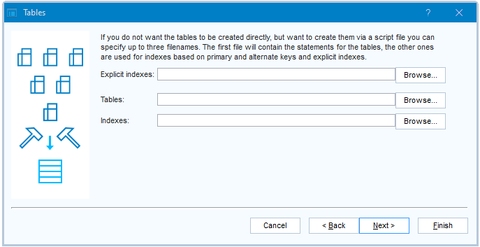

# Generating tables


:::note

The USoft capability to (re)generate database tables and database indexes is variously labeled as **Create Tables** (in USoft Binder), **Create Physical Tables** (in the USoft Definer menu), **creapp.exe** (on the command line), **pc:creapp** (in USoft Blend).

:::

Each time you define or change domain, table, and column attribute values in USoft Definer that affect physical RDBMS tables or indexes, you can have USoft (re)generate the corresponding database tables and indexes in the RDBMS.

You can (re)generate instantly or you can generate a DDL script that contains the instructions for (re)generation. These instructions are chiefly SQL DDL statements, for example, CREATE TABLE and CREATE INDEX statements. By default, USoft attempts to preserve any **application data** already present in the changing tables. For this reason, especially in USoft 10, generated scripts may also contain SQL DML statements (INSERT, UPDATE).

In Definer, to have a specific table and its index(es) (re)generated after the table has been defined or changed:

1. Save any uncommitted work.
2. In the Database Tables window, make sure you have retrieved the record for the table you want to (re)generate.
3. Press the Create button in the top-right corner of the window.

In Definer, to have USoft (re)generate tables and indexes in the RDBMS to reflect changes in multiple tables:

1. Save any uncommitted work.
2. From the menu, choose Tools, Create Physical Tables. You are given a choice between , or 

|**Option**|**Explanation**|
|--------|--------|
|New or Updated|USoft will determine which tables have been changed after the most recent time you had tables (re)generated, and then (re)generate only that subset of tables.|
|Selected|You can determine manually which tables must be (re)generated.|
|All     |All the defined tables will be (re)generated.|


3. If you want USoft to generate a script, as opposed to (re)generating the designated tables immediately, make sure you press Next (not Finish) until you see this dialog:



Enter file paths for the various scripts, as explained. In each case, the script is generated only if you provide a file path.

4. Press Finish to start (re)generating the table(s) or to start generating the script(s).

## Troubleshooting application data upgrades

It is always possible that changes to tables are so drastic that existing application data cannot be automatically preserved. This applies, for example, when you have a column containing alphanumeric string values that changes to a number datatype. In general, you can tackle this kind of issue in one of two ways:

- You can generate the script that defines what (re)generation is about to do. This allows you to analyse the script to spot any problems ahead of time, or to execute the statements in the script one-by-one for easier debugging.
- You can react to error messages and unwanted effects after the fact. For this, you need the background information in this section.

In practice, the risk of losing or corrupting existing application data is limited to the Development environment. It is customary in USoft projects to generate and test upgrade scripts for application data in Production ahead of release time.

Generating tables is quite different between USoft 11 and USoft 10, because USoft 11 introduces GUID-based identification of tables.

----


In USoft 11, tables and columns are identified by globally unique identifiers and not (only) by their string name. It is mostly possible to keep existing application data in the same physical RDBMS table, even if the table name has changed.

In certain cases where application data cannot be preserved automatically, for example when you have a column containing alphanumeric string values that changes to a number datatype, USoft will create an empty new table and you will still be able to recuperate the old application data from an OLD_ table. For an explanation of OLD_ tables, see the USoft 10 section below.


:::tip

Tables that are described in USoft Definer but that are in fact an RDBMS view or an RDBMS synonym, are ignored by Create Table. See [External tables](/Modeller_and_Rules_Engine/Tables_columns_and_relationships/External_tables.md).

:::

----


In USoft 10, USoft will decide to transition to a changed data structure by first renaming the existing RDBMS table (if any) to its equivalent with the prefix OLD_, then creating the new table, and then transferring existing data to the new table.

Tables and columns are identified only by their functional string name. If you rename a table, the generation process will ask if you want a new empty table, or if you want application data to be transferred from a renamed table (it will invite you to specify which).

You can inspect the use of OLD_… table names by letting USoft generate a script and then inspecting the script:

```sql
RENAME TABLE product TO old_product
CREATE TABLE product ( ... )
INSERT INTO product SELECT ... FROM old_product
```

In some cases, instead of this RENAME… CREATE… INSERT... strategy, USoft will implement the transition by issuing an ALTER TABLE statement. If you prepare table generation in USoft Delivery Manager, you can determine yourself for each table if you want the CREATE or the ALTER strategy.

----

 

## Where to activate table generation

You can activate table generation in multiple places in the USoft tool set.

### Create button

In Development, best practice is to instantly re-generate an RDBMS table each time you have made a series of changes that affect it. Do this by pressing the Create button in the Tables window for the table. The Create button does not give you the option to create a script.

### Create Physical Tables wizard

You can run the Create Physical Tables wizard to (re)generate RDBMS tables after changes have occurred that affect these tables. This way, you can choose to (re)generate only tables that you specifically select; to have all new or changed tables (re)generated; or to have all tables in the data model (re)generated.

You can choose to execute immediately or write the RDBMS instructions to a script. The script option is useful for inspecting the operations that will take place before actually executing them. A script may also be carried to a different (non-Development) environment to make the same amendments to the RDBMS table structure there, but this is only guaranteed to work if you are sure that the existing situation is the same as in Development.

Start the Create Physical Tables wizard by choosing Tools, Create Physical Tables from the USoft Definer menu.

### Create Tables option in USoft Binder

You can (re)generate the RDBMS data structure of your application by running the Create Tables option in a USoft Binder item for the application. Do this by right-clicking on the USoft Binder item and choosing Create Tables from the context menu.

This option is useful when you have carried a .CON flatfile of your changed USoft Definer definitions to a different environment and you have access to the application in that environment through a USoft Binder file.

When (re)generating tables in this way, you can choose to drop existing tables. Do this by setting Drop Existing Tables = Yes in the dialog. CAUTION: This will cause all existing application data (if any) to be cleared.

### Data management in USoft Benchmark

You can (re)generate tables using various USoft Benchmark routines for data management. This is suitable only for test environments, where existing data do not matter because they are re-initialised. Run USoft Benchmark in the context of your application, then press the Data button in the Benchmark Toolkit window. See USoft Benchmark Guide for details.

### USoft Delivery Manager

You can have a release script for (re)generating tables created automatically by USoft Delivery Manager. Such a script is based on differences with the RDBMS data structure in the previous version or previous release of your application. A release script can be prepared in Development and then run successfully in Test, Acceptance, Production and other environments.