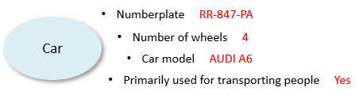

# What is a column?

A **column** is the implementation of an attribute that is relevant for distinguishing or describing instances of an entity.

*Examples*

A numberplate is an attribute of the CAR entity that allows you to distinguish individual vehicles.

A colour is an attribute of the CAR entity that allows you to describe an aspect of an individual vehicle.

### Columns implement attributes

An **attribute** is an abstraction that allows you to identify, describe and classify instances of an entity on the basis of assigning an attribute value, and so describing a relevant characteristic of that instance.

*Example*

An individual vehicle could be identified, described and classified as an instance of the "Car" entity by assigning the attribute values of "RR-847-PA" to the attribute Numberplate, "4" to the attribute "Number of wheels", "AUDI A6" to the attribute Car Model, and "Yes" to the attribute "Primarily used for the transport of people" :

### Attribute values are stored in database columns

A column is the part of a table where attribute values for a specific attribute are stored of the entity represented by the table. For example, the fact that a car with numberplace RR-847-PA is of the car model AUDI A6 is stored in the CAR table in the CAR_MODEL column of the record with numberplate RR-847-PA:

|****Table: CAR****|
|--------|--------|
|**Numberplate**|**Car model**|
|134-PTB-04|MERCEDES C COUPE|
|RR-847-PA|AUDI A6 |

Only non-trivial attribute values are stored in a practical implementation. For a car, the fact that an instance has 4 wheels and is primarily used for transporting people is not stored in a column because it applies by definition for all car instances. The numberplate is likely to identify the instance, and is therefore stored in a column of the CAR database table called NUMBERPLATE. The car model is also likely a non-trivial characteristic of a car, and is therefore likely to be stored in a column called CAR_MODEL.

### USoft generates database columns

On the basis of Column and Domain definitions that you specify in USoft Definer, USoft generates database columns automatically in the RDBMS as part of (re)generating a database table.

Each column must have a name that uniquely identifies that column within the table. A column name is spelled all-uppercaps with underscores (rather than spaces or hyphens) as separators, as in FIRST_NAME.

Each column is based on a domain. The domain characterises the set of values that are allowed as input for the column.

Some of the attributes that you define for Columns and Domains are used when (re)generating the column in the RDBMS. The most important are:

- The name of the table.
- The name of each of the columns.
- The datatype of each of the columns.
- The maximum length (if applicable) of each of the columns.
- The fact that a column is Mandatory (= must have a value for each instance) or not.

### USoft generates fields in application interfaces

Some of the attributes that you define for Columns and Domains are used by USoft to generate application interfaces automatically.

Generated C/S and web interfaces allow human end users to interact with the tables:

- In a default generated C/S application, each input field in a window corresponds with a column.

- In a default generated Web application, each input field on a web page corresponds with a column.

Thus,

- A column's Prompt attribute determines which text is displayed as a prompt next to a field for the column.
- A column's Position attribute determines in which order a field for the column appears in the window or on the page, relative to fields for other columns in the table.
- A domain's Display Type determines what sort of visible control is used to display fields for columns based on the domain, for example, a regular text box, a check box, or a dropdown list box.