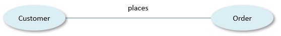
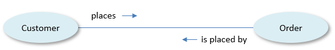
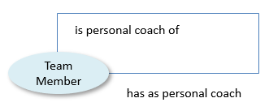
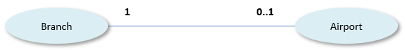
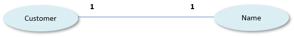
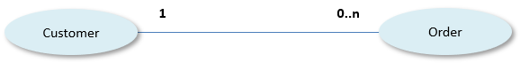
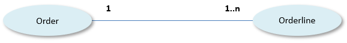
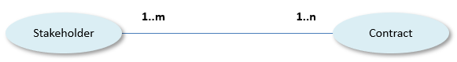
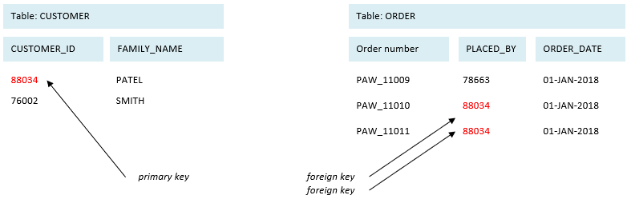

# What is a relationship?

A **relationship** in USoft is the implementation of a connection between 2 instances of entities.

*Example*

The connection between an Order and the Customer who placed that Order.

Each individual person who places an order is an instance of the Customer entity. Each individual order is an instance of the Order entity.

###  

> [!TIP]
> Near-synonyms of **relationship** from other modelling techniques include **binary verb concepts** (SBVR), **associations** (object-oriented modelling), **fact types** (logic), **relations** (Entity-Attribute-Relation modelling).

### Relationships implement connections

A relationship implements the fact that 2 instances of entities are connected in some way that is relevant to the business. Such a connection is typically described in English by using a verb, such as *places* in the example. The grammatical form of the verb is different when you read the other way: customers *place* orders, orders *are placed by* customers:

It is also possible for the 2 instances to be of the same entity (the same type), as in the relationship between a Team Member and another Team Member who is his or her personal coach:

Exactly how you implement a relationship in terms of specific USoft Tables, Columns and Relationships is a design choice that mainly depends on the connection's *cardinality.* 

For help on mapping cardinality to USoft Tables, Columns and Relationships, click [here](/docs/Modeller_and_Rules_Engine/Tables,_columns_and_relationships/Cardinality_in_relationships.md).

Cardinality is the number of times that an instance is allowed to play a part (or *role*) in a relationship. Cardinality is a separate issue for each "side" of the relationship:

A car rental branch may be located at an airport or at some different location. If the company does business from an airport, it only has a single branch there.

If you do not keep any Airport information other than the name, then Airport is said to be a **property** of Branch, rather than an entity in its own right.

Each customer has a name that must be registered. Each time a name is registered, this applies to a single person. Two customers could both be called "Smith", but if one of those names came to be changed in the application (to correct an error, or when the person actually changes his or her name in reality), then the change would apply only to that particular customer.

If you do not keep any family name information other than a customer's name, which is likely, then Name is said to be a **property** of Customer, rather than an entity in its own right.

Each customer registered in the application has placed 0, 1 or multiple orders. Each given order has been placed by a specific customer.

Each order contains 1 or more orderlines. A given orderline is part of exactly 1 order.

Contracts must be signed by at least one stakeholder (as long as it has not been signed, the document may not be registered *as* a contract), but there could be multiple stakeholders. Each stakeholder could be involved in multiple contracts.

### USoft implements relationships as foreign keys

In USoft, a relationship between Customer and Order is implemented by linking up Customer data in a CUSTOMER table to Order data in an ORDER table:

In one of the tables, called the *parent table,* here the CUSTOMER table, a column value or a combination of column values named *primary key,* here the CUSTOMER_ID column,**identifies an instance uniquely.

In the other table, called the *child table*, here the ORDER table, a column value or combination of column values named *foreign key,* here the PLACED_BY column*,* refers to the instance in the other table by using the same value as the primary key.

The Rules Engine automatically checks several aspects of the data integrity required to implement a relationship successfully:

- Primary key and foreign key data must have the same datatype.
- Primary keys must identify an instance in the parent table uniquely.
- Foreign keys in the child table must refer to primary key values that actually exist in the parent table.

These integrity checks are performed in the USoft layer, away from the RDBMS itself. The RDBMS knows only that tables have columns of specified datatypes.

### USoft generates navigation paths between related entities

If your application uses USoft-generated UIs, USoft Definer will automatically create useful navigation paths between connected tables (from a Customer to "related data" such as all the Orders made by that Customer; from a new Order to a "lookup" list of customers from which the ordering Customer may be selected). If you defined that the relationship is mandatory (a Customer must place at least one Order), the UI will automatically present child data in the same window or page as the parent data.

Good relationship design is crucial to the success of a USoft application. Relationships are not only the primary means of connecting data in different tables but they also represent conceptual links that shape your business model. It is only by creating well-chosen relationships that you will end up with tables, columns, logical views and constraints that optimally represent the business operations supported by your application, and that make large applications understandable and maintainable in the long run.