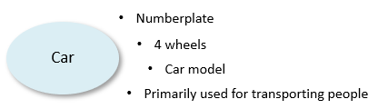

# What is a table?

A **table** is the implementation of a type of object that is relevant to the business, such as "Customer" or "Rental Contract", in the form of stored data that characterises instances of the type of object.

Most tables in USoft take the familiar form of an RDBMS database table. This is the type of table discussed in this help section.

USoft also has a small number of more special table types. The definition of **interface tables** is not declared by editing USoft Definer windows for a USoft application, but obtained by synchronising that application (the consumer) with definitions from a different USoft application (the consumed module). **Component tables** are even more special because they present data as if stored in a database table while the actual implementation is in Java or .NET code using USoft's Rules-Driven Method Invocation (RDMI) features.

Finally, **Logical Views** present data stored in underlying physical tables in a new, again tabular structure, that looks like a physical table but is defined by a query statement on the underlying tables. Logical views are like conventional database views except that they are known to the USoft Rules Engine.

## Tables implement entities

A table implements an entity. An entity is a type of object characterised by a set of attributes that you want a USoft application to store permanently. Typically, an entity also plays an important role in business rules that you define in USoft.

*Example 1*

An entity called "Customer" is a type of person characterised by such attributes as Customer ID, Name, First Name, Email Address, Customer Since (= the date when the person started being a customer).

*Example 2*

An entity called "Rental Contract" in a car rental company could be a type of contract characterised by such attributes as Contract Number, Date Concluded, Customer ID, Rental Type, Product, and Branch.

Certain object modelling and data modelling techniques refer to entities in terms of classes or types. USoft refers to entities as tables. This reflects that it is typical of the USoft methodology to implement entities by creating RDBMS tables.

To distinguish entities in your business world is a modelling skill. If a car rental company has a parking lot with vehicles and each vehicle has a numberplate, has 4 wheels, is of a specific car model, and is primarily used for transporting people, then this is the basis for distinguishing an entity "Car" in their business model, with "Numberplate", "Number of wheels", "Car model", and "Primary use" as attributes:

Each individual car is said to be an *instance*, or *occurrence*, of the entity.

 

## Tables store information about instances

In USoft, a table implements an entity, which is a type of object. Individual persons and objects in the business world that are of the type, are instances or occurrences of the entity. In a table, each horizontal row or record corresponds to an instance, and each vertical column (or combination of columns) represents an attribute or characteristic of the instance:

**Table: CAR**

|**Numberplate**|**Number of wheels**|**Car model**|**Primary use**|
|--------|--------|--------|--------|
|44-TRX-85|4       |AUDI A6 |Transport of persons|
|134-PTB-04|4       |MERCEDES C COUPE|Transport of persons|

In practice, in a USoft application, attributes that apply by definition to each instance of the type are not physically stored in the table for each instance. In the example, the definition of "Car" could be:

**A car is a vehicle that has 4 wheels and is primarily used for transporting people.**

and the physical table would not store "Number of wheels" and "Primary use" of each instance. Instead, it would look like this:

**Table: CAR**

|**Numberplate**|**Car model**|
|--------|--------|
|44-TRX-85|AUDI A6 |
|134-PTB-04|MERCEDES C COUPE|

##  

## USoft generates database tables

On the basis of Table, Column and Domain definitions that you specify in USoft Definer, USoft generates database tables automatically in the RDBMS.

Each table must have a unique name. A table storing customer data could be called CUSTOMER. A table storing product data could be called PRODUCT. A table name is spelled all-uppercase with underscores (not spaces or hyphens) as separators, as in POINT_OF_SALE.

Some of the attributes that you define for Tables, Columns and Domains are communicated to the RDBMS, so that the physical database table may be correctly. The most important of these attributes are:

- The name of the table.
- The name of each of the columns.
- The datatype of each of the columns.
- The maximum length (if applicable) of each of the columns.
- The fact that a column is Mandatory (= must have a value for each instance) or not.

## USoft generates application interfaces

In addition to the table name, each table is also identified by an Abbreviation, an Object Name, and an Object Name Plural.

Some of the attributes that you define for Tables, Columns and Domains are used by USoft to generate application interfaces automatically.

Generated C/S and web interfaces allow human end users to interact with the tables:

- In a default generated C/S application, each table corresponds with a window, with an input field in the window for each of the columns.
- In a default generated Web application, each table corresponds with a page, with an input field on the page for each of the columns.

Generated XML import/export, SOAP service and REST service interfaces allow machines to interact with the tables.

A table's Object Name Plural (for example, "Customers" or "Points of Sale") or its underscored variant ("Points_of_Sale") is used to identify the table in UIs and in exported XML.

 