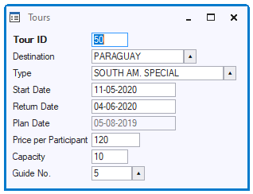
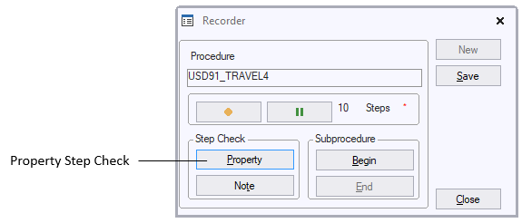
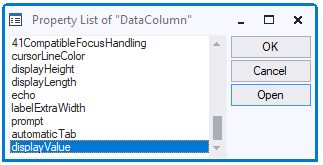
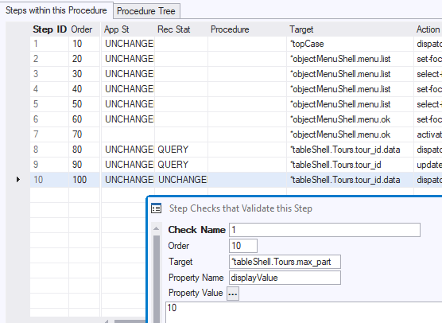
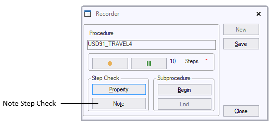
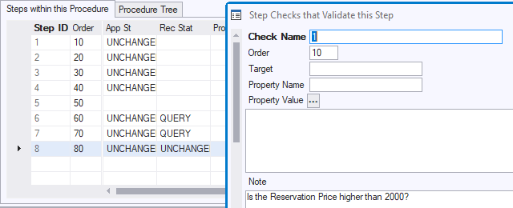

# Adding extra checks to your tests

You can add 3 kinds of extra checks to your USoft Benchmark tests. The first is for a Test Procedure as a whole. The other 2 are for specific Steps in a Test Procedure:

|        |        |        |
|--------|--------|--------|
|**Procedure check**|Procedure|Check that a specific data constellation exists AT THE END of a procedure.|
|**Property check**|Step    |
Check that some property of some object has a specific value.

One interesting thing you can do is check that some field has some specific value at the end of a step.
|
|**Note check**|Step    |Ask the human tester to confirm something.|

 

## Procedure check

Add a **procedure check** to test that a specific data constellation exists in the database AT THE END of a test procedure.

You express what data you want to see by writing a **Check SQL** statement. Each time you run the procedure:

- If that data is present (= the **Check SQL** query returns 1 or more rows) the test is considered passed.
- If that data is NOT present (= the **Check SQL** query does not return any rows), an error is raised. This shows up in the log file as an entry with ERROR in all-capitals.

To add a procedure check:

1. Record and save the test procedure first.
2. In the USoft Benchmark toolkit window, in the Database group, double-click on .
3. In the Test Procedures window, click in the Procedure Name field, then press F9 and from the dialog, select "Procedure Checks that Validate This Procedure”.
4. In the related window now open:

enter a Check Name (any name), an **Order** sequence number, and the **Check SQL** statement. **Order** numbers determine in what order procedure checks are performed if the procedure has multiple checks.

## Property check

Add a **property check** to test that some property of some object has some specific value. As an example, here are the steps for checking that the Capacity field has the value '10’ after the test procedure has retrieved the record with Tour ID = '50’ in the following Tours info window:

Each time you run the procedure:

- If the Capacity field has the value ‘10’ after the step where you added the check, the test is considered passed.
- Otherwise, an error is raised. This shows up in the log file as an entry with ERROR in all-capitals.

To add this property check:

1. Start recording.
2. Open the Tours window. Press F2. Type '50’ in the Tour ID field, then press F3.
3. At this point, press the Property Step Check button in the Recorder window:

4. Your mouse pointer turns into a pointer with a Drop this pointer (ie., point and then click once) in the Tours window on the "Capacity” prompt (you can also drop it elsewhere in the DataColumn control, but not IN the actual white-background Data control containing the value '10’, because that Data control has different properties).

5. In the "Property List of DataColumn” list view, select  , then click OK:

You should now see an information message:

**Check "displayValue” = "10” created.**

You can trace, edit and drop your property checks afterwards:

In the Test Procedure window, on the “Steps within this Procedure” tab, press F9 and select “Step Checks that Validate this Check” related window. If the selected Step has one or more property checks or note checks, these checks now appear in the related window.

## Note check

Add a **note check** to ask a human tester to verify something at some specific point in the test procedure. For example, at some point you can ask:

**Is the Reservation Price higher than 2000?**

Each time you run the test procedure, the human tester is asked that question just after the procedure step where you added the note check:

- If s/he answers **Yes** or **Cancel** to the question, the test is considered passed.
- If s/he answers **No** to the question, an error is raised. This shows up in the log file as an entry with ERROR in all-capitals.

To add a note check:

1. Start recording.
2. At the point when you want to ask the question, press the Note Step Check button in the Recorder window:

3. Type the question text in the "Step Check Notification Editor” window and press Apply.

You can trace, edit and drop your note checks afterwards:

In the Test Procedure window, on the “Steps within this Procedure” tab, press F9 and select “Step Checks that Validate this Check”. If the selected Step has one or more property checks or note checks, these checks now appear in the related window:

 