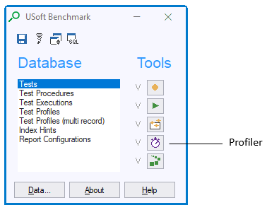
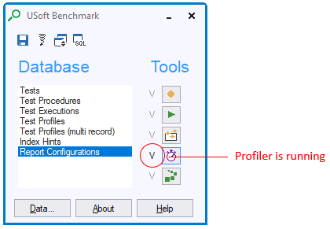

# Debugging constraints and constraint performance

The primary tool that USoft offers for debugging the functionality and performance of constraints is the **Profiler** tool in USoft Benchmark.

Profiler collects and stores diagnostic information in the background while you perform an end user action or a series of end user actions (such as a recorded USoft Benchmark test) in the runtime client/server application.

Profiler begins to collect this information when you **start** it, and stops collecting when you **stop** it.

This article tells you how to **start** and **stop** Profiler, and how to **view** the information it has collected. For more details on how to *interpret* the collected information, go to "[Interpreting Profiler information](/docs/Modeller_and_Rules_Engine/Testing_a_Rules_Engine_with_USoft_Benchmark/Interpreting_Profiler_information.md)”.

You can start and stop Profiler:

- Manually.
- From a USoft Action Language script. This allows you to switch Profiler on or off as part of a USoft **job**.
- From a SQL context.
- When accessing a Rules Service via the HTTP protocol.

## Starting and stopping Profiler manually

To **start** Profiler manually:

1. Run the client-server version of your application with USoft Benchmark running in it. For details, see "”.
2. In the Benchmark toolkit window, press the Profiler button:



3. In the New Profile window, note the because you will need this ID later to identify the information collected by Profiler. Add a Description if this will help you remember the ID. Press OK.
4. Notice that the V-sign next to the Profiler button is no longer greyed out. This signals that the Profiler is running:




:::tip

You can have Profiler collect information about a test run by starting Profiler and then opening Player to play the test.

:::

 

To **stop** Profiler manually:

1. Press once more the Profiler button.

## Starting and stopping Profiler from a USoft Action Language script

Special actions exist that allow you to have Profiler information collected in the USoft Benchmark tables without using the USoft Benchmark GUI interface:

```
rule-profiler-start()

rule-profiler-stop()

rule-profiler-description(<description>)


```

These actions allow you to start Profiler from within USoft **jobs**: they can be called from USoft Batch action tasks.


:::note

It is possible to use a separate database account for the Profiler tables. Do this by adding resource settings to the **usdiw** file of your USoft installation. For the standalone profiler the following resources should be set:

:::

```
TopCase*Profiler.login.database:

TopCase*Profiler.login.user:

TopCase*Profiler.login.password:

TopCase*Profiler.owner:

```

## Starting and stopping Profiler from a SQL context

Special methods of the RulesEngine internal component exist that allow you to have Profiler information collected when SQL is the only interface:

```sql
    INVOKE  RulesEngine.RuleProfilerStart;

    INVOKE  RulesEngine.RuleProfilerDescription WITH
    SELECT  'Performance test';

    INVOKE RulesEngine.RuleProfilerStop;
```

This syntax can be used everywhere an INVOKE statement is allowed. This way, you can start and stop Profiler even from within a constraint. This is also convenient for situation in which there is no SQL Command-like interface available, for example in the Remote Rules Service. When using the ODBC interface, the methods are activated by issuing a call to the ODBC SQLFetch function for the statement.

A profiling session started by calling the 'RuleProfilerStart' method is related to the Rules Engine through which the INVOKE statement is issued. If that Rules Engine is pooled, the profiling session will stay alive until a 'RuleProfilerStop' is issued.

You can have the Profiler (Benchmark) tables in a different database account:

```sql
INVOKE  RulesEngine.RuleProfilerStart WITH
SELECT  <username>
,       <password>
,       <database>;
```

## Starting and stopping Profiler when accessing a Rules Service via HTTP

You can **start** the Profiler by accessing the Rules Service via the HTTP protocol, using an HTTP command with the following syntax:

```language-http
http://<host>:<port>/<application>/<user>/plain/RulesEngine.RuleProfilerStart?$Password=<password>
```

where:

- **\<host>** is the name of the server where the Rules Service is running.
- **\<port>** is the port number that the Rules Service uses to communicate with client applications.
- **\<application>** is the name of the USoft application.
- **\<user>** is the name of the USoft application user.

*Example*

```language-http
http://localhost:7777/TRAVEL/TRAVELUSER/plain/RulesEngine.RuleProfilerStart?$Password=TrustMe
```

The resulting text is: "Profiler activated". Only the Rules Engine through which the RuleProfilerStart command was issued will be profiled. You should ensure that this is the only Rules Engine that is running for the application that you wish to profile. You can do this in the Rules Service configuration pages, which are accessed from the Rules Service item property sheets in the Binder. Set the value for both Minimum and Maximum number of Rules Engines to 1.

You can **stop** the Profiler with the following HTTP call:

```language-http
http://localhost:7777/TRAVEL/TRAVELUSER/plain/RulesEngine.RuleProfilerStop?$Password=TrustMe
```

with resulting text: "Rule profiler stopped successfully".

If you are profiling statements sent to the Rules Service via the Remote Rules Service API, you must ensure that the application that is sending the statements to the Remote Rules Service API has stopped and has disconnected from the Remote Rules Service before you stop the Profiler. If this is not done before the RuleProfilerStop command is issued, the following error message may be displayed:

**"Done AttachToEngine: NO_RULES_ENGINE_FOUND".**

This error message indicates that the (single) engine is still in use, and it is not possible to send the 'RuleProfilerStop' command to the engine.

Also note that when using an ODBC connection, the connection might continue to be active if connection pooling is switched on. Make sure that connection pooling is not switched on when you are profiling.

## Viewing Profiler information

To **view** collected Profiler information after you have stopped the Profiler:

1. In the USoft Benchmark toolkit window, in the Database group, double-click on .
2. In the Test Profiles info window, query the profile you are interested in by ID.