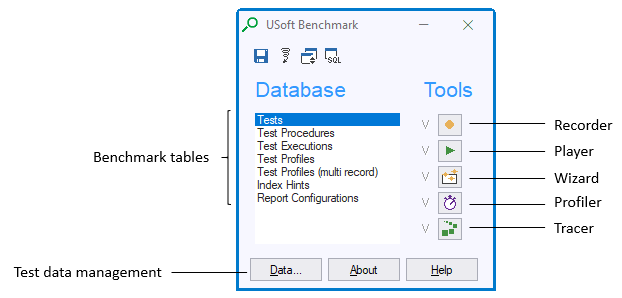

# Getting started with USoft Benchmark

USoft Benchmark is a tool for testing the functionality and performance of a Rules Engine that you build in USoft.

If you develop USoft client/server GUIs, then USoft Benchmark can also be used to test these GUIs.

## Creating USoft Benchmark tables

USoft Benchmark has its own set of database tables. These tables store data about tests. They are prefixed T_TEST_… . To get started, you first need to create this set of tables:

1. In USoft Binder, if you do not have a Benchmark item, create one by choosing Item, New from the menu.
2. Right-mouse-click on the Benchmark item and choose s. Press OK.

## Running USoft Benchmark

To run USoft Benchmark in the context of your application:

1. Right-mouse-click on the User Application item that you use customarily to access (the client-server version of) your runtime Rules Engine, then choose from the context menu.
2. In the Properties sheet, set Run USoft Benchmark = Yes. Press OK.
3. Open the application by double-clicking on the User Application item.

Your application should now open with the Benchmark toolkit window floating on top of it:

USoft Benchmark toolkit windowYou are now ready to record and play test procedures, manage test data, and run and inspect test profiles.

:::note

You can start Benchmark in an already running application by executing in SQL Command:

:::
