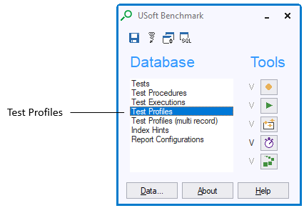
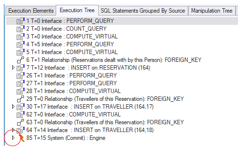
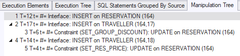

# Interpreting Profiler information

This article is about interpreting debugging information collected by the Profiler tool of USoft Benchmark. To find out how you **create** such debugging information, go to “[Debugging constraints and constraint performance](/docs/Modeller%20and%20Rules%20Engine/Testing%20a%20Rules%20Engine%20with%20USoft%20Benchmark/Debugging%20constraints%20and%20constraint%20performance.md)”.

##  

## Finding Profiler information

1. Make sure you are running the client-server version of your application with USoft Benchmark running in it. For details, go to “”.
2. In the Benchmark toolkit window, in the Database group, double-click 

3. In the Test Profiles window, query the profile you are interested in by ID or by Description.

##  

## Typical debugging strategy

If you use Profiler for debugging why your constraints ran into an error, you want to find quickly what caused the error.

A good strategy is to create a profile of the run up until the point when the error occurred, and then to inspect what happened JUST BEFORE.

Once you have the Profiler information in your screen, you can click the Execution Tree tab. Expand the LAST execution step in the tree:

Expand each time the LAST node in the Execution Tree to get at what caused your errorContinue expanding until you see what happened just before the error occurred.

##  

## Overall times

Profile data, whether the result of interactive user behavior or test executions, are always collected on behalf of a specific user. A profile can be an element of a profile group. The default value for the Profile Group field is the name of the test; this is only the case if the profile is recorded as part of a test, otherwise the field is empty.

The top of the Test Profiles window shows overall times. All times are in milliseconds:

|**Time**|**Meaning**|
|--------|--------|
|Elapsed Time|The total elapsed time, measured from the moment the first execution element is started until the moment the last execution element is finished. A profile that has not yet been prepared will only contain this time.|
|SQL Manipulation Time|The time used for executing and evaluating all data manipulation SQL Statements within the profile.|
|Manipulation Overhead Time|The time used for manipulation overhead other than manipulation SQL . For example: rearranging and optimizing constraint order, and evaluating which constraints should be evaluated.|
|Total Manipulation Time|The total time used for performing data manipulations. The total manipulation time is the sum of the SQL manipulation time and the manipulation overhead time.|
|SQL Other Time|The time used for other SQL queries other than manipulation SQL. Examples include underlying queries, extra queries, decisions and SqlScript methods within the profile.|
|Other Overhead Time|The time used to record the profiler, profiler overhead time and the time to perform user actions like pushing a button, selecting a menu etc. This is the time that is not used for manipulations and SQL.|
|Total Other Time (SQL Other Time + Other Overhead Time)|The total other time SQL is the sum of the SQL other time and the other overhead time. This is the time used for SQL queries other than manipulation SQL and profile recording time, profile overhead time and performing user actions.|
|Total SQL Time|The total time used for executing all SQL statements within the profile. The Total SQL time is the sum of the SQL manipulation time and the SQL other time.|
|Total Overhead Time (Manipulation Overhead Time + Other Overhead Time)|The total overhead time is the sum of the manipulation overhead time and the other overhead time. This is the time used for manipulation overhead other than manipulation SQL and profile recording time, profile overhead time and performing user actions.|

##  

## Profile Groups

Profiles can be organized into profile groups. By creating profile groups it is possible to detect performance trends for a group of profiles.

The Test Profile Groups window can be accessed by clicking the Profile Group Statistics button in the Test Profiles window, and is synchronized with the profile group of the current profile. The Test Profile Groups window is also accessible from the Objects list.

The Statistics tab page shows timing characteristics in a bar chart for all profiles in a profile group The horizontal axis shows all Profiles IDs in this profile group. The vertical axis shows the time. The Test Profiles tab page displays the profiles within this profile group.

##  

## Preparing a profile

After recording and saving, a profile has to be prepared before all details can be viewed. During the preparation specific redundant timing characteristics of the profile are filled. The following actions are performed:

1. The preparation flag is set.
2. Values are inserted for these profile attributes:

- SQL Manipulation Time
- Manipulation Overhead Time
- Total Manipulation Time
- SQL Other Time
- Other Overhead Time
- Total Other Time (SQL Other Time + Other Overhead Time)
- Total SQL Time
- Total Overhead Time (Manipulation Overhead Time + Other Overhead Time)

100. Values are inserted for these Manipulation attributes; they are shown on the Manipulations tab page and in the “View on Manipulations” window (press the “View Manipulation” button to see this window:

- SQL Time
- Total SQL Time
- Number of SQL
- Total number of SQL
- SQL Time handled on the Client
- Number of SQL handled on the Client
- SQL Time handled on the Server
- Number of SQL handled on the Server
- Related Time
- Related SQL Time
- Related number of SQL
- Related SQL Time handled on the Client
- Related number of SQL handled on the Client
- Related SQL Time handled on the Server
- Related number of SQL handled on the Server

##  

## Execution elements

The Execution Elements tab page on the Test Profiles window shows information about the SQL statements that are performed within a profile:

|**Field**|**Meaning**|
|--------|--------|
|ID      |The sequence number of this element.|
|Executed SQL|
If this field is set to Yes, the element is en executed SQL Statement.

If this field is set to No, the element is a grouping element.
|
|Parent  |The ID of the parent element of this element.|
|Manipulation Seqno|
The sequence number of the manipulation that has triggered this SQL.

If this field is empty, the SQL statement is not triggered by a manipulation.

For example, when an INSERT constraint is triggered by a manipulation, the SELECT_FOR_INSERT statement of the constraint will be connected to the manipulation that triggered the constraint. When the SELECT_FOR_INSERT statement retrieves a record and is ready to perform the insert, it will fire a uniqueness check and then the actual insert. The check and insert will both then have a new manipulation sequence number.
|
|Group Time|For grouping elments, this field displays the time required to perform the group of elements.|
|Time    |
The time used to perform this SQL statement.

Time 0 means that USoft BenchMark cannot measure the time.
|
|% Total SQL Time|The percentage of the Total SQL Time needed to perform this SQL statement.|
|Rows Processed|The number of records involved in this SQL statement.|
|Optimized|
"Yes" means that the SQL statement is processed on the client computer.

"No" means that the SQL statement is sent to the database server.
|
|Constraint Execution ID|Every time that the Rules Engine starts to check if a constraint needs to be fired or not, it will create a new 'constraint exe ID'. If that constraint then actally fires one or more SQL statements, those SQL statements will all then be allocated this constraint execution ID. In this manner, different SQL statements can be located and matched. For example constraint key queries can me matched with their corresponding constraint tests (if any). Because not every checked constraint will result in a SQL statement (the Engine can pre-evaluate constraints as well) it is likely that there will be 'gaps' between the constraint execution IDs. Furthermore, the ID is not bound to a single profile: a constraint key query recorded by profile 1 and the corresponding constraint-test recorded by profile 2 will have the same constraint execution ID. The constraint execution ID is not reset in a new profile.|
|Source Type|The area of USoft Developer that this SQL statement is related to.|
|Source  |The name of the domain constraint, the constraint, or the relationship that causes the execution of this SQL statement.|
|Reason  |The internal reason why this SQL statement is executed. See the table in the next section of this article.|
|SQL Statement|
The SQL Statement as the Rules Engine processes it internally.

The Rules Engine attempts to execute this SQL statement using information that is already available on the client computer.
|
|RDBMS SQL Statement|
The SQL Statement as it is sent to the database, to be processed by the RDBMS.

If it turns out that server data is required, the Rules Engine builds this RDBMS SQL statement.
|
|Initial SQL Statement|The Rules Engine occasionally has to evaluate a SQL statement which needs to be split up into several statements because it contain invokes or references to table components as well as database tables. The profiler will record and show these 'initial' statements, so you can see how the engine will perform the splitting of the statement. In this manner performance problems can be adressed by changing the SQL statement in such a way that the Rules Engine will change the way it splits up the statement . These execution elements are displayed as group element (the Executed-SQL field is set to No).|
|Source Details|This field contains detailed information about the execution element. For example, when a row event is fired by a decision, the details of the rowevent (table name and primary key values) are displayed.|

 

##  

## Reasons for SQL Statements

The table below lists reasons that can cause a SQL statement to be executed.

The values in the Reason column are those that are displayed when you use USoft BenchMark to interpret a Profile.

|**Reason

**|**Description

**|
|--------|--------|
|
AUTHORIZATION
|
Occurs when conditions on table and column rights are checked

Example: If a table right specifies that records should exist in another table, a SQL SELECT statement is generated and executed to determine whether these records actually exist.
|
|
BATCH_FETCH
|
Occurs when batch manipulations are fetched.
|
|
CARDINALITY
|
Occurs when relationship cardinality rules are checked.

Example: If the maximum number of child records is specified in a relationship definition, a SQL SELECT statement is generated and executed to determine the actual number of child records (just before committing a change or an insert).
|
|
CASCADING
|
Occurs when children are selected for evaluation and execution of referential integrity rules.

Example: If a referential integrity rule is specified as update cascade, the child records to be manipulated are first selected and then manipulated. Both SQL statements generate this reason.
|
|
COMPUTE_VIRTUAL
|
Occurs when a value is retrieved for a joined column or when a value is computed in an extra query.

Example: In a child record's virtual field a parent record field value is retrieved on the basis of the relationship between the tables involved. The execution of the value retrieving SQL SELECT statement causes this reason
|
|
CONSTRAINT_KEYQUERY
|
Occurs when primary keys are selected that might refer to constraints.

Example: If records of a child table are manipulated, the primary keys of the parent records are retrieved. This generates the reason.

Using these key values, restrictive and productive single-record constraints can sometimes be executed only once per parent instead of for each child record.
|
|
CONSTRAINT_TEST
|
Occurs when a possible violation of a single-record constraint is checked.

Example: Suppose a subset of parent records (pointed out by the condition in the WHERE clause) can only be deleted if related child records do not exist, execution of the SQL SELECT statement checking for the existence of the child records generates this reason.
|
|
COUNT_QUERY
|
Occurs when the Count Query option is selected.
|
|
DOMAIN_CONSTRAINT
|
Occurs when the SQL statement of a Domain Constraint is evaluated.

Example: Although domain constraint definitions do not really look like SQL statements, internally they are transformed into full SQL statements. Execution of these domain SQL statements generates the reason.
|
|
FOREIGN_KEY
|
Occurs when a foreign key is checked.

Example: A SQL SELECT statement determining whether or not an existing (referenced) primary key value exists.
|
|
INVOKE_EXECUTION
|
Occurs when an INVOKE statement is executed.

The only exception is when the XML export method is invoked.
|
|
LOCK_RECORD
|
Occurs when a record is locked as preparation for manipulation.

Example: If a relationship cardinality check is scheduled by the Rules Engine the parent record is locked just before the actual SQL statement select is executed in order to avoid any manipulation of the parent.

If the record cannot be locked, or if the record does not exist, this results in an error.
|
|
MANIPULATION
|
Occurs when INSERT, DELETEs and UPDATEs are executed on the database.
|
|
NEWVALUES
|
Occurs when a new value is computed by a constraint.

Example: If the set clause of an UPDATE constraint contains a subquery, the evaluation of the subquery (which determines the new value for the column to be updated) generates this reason.
|
|
OLD_NEWVALUES
|
Occurs when the retrieval and locking of updated records (SELECT_FOR_UPDATE) is combined with the determination of new values (NEWVALUES).

When records are updated, these records are locked first. If new values need to be determined, in some cases these new values can be queried within the same SQL statement. Execution of this SQL statement generates the reason.

This reason can only be generated if the COMBINE_QUERIES parameter has been set to True.
|
|
PERFORM_QUERY
|
Occurs when a query is performed.

Example: Execution of the SELECT statement retrieving the data for a lookup window generates this reason.
|
|
READ_RECORD
|
Occurs when a single record is read.
|
|
READ_ROWID
|
Occurs when a record ID is read.

Example: The record ID of newly inserted record is read immediately after the actual INSERT. This unique record identifier is used for optimization purposes.
|
|
RESTRICTED
|
Occurs when child records are selected because of evaluation restrictive referential rules.

Example: If a parent record is scheduled to be deleted the execution of the SQL SELECT statement checking the non-existence of child records generates this reason.
|
|
REVERSE_COMPUTE_VIRTUAL
|
Retrieves data by reversing the process of virtual column data computation in case of manipulation of joined or extra query columns (see COMPUTE_VIRTUAL).

Example: A joined column contains a parent column value retrieved on the basis of a relationship (foreign key, primary key). If you change this value, the Rules Engine generates the SQL SELECT statement trying to retrieve the primary key value of the parent record containing the (new) value. This leads to an update of the foreign key in the child record if the new primary key is indeed found.

The SQL SELECT statement trying to retrieve the primary key of the record containing the joined columns new value generates this reason.
|
|
ROW_CONSTRAINT
|
Occurs when single record constraints are evaluated.

Example: The execution of the SQL SELECT statement checking a logical relationship between fields in one record generates this reason.
|
|
SELECT_FOR_DELETE
|
Occurs when a record is selected for deleting.

Example: Evaluation of a productive (delete) constraint causes the Rules Engine to generate a SQL statement to determine if there are records meeting the condition specified in the constraint WHERE clause (the ones meeting the condition are the ones to be updated).

Execution of this SQL SELECT statement generates the reason.
|
|
SELECT_FOR_INSERT
|
Occurs when a record is selected for inserting.

Example: Evaluation of a productive (insert) constraint causes the Rules Engine to generate a SQL SELECT statement to determine whether the values to be inserted meet the condition specified in the WHERE clause of the constraint. This statement's execution generates the reason.
|
|
SELECT_FOR_UPDATE
|
Occurs when a record is selected for updating.

Example The evaluation of a productive (update) constraint causes the Rules Engine to generate a SQL statement to determine if there are records meeting the condition (the ones pointed out by selection are the ones to be updated!).

Execution of this SQL SELECT statement generates the reason.
|
|
SELECT_FOR_UPDATE_ON_SELF
|
Occurs when a record is selected for updating at record validation time, before the storage of the record.

Example: The evaluation of a productive constraint that can be handled as an Update On Self constraint, causes the Rules Engine to generate a SQL statement to determine if the current record meets the condition.

Execution of this SQL SELECT statement generates the reason.
|
|
SELECT_FOR_XML
|
Occurs when the XML query method executes the SELECT part within an INVOKE statement.
|
|
SEQNO
|
Occurs when a unique sequence number is selected.
|
|
UNIQUE_KEY
|
Occurs when the uniqueness of a key is evaluated.

Example: Before an actual data manipulation action is executed on the database a SQL SELECT statement is generated to determine that the primary key value doesn't already exist in the target table. Execution of this SQL SELECT statement generates the reason.
|
|
XML_EXPORT_EXECUTION
|
Occurs when the XML export method generates XML output based on an INVOKE...SELECT statement.
|

##  

## Execution tree

 The Execution Tree Tab Page on the Test Profile Window displays all the execution elements in a tree representation, making use of the Parent ID and ID information for the elements.

> [!WARNING]
> If you open a tree element with a large number of children, for example a manipulation that updates 10000 records, this can take a long time to open due to the large number of SQL statements involved.

 

##  

## SQL Statements grouped by Source

The source type of an SQL statement is the area of USoft Developer that this SQL statement is related to. A source type is one of the following:

- Constraint
- Domain Constraint
- Relationship
- System
- Authorization
- Interface
- Decision
- Job
- Action Task
- Export Task
- Import Task
- Job Task
- SQL Task

For SQL statements, the source type and source depend on the internal reason why the SQL Statement is executed. They will be calculated when saving a profile.

If a constraint causes the execution of an SQL statement, then the source type is Constraint. The same holds for the following source types (in which case, the source for the SQL statement is the name of the source that causes the execution of this SQL statement):

- Domain Constraint
- Relationship
- Decision
- Job
- Action Task
- Export Task
- Import Task
- Job Task
- SQL Task

If the internal Reason for an SQL statement is MANIPULATION or SEQNO, then the source type is System. If the internal Reason is AUTHORIZATION, then the source type is Authorization. In all other cases, the source type is Interface.

The SQL Statements Grouped by Source tab page on the Test Profiles window shows grouped information about the source types and sources that cause SQL statements to be executed. The advantage of this grouped information is that it gives a clear view of which source type and source causes performance problems.

|**Field**|**Meaning**|
|--------|--------|
|
Time
|
The total time of all SQL statements executed by this source.
|
|
Max Time
|
The maximum SQL execution time
|
|
#SQL
|
The number of SQL statements executed by this source.
|
|
Rows Manipulated
|
The number of records manipulated by all SQL statements executed by this source. It is he number of rows which have been updated, deleted and or inserted. This is the sum of the RowsProcessed in the execution elements list with the reason Manipulation.
|
|
Rows Retrieved
|
The number of records retrieved by all SQL statements executed by this source. It is the number of rows queried from the database or component. This is the sum of the RowsProcessed in the execution elements list with a reason other than Manipulation.
|
|
Source Type
|
The area of USoft Developer that this SQL statement is related to.
|
|
Source
|
The name of the domain constraint, the constraint, or the relationship that causes the execution of this SQL statement.
|

 

You can click the SQL Statements button to view the SQL statements within this source.

##  

## Manipulations

The Manipulations tab page on the Test Profiles window shows statistical timing information about all manipulations in the profile.

Only the manipulations with Constraint, Relationship or Interface source type can occur.

**Fields of the Manipulations tab page**

All times are in milliseconds:

|**Field

**|**Meaning

**|
|--------|--------|
|
Manipulation Seqno
|
The sequence number of the manipulation.
|
|
Time
|
The execution time of the single manipulation
|
|
Total Time
|
The total execution time used for performing data manipulations, including related manipulations.
|
|
SQL Time
|
The time used for executing all SQL statements within a single manipulation.
|
|
Total SQL Time
|
The total time used for executing SQL statements, including SQL statements in related manipulations.
|
|
#SQL
|
The number of SQL statements within a single manipulation.
|
|
Total #SQL
|
The total number of SQL statements within the manipulation, including SQL statements within related manipulations.
|
|
Source Type
|
The area of USoft Developer that this manipulation is related to.
|
|
Source
|
The name of the domain constraint, the constraint, or the relationship that causes this manipulation.
|
|
Manipulation
|
The type of data manipulation, for example: Update or Insert.
|
|
Table
|
The database table that is affected by this manipulation.
|

 

From the Manipulations tab page, you can:

- Click the View Manipulation button to view a specific manipulation.
- Click the Manipulations Started button to view all manipulations started due to SQL Statements within a specific manipulation.
- Click the SQL Statements button to show the SQL statements within a specific manipulation.

##  

## View on Manipulation

The View on Manipulation window shows statistic timing information about a specific manipulation. This window can be viewed by clicking the View Manipulation button on the Manipulations tab page in the Test Profiles window.

The timing characteristics are divided into single manipulation information and related manipulation information. The 'Related Manipulation' fields present the timing characteristics of manipulations started due to SQL statements within this manipulation.

The information about the timing characteristics of SQL statements handled on the client and on the server depends on whether the SQL statement is optimized, or not. If SQL Statements are optimized they are processed on the client computer; if they are not optimized they are sent to the database server.

**Fields of the View on Manipulation window**

This table lists the meaning of all Specific and Related manipulation fields (reading from left to right). All times are in milliseconds.

|**Field

**|**Meaning

**|
|--------|--------|
|
Time
|
The time used performing the data manipulation. This is the time used for executing all SQL Statements within the manipulation plus the time used for manipulation overhead other than manipulation SQL. For example: rearranging and optimizing constraint order, and evaluating which constraints should be evaluated.
|
|
SQL Time
|
The time used for executing and evaluating the SQL statements within the manipulation. This time can be divided into time used for SQL handled on the client and time used for SQL handled on the server; it is the sum of these two times.
|
|
Number of SQL
|
The number of SQL statements executed within the manipulation. This number can be divided into a number of SQL statements handled on the client and a number of SQL statements handled on the server; it is the sum of these two numbers.
|
|
SQL Client Time
|
The time used for executing the SQL statements handled on the client within the manipulation.
|
|
Number of SQL Client
|
The number of executed SQL statements handled on the client within the manipulation.
|
|
SQL Server Time
|
The time used for executing the SQL statements handled on the server within the manipulation.
|
|
Number of SQL Server
|
The number of executed SQL statements handled on the server within the manipulation.
|
|
Total Time
|
The time used performing the specific data manipulation plus the time used to perform the related manipulations which are started due to SQL statements within the manipulation.
|
|
Total SQL Time
|
The time used for executing and evaluating the SQL statements within the manipulation plus the time used for executing and evaluating SQL Statements of related manipulations which are started due to SQL statements within the manipulation.
|
|
Total Number of SQL
|
The number of SQL statements executed within the manipulation plus the number of SQL statements executed within the related manipulations which are started due to SQL statements within the manipulation.
|

##  

## Manipulation Tree

The Manipulation Tree tab page presents the timing characteristics of the total manipulation. These are the characteristics of all manipulations started due to SQL statements within this manipulation.The format is :

**Manipulation Seqno T(otal Time) t(otal SQL Time #(Total Number of SQL) Source Type '(' Source ')' ':' Manipulation Type 'on' Table Name '(' Table Key')'.**

This is illustrated in the example below:

Double-click on an item in the tree to open the View on Manipulation window for the manipulation in question.

##  

## Statistics

The Statistics tab page of the Test Profiles window presents all statistics about all manipulations and SQL statements within the profile.

For each type of manipulation (Insert, Update, Delete), the total number of manipulations in the profile are shown, itemized by manipulations performed by the interface, all manipulations, and manipulations that are handled as an Update On Self constraint.

For the SQL statements the total time and total number of SQL statements handled on the server and the client can be viewed.

##  

## Index Hints

 USoft BenchMark's Profiler provides hints about which database columns could be candidates for putting an index on. Obtaining these hints is useful for SQL statements that are executed because of constraints. Especially, of course, if they take up a lot of network time.

Generally speaking, indexes will increase the performance of your application. Performance, however, is a relative and subjective concept. For example: a badly written constraint may perform excellently on a small database or a fast machine. Therefore, concentrate your efforts on those performance aspects that are considered to be unacceptable.

To obtain index hints from the test database:

1. In the USoft BenchMark toolbox, double-click Index Hints in the Test Database list. The Index Hints window appears.
2. Perform a query that retrieves the data of the appropriate profile. The first info box has four fields: Profile ID, Hint No, Table Name, and Available Index (of which the last one is the most important).
3. The Available Index field contains the value 1, 2 etc., if USoft Developer has auto-generated an index on the table's primary, secondary key etc. The field contains a name if an additional index was created manually with the Definer. The field is empty if USoft Developer knows NO index.
4. Scroll through the records, and look for those combinations in which the Available Index field is empty, and the related SQL statements (displayed in the "SQL Statements that Generate this Index Hint" info box) take up much time. The Column Name field lists the columns on which you COULD put an index (see the note below).

> [!NOTE]
> Once you have obtained the index hints, you will have to use a trial-and-error method to find out whether performance really increases. It may turn out, for example, that performance increases for this aspect of your application's functionality but decreases for some other aspect.

To obtain index hints via the Test Profiles window:

1. In the USoft BenchMark toolbox, double-click Test Profiles in the Test Database list. The Test Profiles window appears.
2. Perform a query that retrieves the data of the appropriate profile.
3. Click the Index Hints tab page. The first info box has three fields: Hint No, Table Name, and Available Index. The Available Index field contains the value 1, 2 etc. if USoft Developer has auto-generated an index on the table's primary, secondary key etc. The field contains a name if an additional index was created manually with the Definer. The field is empty if USoft Developer knows NO index.
4. Scroll through the records, and look for those combinations in which the Available Index field is empty, and the SQL Statements that Generate this Index Hint take up much time. The Column Name field lists the columns on which you COULD put an index.