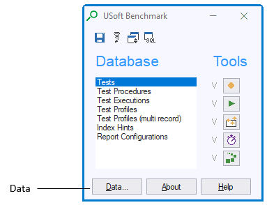
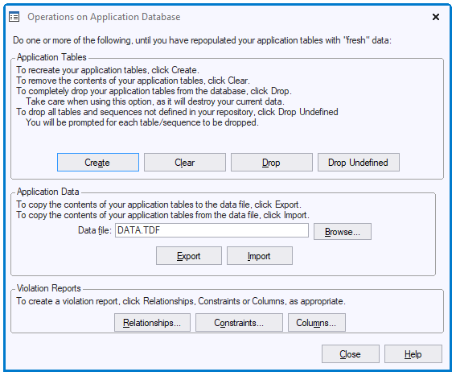
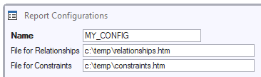

# Managing application data as test data

USoft Rules Engines are data-intensive: they "bounce off” against live application data, and what exactly they do at runtime is largely determined by the data constellations they are asked to process.

For this reason, it is essential to spend time producing and managing the application data that you use for testing. Realistic data sets that you copy from Production are more attractive for testing Rules Engines than elemental dummy data such as a table called T1 with a single record with value ‘X’ in it.

## Producing good test data

The best way to produce good test data is to obtain them from Production or from another realistic environment and to invent routines for exporting, storing, and re-importing these data sets in different situations.

The XML internal component in USoft has methods for converting relational data easily into and from XML:

```sql
INVOKE     XML.Export WITH SELECT ...
INVOKE     XML.MultiExportTables WITH SELECT ...
INVOKE     XML.Import WITH SELECT ...

```

USoft Delivery Manager and the USoft Blend scripting framework both build on these methods to offer rich functionality for exporting, comparing, storing and re-importing XML data sets.

## Re-initialising test data

If you run *regression tests* to detect whether Rules Engine functionality is still correct after a change, it is essential to run tests before and after the change with the same data sets.

If you run *performance tests* to detect whether a Rules Engine has slowed down or become more speedy, this is equally essential.

For these reasons, you need to register and maintain which data sets run with which tests. Also, data structures will vary between versions of your application, so you need to maintain different test data sets for different application versions.

The approach that gives you most flexibility and programmability is to define **tests** in USoft Benchmark, but to define **jobs** (in USoft Definer) that will re-initialise test data sets using USoft’s XML capabilities. Make sure a re-initialisation job first removes any remaining data, then re-imports the same data set as before. Each time you run a test or test suite, make sure that the first step is to re-run the corresponding initialisation job.

## Test data in USoft Benchmark

USoft Benchmark has built-in features of its own for managing test data. While some of these are highly useful, you need more to achieve truly professional test data management, for reasons explained in this article.

To get access to USoft Benchmark test data management features:

1. Run the client-server version of your application (your Rules Engine) with USoft Benchmark running in it. See “Getting Started with USoft Benchmark” for details.
2. In the Benchmark toolkit window, press the Data button.



This opens the “Operations on Application Database” dialog:



### Create, Clear, Drop, Drop Undefined

This allows you to create, clear and drop application tables as explained in the dialog text.


:::danger

Do not press these buttons unless you are sure. Your application data will be dropped. USoft Benchmark is not usually the best or most logical context for dropping or re-creating application tables.

:::

One use case for the **Clear** button is when you want to manually repeat a test, and re-initialise the test data you have just used in a previous test:


:::tip

To re-initialise test data in this way, first make sure that you have an exported version of the test data available in a .TDF file (**Export** button). Then, at the beginning of each test, press **Clear**, followed by **Import**.

:::

### Export, Import

This allows you to write (export) a copy of all your current application data to a file with extension .TDF, and to re-import it from that file.


:::warning

If you want to Import, be careful not to accidentally press Export, because Export would **overwrite** the file you wanted to import with the current state of the data.
You cannot Import if you are running your development repository as a [version-controlled repository](/Repositories/Version_control/Versioncontrolled_repositories.md).

:::

The TDF format has drawbacks. Its contents is not human-readable. If the data structure (the metadata) of your application changes, you may not be able to re-import TDF data created prior to the change.

The TDF format has the advantage that it is very easy to use. TDF imports are also relatively fast. For these reasons TDF can be a good choice for temporary backup and restore, and also for storing and re-using data in different situations where you know that the same application version will be used each time.


:::tip

Tables that are described in the USoft dictionary but that are a view or a synonym in the database are *not* exported to the .TDF file.

:::

If you like TDF, you may want to define a Test Procedure that clears your application data and re-imports a TDF file:

1. In the Benchmark toolkit window, in the Database group, double-click .
2. Define a procedure called INITIALISE with the following steps:

|**Step ID**|**Order**|**Target**|**Action**|**Parameters**|
|--------|--------|--------|--------|--------|
|1       |10      |*topCase|top-test-clear-tables|        |
|2       |20      |*topCase|top-test-import|c:\\temp\\DATA.TDF|


3. To start a Test with this INITIALISE routine as the first step, simply create an overall Test Procedure where the steps are sub-procedures, and have your Test execute this overall procedure:

|**Step ID**|**Order**|**Procedure**|
|--------|--------|--------|
|1       |10      |INITIALISE|
|2       |20      |MY_TEST |


### Violation reports: Relationships, Constraints, Columns

You can have USoft Benchmark screen your current application data against your current restrictive and productive rules, as declared at Relationship, Constraint, and Column level. This allows you to detect any *existing* data that no longer satisfy *new* rules. Two scenarios are especially frequent:

- When releasing a new application version in Production, you want to know if there are existing Production data that violate new rules.
- When re-using test data sets against a changed application, you want to know if these data sets are still valid for the new situation.

Looking at violation reports is typically a one-time manual action because, if there are any violations, they require individual decisions to be made with the customer or tester. Once the violations are repaired, these decisions no longer need to be remembered. You can structure and automate reparations by using Upgrade Scripts in USoft Delivery Manager.

To make a violation report for constraints defined at **Relationship** level:

1. In the USoft Benchmark toolkit window, in the Database group, double-click .
2. Make sure that you have a named Report Configuration with a convenient file path in the “File for Relationships” field. Make sure the file has extension .HTM:



3. Press the button in the “Operations on Application Database” dialog, specify the Report Configuration that has the file path you want, then press OK.
4. Open the .HTM file in the file path with a browser.

 To make a violation report for constraints defined at **Constraint** level:

1. In the USoft Benchmark toolkit window, in the Database group, double-click .
2. Make sure that you have a named Report Configuration with a convenient file path in the “File for Constraints” field. Make sure the file has extension .HTM:


3. Press the button in the “Operations on Application Database” dialog, specify the Report Configuration that has the file path you want, then press OK.
4. Open the .HTM file in the file path with a browser.


:::warning

Violation reports about rules defined at **Constraint** level do not contain violations against:

:::

To make a violation report for constraints defined at **Column** level:

1. Press the button in the “Operations on Application Database” dialog. Follow the instructions in the “Column Violations” window.